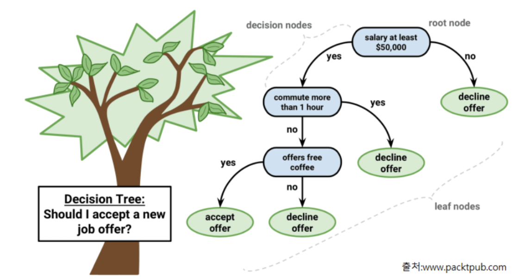

## Decision Tree란?

- 질문을 던져 가며 대상을 좁혀가는 '스무고개'와 비슷한 형식의 알고리즘
- 추론 결과를 통해 분기해 나가는 구조가 Tree와 비슷하기 때문에 Decision Tree라고 한다.
    - 노드안의 원소들의 불순도(impurity) 최대한 감소하는 방향(최대한 한 class의 값들만 있는 상태)으로 조건을 만들어 학습을 진행한다.
        - **순도(purity)/불순도(impurity)**
            - 서로 다른 종류의 값들이 섞여 있는 비율
            - 한 종류(class)의 값이 많을 수록 순도가 높고 불순도는 낮다.

    - 하위 node는 yes/no 두 개로 분기 된다.
    - **분기 기준**
        - **분류**: 가장 불순도를 낮출수 있는 조건을 찾아 분기한다.
        - **회귀**: 가장 오차가 적은 조건을 찾아 분기 한다.
    - 적당한 시점에서 하위 노드를 생성하지 멈추지 않으면 **Overfitting이 발생하기 쉽다**.
        - 하위 노드가 더이상 생성되지 않도록 하는 것을 **Pruning(가지치기)**라고 한다.
    - 앙상블기반 알고리즘인 랜덤 포레스트와 많은 부스팅(Boosting)기반 앙상블 모델들의 기반 알고리즘으로 사용된다.
    - 머신러닝 모델들 중 몇 안되는 White box 모델로 추론 결과에 대한 해석이 가능하다.
        - white box 모델
            - 해석 가능 모델
            - 기계학습 시스템의 행동과 예측을 인간이 이해할 수 있게 하는 방법과 모델
   
## 용어
- Root Node : 시작 node
- Decision Node (Intermediate Node): 중간 node
- Leaf Node(Terminal Node) : 마지막 단계(트리의 끝)에 있는 노드로 최종결과를 가진다.

## Hyper Parameter
- `max_depth`
    - 트리의 최대 깊이(질문 단계)를 정의
    - 기본값: None - 깊이 제한 없이 완벽히 분할 될때 까지 분기한다.
        - 분류: 불순도가 0이 될때 까지, 회귀: MSE가 0이 될 때 까지

- `max_leaf_nodes`
    - Leaf Node 개수 제한한다. 
    - 기본값: None - 제한없다.
    - ex) max_leaf_nodes=10 -> 전체 Tree의 leaf node가 최대 10개를 넘을 수 없다.

- `min_samples_leaf`
    - Leaf Node가 가져야 하는 최소한의 sample (데이터) 수를 지정한다.
    - 개수를 지정할 수 도있고(정수), 전체 샘플대비 비율로 지정(0.0 ~ 0.5 실수)할 수 있다.
        - ex: min_sample_leaf=5 -> 모든 leaf node는 최소한 5개 데이터를 가져야한다. 그래서 5개가 되면 더이상 분기하지 않는다.
    - 기본값: 1 -> 제한이 없다. 

- `max_features`
    - 분기 할 때마다 지정한 개수의 랜덤한 Feature(특성)만 사용한다. **&rarr;** **Overfitting을 줄일 수 있다.**
    - 다음 값 중 선택한다.
        - **None(기본값)**: 전체 Feature를 다 사용한다.
        - **정수**: 개수를 지정한다.
        - **0 ~ 1 사이 실수**: 전체 개수 대비 비율
        - **"sqrt"**: 전체 특성개수의 제곱근 개수만큼만 사용한다.
        - **"log2"**: $\log _{2} {Feature개수}$ 만큼만 사용한다.
    - ex) Feature 가 25개일 경우 
        - 'sqrt' 는 $\sqrt{25}=5$ 이므로 5개 Feature를 사용
        - 'log2' 는 $\log_{2} 25=4.64$ 이므로 5개 특성 사용

- `min_samples_split`
    - 분할 하기 위해서 필요한 최소 샘플 수를 정의. 정의한 개수보다 더 적은 샘플을 가진 노드는 더이상 분기 되지 않는다.
    - 기본값: 2
    - ex) min_samples_split=10 -> sample 수가 10 미만인 노드는 더이상 분기되지 않는다.

- `criterion`
    - 각 노드의 불순도 계산 방식을 정의한다.
    - 분류
        - "gini"(기본값), "entropy"
    - 회귀
        - "squared_error"(기본값), "absolute_error", "friedman_mse", "poisson"
            - **squared_error**
                - 제곱 오차
                - 오차를 제곱으로 표현하기 때문에 오차가 작으면 더 작게, 오차가 크면 더 크게 표현한다.

## 학습이 끝난 후 Feature(컬럼) 중요도 조회
- **feature_importances_** 속성
    - 모델을 학습 결과를 기반으로 각 Feature 별 중요도를 반환
    - 전처리 단계에서 input data 에서 중요한 feature들을 선택할 때 decision tree를 이용한다.