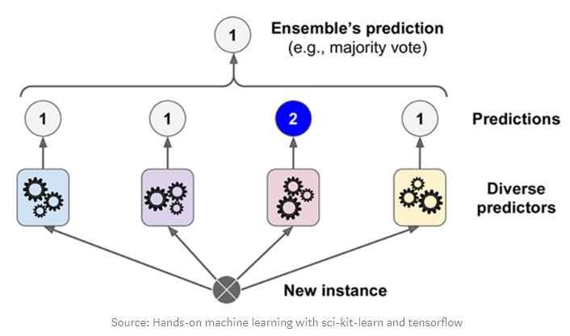

# Ensemble
## Ensemble 이란?
- 여러 모델을 학습시켜 결합하는 방식으로 문제를 해결하는 방식
- 개별로 학습한 여러 모델을 조합해 과적합을 막고 일반화 성능을 향상시킬 수 있다.
- 개별 모델의 성능이 확보되지 않을 때 성능향상에 도움될 수 있다.

## Ensemble 종류
1. Voting(투표) 방식
    - 여러 개의 Estimatro(추정기)가 낸 결과들을 투표를 통해 최종 결과를 내는 방식
    - 종류
        1. Bagging - 같은 알고리즘, 다른 학습 데이터
            - ex) Random Forest
        2. Voting - 다른 알고리즘
2. Boosting (부스팅)
- 성능이 떨어지는 학습기(Weak Learner)를 결합해서 정확하고 강력한 학습기(Strong Learner)를 만든다.
- 각 약한 학습기들은 순서대로 일을 하며 뒤의 학습기들은 앞의 학습기가 찾지 못한 부분을 추가적으로 찾는다.

# Voting 방식
- 서로 다른 종류의 알고리즘들을 결합하여 다수결 방식으로 최종 결과를 출력한다.
## Bagging(Random Forest)
- Bagging 방식의 ensemble 모델
- 다수의 Decision Tree를 사용
    - 여러 개의 Decision Tree를 생성하고 입력데이터를 각각 추론하게 한 뒤 가장 많이 나온 추론결과를 최종결과로 결정한다.
- 처리 속도가 빠르다 & 성능도 높다
    - Random: 학습할 때 Train dataset을 random하게 sampling한다.
    - Forest: 여러개의 (Decision) Tree 모델들을 앙상블한다.

## Voting
- 비슷한 성능을 내면서 서로 다른 예측하는 것이 많은 모델들을 묶어줄 때 성능이 올라간다.
1. hard voting
- 다수의 추정기가 결정한 예측값들 중 많은 것을 선택하는 방식

2. soft voting
- 다수의 추정기에서 각 레이블별 예측한 확률들의 평균을 내서 높은 레이블값을 결과값으로 선택하는 방식

- 일반적으로 soft voting의 성능이 더 좋다
    - 거의 똑같은 결과를 내는 모델이 있기 때문에 
        - (0.51, 0.49) 확률로 나눈 모델은 (0.1, 0.9)확률로 나눈 모델보다 믿을 수가 없다
- 비슷한 성능을 내면서 서로 다른 예측하는 것이 많은 모델들을 묶어줄 때 성능이 올라간다.
### 주요 Parameter
- `estimators`
    - Ensemble할 모델들 설정. ("추정기이름", 추정기) 의 튜플을 리스트로 묶어서 전달
- `voting`
    - voting 방식. hard(기본값), soft 지정

# Boosting model
- 단순하고 약한 학습기(Weak Learner)들를 결합해서 보다 정확하고 강력한 학습기(Strong Learner)를 만드는 방식.
- 약한 학습기들은 앞 학습기가 만든 오류를 줄이는 방향으로 학습한다
- 점점 오차를 줄여 보완하는 형식의 모델

## Gradient Boosting
- 개별 모델로 Decision Tree 를 사용한다.
- depth가 깊지 않은 트리를 많이 연결해서 이전 트리의 오차를 보정해 나가는 방식으로 실행한다.
    - 단순한 모델
    - max_depth 가 최대 5이상을 잡지 않는다.
- 각 모델들은 앞의 모델이 틀린 오차를 학습하여 전체 오차가 줄어들도록 학습한다.
- 얕은 트리를 많이 연결하여 각각의 트리가 데이터의 일부에 대해 예측을 잘 수행하도록 하고 그런 트리들이 모여 전체 성능을 높이는 것이 기본 아이디어.
- 분류와 회귀 둘다 지원하는 모델 (GradientBoostingClassifier, GrandientBoostingRegressor)
- 훈련시간이 많이 걸리고, 트리기반 모델의 특성상 희소한 고차원 데이터에서는 성능이 안 좋은 단점이 있다.

- 훈련 과정 예시 영상



### 주요 Parameter
- `Decision Tree 의 가지치기 관련 매개변수`
    - 각각의 decision tree가 복잡한 모델이 되지 않도록 한다. 
- `learning rate`
    - 이전 decision tree의 오차를 얼마나 강하게 보정할 것인지 제어하는 값. 
    - 값이 크면 보정을 강하게 하여 복잡한 모델을 만든다. 학습데이터의 정확도는 올라가지만 과대적합이 날 수있다. 
    - 값을 작게 잡으면 보정을 약하게 하여 모델의 복잡도를 줄인다. 과대적합을 줄일 수 있지만 성능 자체가 낮아질 수있다.
    - 기본값 : 0.1
- `n_estimators`
    - decision tree의 개수 지정. 많을 수록 복잡한 모델이 된다.
- `n_iter_no_change, validation_fraction`
    - validation_fraction에 지정한 비율만큼 n_iter_no_change에 지정한 반복 횟수동안 검증점수가 좋아 지지 않으면 훈련을 조기 종료한다.
- **보통 max_depth를 낮춰 개별 decision tree의 복잡도를 낮춘다. 보통 5가 넘지 않게 설정한다. 그리고 n_estimators를 가용시간, 메모리 한도에 맞춰 크게 설정하고 적절한 learning_rate을 찾는다.**

## XGBoost(Extra Gradient Boost)
- <https://xgboost.readthedocs.io/>
- Gradient Boost 알고리즘을 기반으로 개선해서 분산환경에서도 실행할 수 있도록 구현 나온 모델.
- Gradient Boost의 단점인 느린수행시간을 해결하고 과적합을 제어할 수 있는 규제들을 제공하여 성능을 높임.
- 회귀와 분류 모두 지원한다.
- Kaggle 경진대회에서 상위에 입상한 데이터 과학자들이 사용한 것을 알려져 유명해짐.
- Window와 Linux에서는 GPU를 지원 - NVIDIA 것을 사는 걸 추천 &rarr; 알고리즘은 NVIDIA에서만 지원

- 두가지 개발 방법
    - [Scikit-learn 래퍼 XGBoost 모듈 사용](https://xgboost.readthedocs.io/en/latest/python/python_api.html#module-xgboost.sklearn)
    - [파이썬 래퍼 XGBoost 모듈 사용](https://xgboost.readthedocs.io/en/latest/python/python_api.html#module-xgboost.training)
- 설치
    - `conda install -y -c anaconda py-xgboost`  
    - `pip install xgboost`

## + LightGBM(Light Gradient Boosting Model)
- kaggle에서 자주 우승한 모델
- 기존 GB보다 예측 오류 손실을 최소화 할 수 있다.
- 빠른 학습 속도
- 주로 많은 데이터셋을 사용할 때 이용 &rarr; 너무 작은 데이터셋에서 이용하면 overfitting이 발생할 수 있음