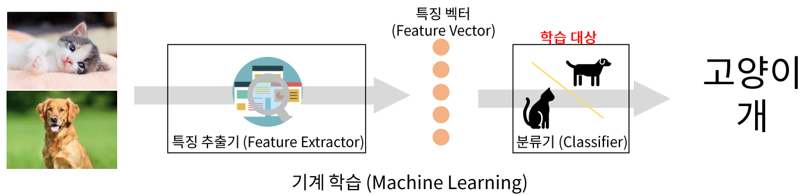
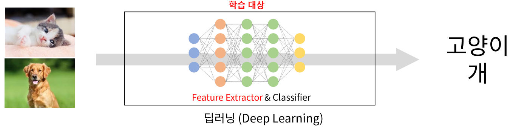
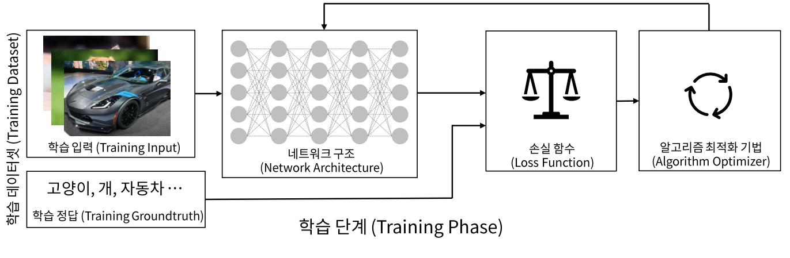
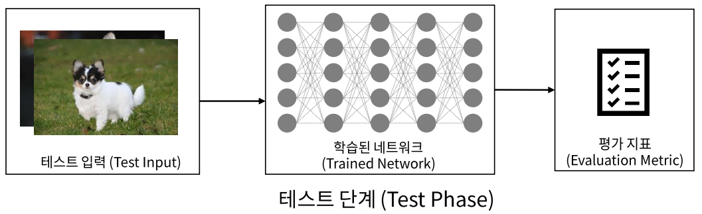

# 딥러닝 개요
- **인공지능 (AI - Artificial Intelligence)**
    - 지능: 어떤 문제를 해결하기 위한 지적 활동 능력
    - 인공지능
        - 기계가 사람의 지능을 모방하게 하는 기술
        - 규칙기반, 데이터 학습 기반
- **머신러닝(Machine Learning)**
    - 데이터 학습 기반의 인공 지능 분야
    - 기계에게 어떻게 동작할지 일일이 코드로 명시하지 않고 데이터를 이용해 학습할 수 있도록 하는 알고리즘과 기술을 개발하는 인공지능의 한분야
- **딥러닝 (Deep Learning)**
    - 인공신경망을 기반으로 하는 머신러닝의 한 분야. **비정형의 대용량 데이터 학습**에 뛰어난 성능을 나타낸다. 
    - 사람이 찾기 힘든 데이터를 처리한다.
    - 영상, 자연어, 번역

## 딥러닝의 특징
### 전통적 기계학습(Machine learning) Process

> - 특성 추출을 사람이 해야함

### 딥러닝(Deep Learning) Process

> - 특성 추출까지 해줌

## 딥러닝 프로세스

- **학습단계**

- **추론단계**

# Tensorflow
- <https://www.tensorflow.org/?hl=ko>
- 구글에서 오픈소스로 공개한 다양한 수치 연산과 딥러닝을 위한 라이브러리. 구글내 연구와 제품개발을 목적으로 사용하던 라이브러리를 2015년 공개.

## Keras
- <https://keras.io/>
- 파이썬으로 구현된 쉽고 간결한 딥러닝 라이브러리로 구글 개발자인 프랑소와 숄레(François Chollet)가 개발. 딥러닝 비전문가라도 쉽게 딥러닝 모델을 개발하고 활용할 수 있도록 직관적인 API를 제공한다. 내부적으로는 텐서플로우(TensorFlow), 티아노(Theano), CNTK 등의 딥러닝 전용 엔진위에서 작동된다. 
- Tensorflow 2.0 부터 Keras가 텐서플로우에 포함됨.

## Tensorflow 설치

### conda 가상환경 만들기
1. conda create -n tf2 python=3.8
2. conda activate tf2
3. pip install tensorflow==2.5.0
4. conda install jupyter pandas matplotlib
    - `conda install -c anaconda tensorflow`

# 컴퓨터에 GPU가 설치 된 경우
- GPU는 Nvidia 제품이어야 한다.
- Tensorflow 버전별 python, cuda, cudnn 버전: <https://www.tensorflow.org/install/source#gpu>
- GPU 드라이버 설치
- CUDA 설치
    - CUDA download: <https://developer.nvidia.com/cuda-toolkit-archive>
- cuDNN 설치    
    - cuDNN download: <https://developer.nvidia.com/rdp/cudnn-archive>

# Mac에서 설치
- 실리콘(M1, M2) 맥(Mac) OS 에서 텐서플로(TensorFlow) 설치: <https://teddylee777.github.io/tensorflow/tensorflow-silicon-install/>