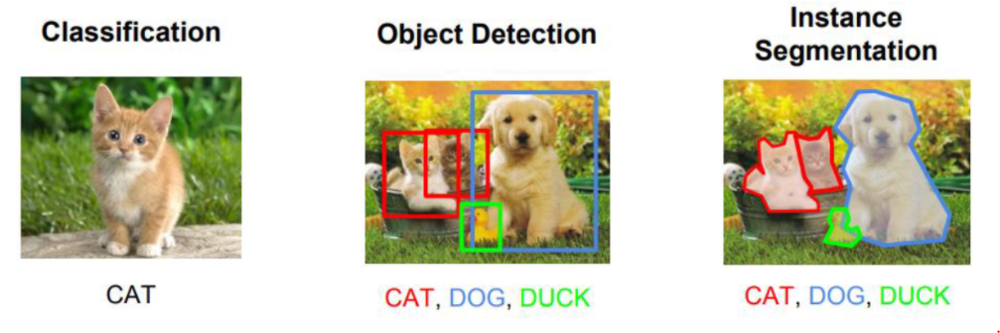
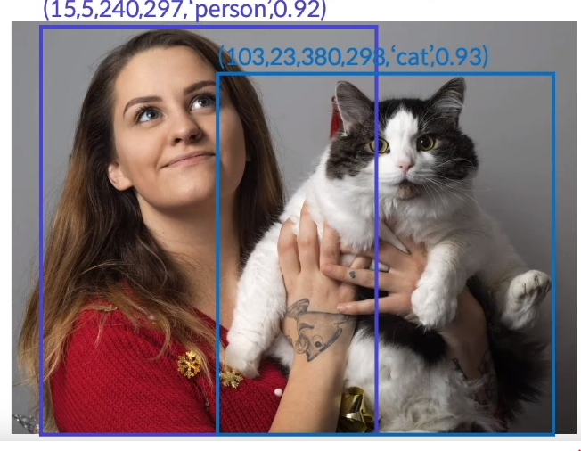
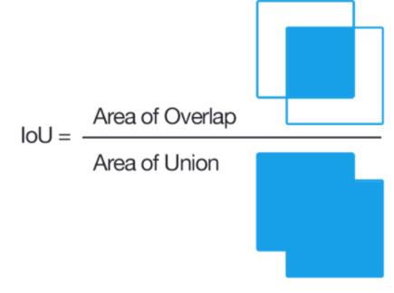
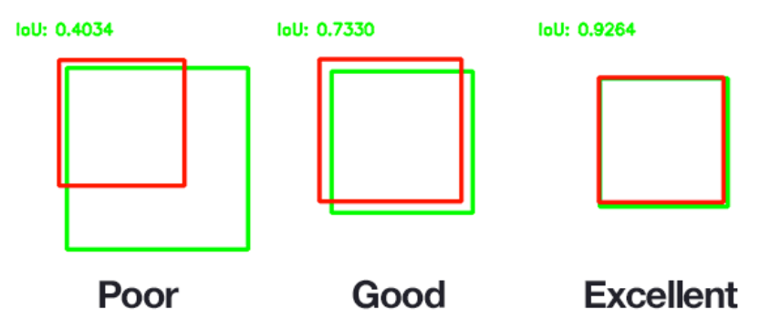
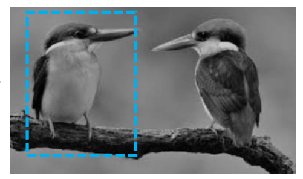
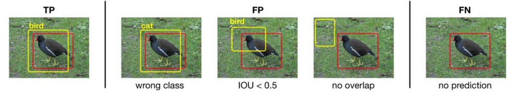
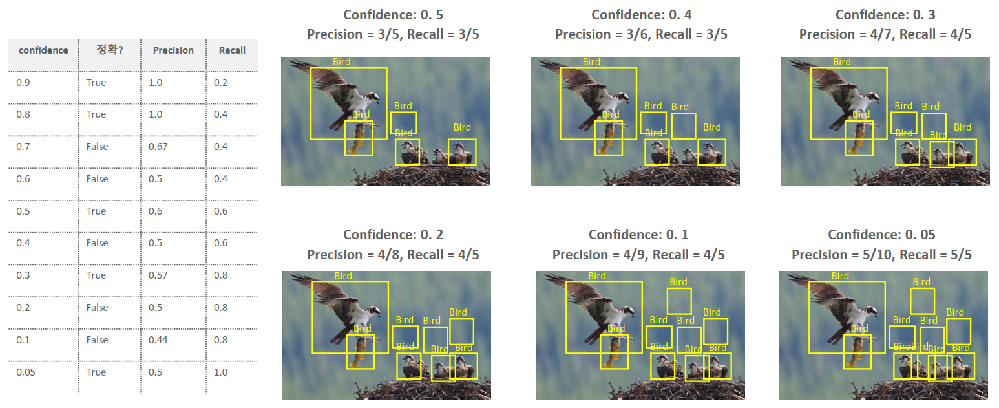
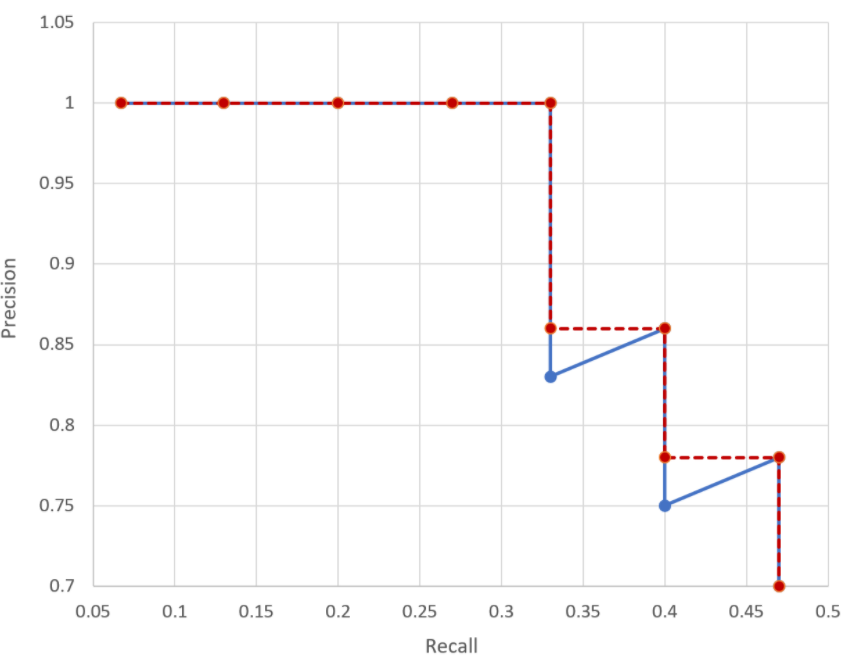
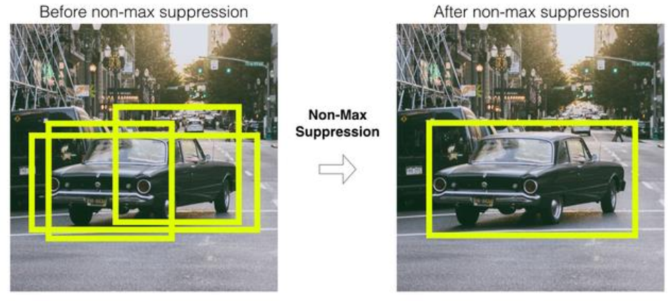
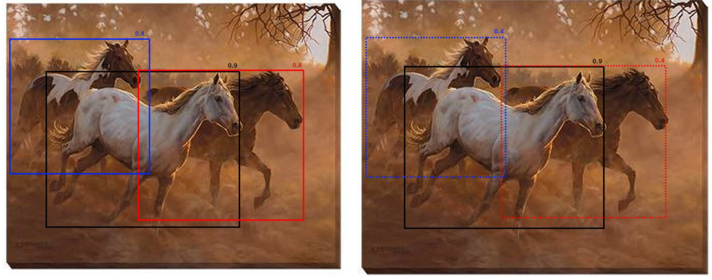

# Object Detection
## Computer Vision (컴퓨터 비전)
- 인간의 시각과 관련된 부분을 컴퓨터 알고리즘을 이용해 구현하는 방법을 연구하는 분야

### 주요 컴퓨터 비전 분야
- Image Classification (이미지 분류)
    - 이미지가 들어오면 어떤 물체인지 분석 &rarr; 주 물체로만 분류
- Object Detection (물체 검출)
    - 좀 더 세분화 하게 찾아줌 &rarr; 그 물체의 **위치**를 찾아 박스를 쳐준 후 물체를 **분류**
    - 물체의 좌표를 2개만 찾으면 됨
- Image Segmentation (이미지 세분화)
    - Object Detection 처럼 물체를 찾기는 하지만 픽셀 단위로 찾는다.
    - 픽셀 단위로 찾아야 하기 때문에 많은 좌표가 필요함

## Object Detection 개요
### Object Detection = Localization + Classification
- **Object Detection**은 영상에 존재하는 Object(물체)들을 Bounding Box를 이용해 **위치를 찾아내고(Localization-Regression 사용)** **class를 분류(Classification)**하는 작업이다
- 사진 속에서 찾는 정답이 1개인 Image Classification과는 달리 Object Detection은 정답의 개수가 정해져 있지 않기 때문에 찾기 힘들다
    - 사진 속에 있는 물체의 최대값을 정해 높는다.
- **Object Detection방식**
    - **One stage detector**: localization과 classification을 하나의 네트워크에서 처리
        - localization과 classification을 한 번에 처리하는 방식
        - 성능은 떨어지지만 속도가 빠르다 &rarr; 하지만 속도가 더 빠르기 때문에 이쪽을 주로 연구하게 되어 two stage detector보다 성능이 좋아지게 됨
    - **Two stage detector**: localization과 classification을 나눠서 순차적으로 실행 처리
        - 모델을 2개로 나눠서 각자의 역할을 수행하는 방식
        - 성능은 좋지만 속도가 느리다

#### Object Detection의 출력값
-  **Bounding Box(BBox)의 Location(위치)**
    - Bounding Box의 위치값은 4개로 구성되어 있는데 각 값이 가리키는 것은 모델마다 다르다. 대부분 아래 3가지 경우중 하나이다.
    - x좌표, y좌표, width, height 로 구성
        - x좌표, y좌표
            1. **Bounding Box 중심점의 좌표** &rarr; 주로 이 방식을 사용한다.
            2. Bounding Box 좌상단 좌표
        - width, height: Bounding Box 의 너비(width)와 높이(height)  
        
    3. x_min, y_min, x_max, y_max를 이용
        - x_min, y_min: 좌상단(Left-Top)의 x, y 좌표
        - x_max, y_max: 우하단(right-bottom)의 x, y 좌표

    - 알고리즘에 따라 좌표와 크기를 **실제값** 또는 **이미지의 width, height 대비 비율**로 지정한다.
        - 비율로 했을 때 장점은 **원본 이미지의 크기가 resize되어도 영향을 받지 않는다.**
        - ex. (X좌표/이미지 width, Y좌표/이미지 height, bbox width/이미지 width, bbox height/이미지 height)
    

-  **Object class 관련 출력값**
    1. Bounding Box안의 물체의 class 별 확률
    2. **Confidence score**
        - Bounding Box 안에 찾으려는 Object(물체)가 있을 확률값으로 0.0 ~ 1.0 사이의 값

- Object Detection 은 하나의 이미지안에서 N개의 Object를 검출해 내야 한다. 그런데 몇개를 찾을지는 입력 이미지마다 다르다.  그래서 한 이미지에 찾으려는 **Object가 있을 최대의 개수를 정하고** 모델은 무조건 그 개수만큼 bounding box(위치+분류)를 추론(출력)하도록 한다. 추론한 결과에서 **후처리를 통해 최종 추론결과**를 낸다.
- 위와 같은 이유로 bounding box마다 box안에 물체가 있을 확률(confidence score)을 모델이 찾도록 하여 낮은 확률의 box는 후처리에서 제거한다.

## Object Detection 성능 평가
### IoU (Intersection Over Uinon, Jaccard overlap)
- 두개의 bounding box가 얼마나 겹치는지를 나타내는 평가지표.
    - 두개의 Bounding Box가 일치할 수록 1에 가까운 값이 나오고 일치하지 않을 수록 0에 가까운 값이 계산된다.
- 일반적으로 IoU값 0.5를 기준으로 그 이상이면 많이 겹치는 것으로 적게 겹치는 것으로 본다.
    - 이 기준이 되는 값을 IoU Threshold(임계값) 라고 한다.
        - 임계값은 정할 수 있다.
    - **0.5 수치**는 ground truth와 66.% 이상 겹쳐(overlap)되야 나오는 수치이며 사람의 눈으로 봤을때 잘 찾았다고 느껴지는 수준이다.
- 예시
    - Train(학습) 시 모델이 예측한 bounding box와 ground truth(정답) bounding box가 얼마나 겹치는지 확인하는 지표로 사용.
    - 모델이 추론한 결과에서 하나의 object에 대해 여러개 bounding box가 나오면 그중 하나만 선택할 때 사용.(NMS)

$$\cfrac{두\,영역의\,교집합\,영역}{두\,영역의\,합집합\,영역}$$

### mAP (mean Average Precision)
- 여러개의 실제 Object가 검출된 재현율(Recall)의 변화에 따른 정밀도(Precision) 값을 평균화 한 것
    - 클래스들의 AP의 평균값
- mAP를 이해하기 위해선 precision, recall, precision-recall curve, AP(Average Precision)을 이해 해야 한다.
> precision-recall curve, AP(Average Precision)는 Object Detection(물체 검출) 알고리즘 성능 평가를 위해 사용되는 방법중 하나이다.

#### Precision(정밀도)와 Recall(재현율)
- 정밀도는 Positive로 예측한 것 중 실제 Positive인 것의 비율. (Positive로 예측한 것이 얼마나 맞았는지의 수치)
    - Object Detection에서는 Detect(검출) 예측결과가 실제 Object(물체)들과 얼마나 일치하는지를 나타내는 지표
    - TN에 대한 개념이 필요 없다 &rarr; positive인 값만 필요하기 때문
$$
\cfrac{TP}{All\,Detection}
$$    
- 재현율은 실제 Positive인 것 중 Positive로 예측한 것의 비율. (Positive인 것을 얼마나 맞았는지의 수치)
    - Object Detection에서는 실제 Object(물체)들을 얼마나 잘 Detect(검출) 했는지를 나타내는 지표
$$
\cfrac{TP}{All\,Ground\,Truth}
$$

위의 그림을 보면 두마리 새 중 한마리만 Detect 했다.
- 1개를 예측해서 1개 맞았으므로 Precision은 100%(1.0)가 된다.
- 새는 두 마리인데 하나만 Detect(검출) 했으므로 Recall은 50%(0.5)가 된다.

#### Object Detection에서 TP, FP, FN

- **FP(False Positive)**
    1. 다른 class로 예측한경우. 
    2. IoU가 threshold 이하인 경우.
    3. 아예 잘못된 위치로 예측한 경우
    - Positive(예측은 했으나) False(잘못) 한 것
- **FN(False Negative)**
    - 아예 찾지를 못한 경우

#### precision과 recall의 trade off(반비례관계)
> **Confidence threshold:** 지정된 값 이상의 confidence를 가진 결과만 예측결과로 사용하고 그 이하인 것들은 무시한다.   
> 이 값을 0.5로 설정하면 confidence score가 0.5 미만인 결과(0.1,0.2,0.3등)는 무시한다.이 값은 하이퍼파라미터이다. 
- **confidence threshold를 낮게** 잡으면 precision은 낮게 recall은 높게 나온다.
- **confidence threshold를 높게** 잡으면 precision은 높게 recall은 낮게 나온다.
- Precision과 Recall은 이렇게 반비례 관계를 가지기 때문에 Precision과 Recall의 성능 변화 전체를 확인해야 한다 &rarr;**precision-recall curve**

#### Precision-Recall curve
- confidence threshold의 변화에 따라 recall과 precision의 값이 변화게 된다.  
이것을 **recall이 변화할때 precision이 어떻게 변하는지**를 선그래프로 나타낸 것을 Precision-Recall curve 라고 한다.
- Object Detection 알고리즘의 성능을 성능을 평가하는 방법으로 많이 사용된다.

#### Average Precision (AP)
- precision-recall curve 그래프를 **하나의 scalar 값으로 정량화**한 값
- Average precision는 precision-recall curve 그래프의 선 아래 면적을 계산한 값이다.  
- Average precision은 **0 ~ 1사이**의 값을 가지며 1에 가까울 수록 좋은 성능을 나타낸다. 
- Average Precision을 계산은 Precision-recall curve의 선을 단조적으로 감소하는 그래프로 바꾼 뒤 면적을 계산한다.

 Blue: Precision-Recall curve, Red: Average Precision 

# Model 추론 결과 후처리 (Post Processing)
- 모델이 추론한 Bounding Box 예측 결과를 후처리를 통해 정제한다.

## NMS
### (Hard) NMS
    - Non Max Suppression
    - Detect(검출)된 bbox(Bounding Box)들 중에서 비슷한 위치에 있는 겹치는 bbox들을 제거하고 가장 적합한 bbox를 선택하는 방법

### 실행 로직
1. Detect(검출)된 Bounding Box 중 Confidence score가 Confidence threshold (신뢰 임계값: Hyper Parameter) 이하의 박스들을 제거한다.
    - 찾고자 하는 물체를 표시한 bbox만 제외하고 다 지운다
2. 가장 높은 confidence score를 가진 bounding box 순서대로 내림차순 정렬을 한다
3. 높은 confidence score를 가진 bounding box와 겹치는 다른 bounding box를 모두 조사하여 IoU가 특정 threshold(임계값) 이상인 bounding box들을 모두 제거한다. (ex. IoU threshold > 0.5)
    - IoU(곂치는 부분)이 threshold 이하이면 그대로 유지 &rarr; 서로 다른 값이다.
    - IoU가 threshold 이상이면 작은 값 지우기 &rarr; 같은 값을 나타내는 것으로 좀 더 confidence가 높은 것을 남긴다.

- confidence threshold는 보통 0.2에서 0.5로 잡아준다.
- 단점: 물체가 곂쳐 있을 경우 하나밖에 찾지 못해 mAP가 낮아진다. &rarr; Soft NMS
### Soft NMS
- 겹치는 bbox의 경우 confidence score가 낮은 것을 제거하지 않고 confidence score를 줄여서 남기는 방식
- [논문](https://arxiv.org/pdf/1704.04503.pdf)

- 위의 그림의 경우 좌우 사이드에 있는 말의 confidence를 0.4로 줄인다. (hard는 제거)