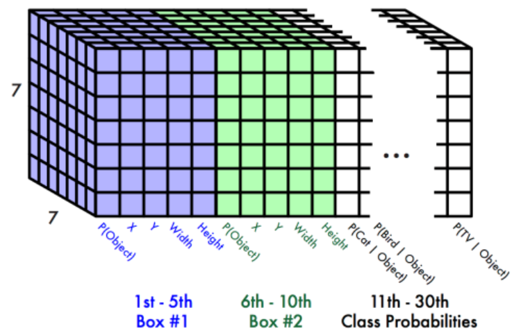
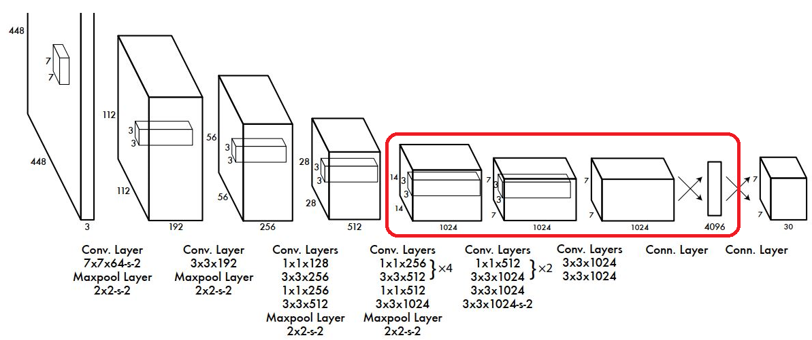
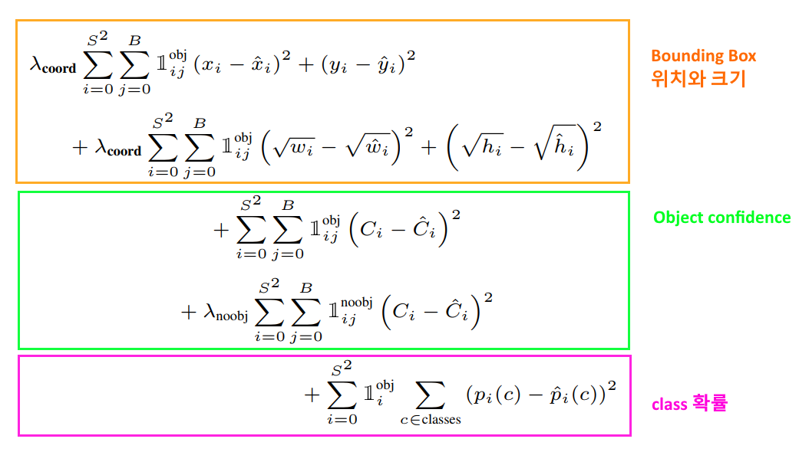
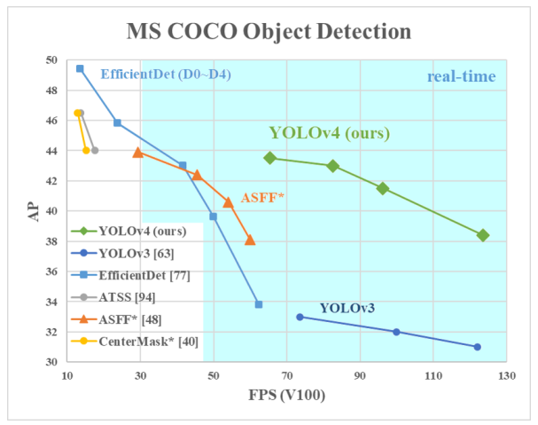

# Object Detection 모델

## Object Detection = Localization + Classification
- **Object Detection** 은 이미지에 존재하는 Object(물체)들을 Bounding Box를 이용해 그 위치를 찾아내고(Localization) class를 분류(Classification)하는 작업이다.   
- Deep learning 을 이용한 Object Detection 모델들은  One stage detector와 Two stage detector 두가지 방식이 있다.

## One stage vs Two Stage detector
- **One stage Detector**
    - Localization과 classification을 하나의 네트워크에서 처리한다. 
- **Two stage Detector**
    - Localization과 classification을 처리하는 모델을 따로 만들어서 각각 순차적으로 처리한다. 
    - 정확도가 높은 대신 속도가 느리다.  느리다는 단점 때문에 Real-Time Detection이 안된다.

# YOLO (You Only Look Once)
- 2015년 발표된 Joseph Redmon, Santosh Divvala, Ross Girshick, Ali Farhadi이 발표한 Object Detection 모델. 
- **최초의 One stage 계열의 object detection**로 이전의 RCNN 계열의 모델과 다르게 Real time detection을 구현했다.
- 논문: <https://arxiv.org/abs/1506.02640>
- 홈페이지: <https://pjreddie.com/darknet/>

## 특징
- 통합된 Network로 Detection (Unified Detection)
    - 기존 two Stage Detection과 다르게 YOLO는 후보영역 추출(Region Proposal)과 물체검출 및 분류(Object Detection & Classification)을 통합해 하나의 딥러닝 네트워크가 한번에 처리한다.
    - Object Detection을 Single Regression Problem 으로 문제를 재정의
        - 입력된 이미지로 부터 bounding box 좌표(coordinate)와 class 확률을 한번에 구한다.
- C로 구현했으며 Darknet(version 2부터)이라는 자체 뉴럴네트워크 프레임워크를 사용한다.    
- 기존 2 stage 계열의 Faster R-CNN에 비해 약 6배 빠른 detection 속도를 보여 실시간 detection이 가능하다. 빠른 대신 성능은 떨어진다.

### 장점
- One stage detection으로 속도가 매우 빠르다.
    - 기존의 다른 real-time detection system과 비교해 2배 높은 mAP를 보인다.
- 낮은 False Positive를 보인다.
    - 특히 배경을 물체로 잘못 검출하는 것이 적다.
    - False Positive: Object를 잘못 Detection한 것.
- Object에 대한 좀 더 일반화된 특징을 학습한다.
    - Natural 이미지로 학습하고 화가가 그린 그림으로 테스트 했을때 다른 시스템보다 더 높은 성능을 보임

### 단점
- 기존의 2 stage detection에 비해 낮은 성능을 보인다.
- 작은 물체를 잘 감지하지 못한다.

## Yolo Prediction(추론단계)

1. 전체 이미지를 S X S 의 grid로 나눈다. (S = 7)
2. 각 Cell에서 Bounding Box와 Confidence 예측한다.
    - 각 cell에서 B(2)개의 Bounding Box와 그 Bounidng Box에 대한 신뢰점수(Confidence)를 예측한다.
    - Bounding Box는 (c, x, y, w, h) 5개의 값으로 구성된다.
        - (x,y)는 중심점의 좌표, (w,h)는 bounding box의 너비의 높이, c는 해당 bounding box에 대한 신뢰점수(Confidence)
    - Confidence: $\large Pr(Object)*IoU^{truth}_{pred}$
        - 물체가 있을 확률 * IoU점수(Ground truth와 예측bbox간의 겹치는 부분의 넓이)
3. 각 cell에서 C개의 class별 확률을 예측한다. 
    - Class일 확률: $\large Pr(Class_{i}|Object)$ 
    - class에대한 확률예측은 bounding box 가 아니라 cell 단위로 진행한다.
4. 모델이 예측한 Bounding Box들을 NMS 후처리 후 최종결과 출력한다.

### 최종 출력(예측) 결과
- Yolo model은 $S \times S \times (B*5 + C)$ shape의 3차원 Tensor로 출력한다.
    - S: grid 개수 - (논문 - 7)
    - B: Grid별로 예측할 Bounding Box의 개수 (논문 - 2)
    - C: class개수 (논문에서는 Pascal VOC 데이터셋을 사용. Pascal VOC class개수 - 20개)
        - 논문의 최종 결과는 (7,7,(2*5+20))=>(7, 7, 30) shape으로 반환됨

- Network의 출력 결과 총 98개의 Bounding Box가 예측되고 **Non Maximum Suppression** 알고리즘으로 후처리 한 결과가 최종 예측결과가 된다.  

## Network Design

- 네트워크 구조는 단순한 Convolution Network 이다.
    - 입력으로 $448 \times 448$ 이미지를 받는다.
    - 학습시 Bounding box 좌표(cx, cy, w,h) Ground Truth Label은 전체 이미지 width, height 기준의 비율로 0~1사이 실수로 normalize한다.
    - Activation Function으로 Leaky ReLU를 사용하였고 마지막 출력 Layer만 Linear Function을 사용함.
- Fully Connected Layer를 통과하여 나온 결과를 ($7 \times 7 \times 30$) 형태로 reshape해서 최종 결과로 출력한다.
- 앞단의 20개의 Layer들은 Base Network(Backbone-특징 추출 네트워크)으로 $224 \times 224$ 크기 이미지넷 데이터셋으로 Pretrain의  시켰다.
- 학습시 Base Network(Backbone) 레이어들은 Frozen(고정) 시키고 위 그림의 붉은 Box의 Convolution Layer들을 Object Detection Task에 맞춰 Transfer Learning을 함.

## Loss Function

> - $\mathbb{1}_{i}^{obj}$ : i번째 cell 의 object. 
> - $\mathbb{1}_{ij}^{obj}$ : i번째 cell, j번째 bounding box 의 object   
> - $\mathbb{1}_{i}^{noobj}$ : i번째 cell, j번째 bounding box에 검출된 object가 없다.
> - $\lambda_{coord}$ : Bounding Box 오차에 대한 가중치. 논문에서는 5
> - $\lambda_{noobj}$ : object가 없을 경우 가중치. 논문에서는 0.5

### Bounding Box 위치와 크기 Loss 계산
- bounding box를 찾는 것이 가장 중요하므로 이것에 대한 오차를 크게 만들기 위해 가중치 $\lambda_{coord}$ 를 곱한다.
### Object Confidence Loss 계산
- 물체가 없는 confidence score의 오차의 영향력을 조절하기 위해 가중치 $\lambda_{noobj}$ 를 곱한다.
### Classification Loss 계산
- classification loss로 실제 class와 예측한 class의 확률의 차이를 Mean squared error로 계산

# YOLO V2 (YOLO9000)
- YOLO의 성능을 개선한 두번째 버전으로 2016년 후반에 발표됨. 총 9000개의 class를 검출했다고 해서 YOLO9000으로 불리기도 한다.
- 논문: <https://arxiv.org/pdf/1612.08242.pdf>

## 주요 변화
- **Anchor box 사용**
    - Yolo는 grid cell만 나누고 grid cell을 기준으로 최적의 bounding box를 찾는 방식을 사용해 성능이 떨어짐. 
    - Yolo V2는 Faster R-CNN에서 도입된 anchor box를 적용하여 성능을 높임
    - Anchor box
        - 다양한 크기와 종횡비를 가진 bounding box를 미리 정의해 놓고 그것을 기준으로 bounding box를 찾는다.
        - Yolo에서는 학습 초기 단계에서 box의 중심좌표(x,y)위치를 너무 랜덤하게 예측하기 때문에 모델이 불안정해지는 문제가 있었는데 anchor box를 사용하면서 이를 해결할 수 있었다. 
        - 모든 anchor box에 대해 그 안에 Object 가 있을 확률을 예측한 뒤 Object가 있는 경우 class를 예측한다. 
            - $P(class_{i} | Object)$
        - Bounding Box의 center 좌표가 grid cell에서 벗어나지 않도록 제약을 두었다.22

# Yolo V3
2018년 4월에 발표된 버전. 

- 홈페이지: <https://pjreddie.com/darknet/yolo/>
- 논문: <https://arxiv.org/pdf/1804.02767.pdf>

- Yolo V2 의 아키텍처를 거의 그대로 따라하고 그 당시 나온 각종 기법들을 기존 Yolo V2 모델에 적용해 보고 성능 향상에 도움이 된 몇몇 기법을 추가했다.
- 빠른 속도는 유지하면서 정확도를 높였다.
    - 320 X 320 이미지를 input으로 받아 28.2 mAP의 정확도와 22ms의 추론시간의 성능을 보임.

## 주요 변화
- Base Network(Backbone) 을 Darknet-19에서 Darknet-53으로 변경
    - ResNet의 skip connection을 적용하여 layer를 더 많이 쌓아 성능을 높임.
- Bounding Box를 예측할 때 3개의 다른 Scale에서 box를 예측함.
- Classification을 Softmax를 사용하지 않고 개별 클래스 별로 sigmoid를 사용해 binary classification을 함.
    - 여러 물체가 겹쳐있는 경우(하나의 박스에 여러 Object들이 있는 것) 더 효과적. 
- 그 외에 발표 시점의 다양한 성능 향상 기법을 적용해 봤으나 yolo model에는 효과가 없거나 오히려 성능을 떨어트려 적용하지 않았다고 함.

# Yolo V4
- 논문: https://arxiv.org/pdf/2004.10934.pdf
- 2020년 4월에 발표됨. Joseph Redmon이 빠지고 Alexey Bochkovskiy 등이 참여.

## 기본 Network 구조 개요
- **Backbone**
    - 역할: feature map 추출
    - CSP-Darknet53 사용
- **Neck**
    - 역할: Backbone의 추출된 Feature map을 refinement(정제), reconfiguration(재구성)하여 head에 전달
    - SPP(Spatial Pyramid Pooling), PAN(Path Aggregation Network)
- **Head**
    - 역할: object detection(bbox와 class 추론) 
    - Yolo-V3와 동일

## 적용한 기법들
- Yolo V4 도 V2, V3 버전과 마찬가지로 그 당시 나온 여러 Object Detection 관련 기술들을 Yolo 모델에 적용해보고 성능 향상에 효과가 있는 기법들을 접목했다. 
- 접목한 기술군을 두가지 범주로 설명
    - Bag of Freebie: 검출속도에 영향을 주지 않으면서 성능향상이 있는 딥러닝 기법들.
    - Bag of specials: 검출속도는 약간 느리게 하지만 성능향상이 되는 딥러닝 기법들

### Bag of Freebie
- 데이터 증강법(Image Augumentation)
    - CutMix: 이미지의 일부영역을 다른 class로 변경
    - Mosaic Data Augmentation: 4개 class의 이미지를 crop해서 붙임
- DropBlock Regularization 
    - Dropout이 random 하게 가중치들을 out시키는 것과 달리 DropBlock 은 **일정한 범위를 out** 시키는 규제 방식이다.
- Focal Loss 사용
    - 분류하기 쉬운 샘플의 경우 학습시 기여도가 낮기 때문에 학습에 비효율적이다. 이것을 해결하기 위해 cross entropy에 판별이 쉬운 데이터에 대한 loss를 더 낮게 만들어 주는 loss함수
    - $\large FocalLoss = - (1-p_t)^\gamma log(p_t),\:\; \gamma>=0$
- Hard Negative Example Mining
    - Hard Negative: Negative를 Positive라고 예측하기 쉬운 데이터를 말한다.
    - Hard Negative Mining은 Hard Negative 데이터들을 모아 학습데이터에 추가해 학습시켜 **False Positive**오류에 대한 성능을 높인다.
- Class label smoothing
    - 기존에 label들은 0, 1 같은 정수로 labeling을 했는데 이것을 **0.1, 0.9** 같은 실수의 확률로 표시한다.     
    - Labeling은 사람이 하는 것이기 때문에 실수를 할 수가 있다. 이것을 보정하는 기법. 
- IoU의 성능을 높인 CIoU-Loss를 적용
- CBN(Cross mini-Batch Normalization) 적용
- CA(Cosine annealing scheduler) 적용    

### Bag of Special
- 최신 활성함수인 Mish 적용
    - ReLU의 변형으로 훈련속도가 빨라지고 overfitting 문제를 방지하는 효과
   
    - [참고](https://krutikabapat.github.io/Swish-Vs-Mish-Latest-Activation-Functions)
- 작은 물체에 대한 검출능력은 높이는 기법
    - SPP (Spatial Pyramid Pooling Layer) 적용해 다양한 크기의 이미지를 input 으로 받는다.
    - PAN (Path Aggregation Network) block 적용, SAM (Spatial Attention module) 적용해 성능을 향상시켰다.