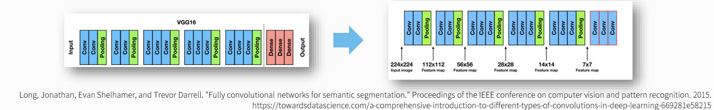

# Segmentation 개요

- Segmentation(세분화)란 이미지에서 관심객체를 픽셀단위로 추출하는 것을 말한다. 관심객체가 이미지 어디에 있는 위치 뿐아니라 그 객체의 모양을 추출하고자 할때 방식이다.
- 딥러닝의 발전과 함께 많은 성능향상이 이뤄진 분야이다.


- [실질적으로 컴퓨터가 모델을 뽑아낼 경우](https://www.jeremyjordan.me/semantic-segmentation/)


# Segmentation 종류  

## Semantic segmentation
- 관심객체를 Category(범주) 별로 분류하는 segmentation이다. 이미지내의 모든 픽셀(요소)에 대해서 class를 분류하는 것을 목표로 한다.  (배경포함)
- 같은 class의 객체가 여러개 있을 경우에 **각각을 구분하지 않는다.**

## Instance segmentation
- 이미지에서 관심객체를 객체별로 분류하는 segmentation이다.
- Semantic segmentation과 다르게 동일한 클래스라고 해도 다른 객체일 경우 구분해서 검출하고 배경의 경우는 분류하지 않는다.

## Panoptic segmentation
- Semantic segmentation과 instance segmentation을 합친 방식이다.
- 이미지내의 모든 픽셀에 대해 클래스별 예측을 하고 각각의 instance 별로 구분하여 추론한다.

# 주요 모델
## Fully Convolution Networks for Semantic Segmentation(FCN)
- 2015년 CVPR 학회에서 발표된 모델
- 당시 이미지 분류에 좋은 성능을 보이던 CNN 모델을 segmentation 업무에 적용시키려함.
- <https://arxiv.org/abs/1411.4038>

### 모델 핵심 구조
01. **전체 네트워크 구조를 Convolution Layer로 구성**
- 기존 이미지 분류 모델들은 입력층에서 중간부분까지 Convolution Layer들을 이용해 특징들을 추출하고 그 특징을 출력층인 Fully Connected Layer 에 전달하여 결과를 출력하였다.
- 이런 구조는 semantic segmentation에서는 다음과 같은 이유로 한계점이 있다.
    1. 3차원의 Feature map이 1차원으로 변환되면서 이미지의 위치정보가 사라진다.
        - Segmentation을 진행 할 때 flatten을 진행하면 2차원 형태를 1차원으로 바꾸기 때문에 **위치 정보를 잊어버리게** 되어 성능이 떨어진다.
            - Dense layer의 경우에는 사진을 통한 분류만을 진행 되기 때문에 위치 정보가 필요없지만 Segmentation 필요하다
    2. Fully connected Layer의 weight 개수를 모델 구성시 정해야 하기 때문에 고정된 크기의 input을 사용해야 한다. 
- 이런 한계점을 보완하기 위해 fc-layer들을 제거하고 전체 네트워크를 convolution layer로 구성함. 그 결과 **object가 있을만한 영역**을 나타내주는 heatmap이 생성되는 것을 확인할 수 있었다.




- VGG16의 마지막 FC-layer를 3개의 1 x 1 필터의 convolution layer로 대체. 


02. **Upsampling**
- Segmentation을 위해 size가 작아진 Feature map을 다시 Input image의 size로 키움.
- Upsampling  방식으로 Bilinear Interpolation 방식과 Transpose Convolution 방식을 사용함.

    - [Bilinear Interpolation](https://darkpgmr.tistory.com/117)
        - 1차원 구조의 보간법인 Linear interpotation을 2차원으로 확장한 방식    
        - size를 키우면서 생긴 공간을 계산식을 이용해 채워넣는다. 

    - Transpose Convolution
        - convolution 연산으로 size가 작아진 feature map을 원래 크기로 돌리는 convolution 연산. **값을 복원하는 것이 아니라 size를 복원한다.**
        - filter size - 1크기의 zero padding을 붙인다. 설정한 **stride 만큼 feature map의 원소들을 떨어 트리고, 지정한 padding 만큼 zero padding을 제거한다.**
        - <https://github.com/aqeelanwar/conv_layers_animation#transposed-convolution>

03. **Skip connection**
- Downsampling 으로 size가 줄어든 상태에서 bilinear interpolation 방식으로 upsamping하여 디테일이 사라진 부정확한 결과를 출력하게된다.
- 그래서 이전 Layer의 디테일이 남아있는 Feature map을 합쳐서(skip) upsampling을 수행한다.
- FCN-32s: skip connection을 사용하지 않은 모델로 마지막 출력결과를 32배 upsampling해서 FCN-32s라고 한다.
- FCN-16s: 4번째 conv block 의 Feature map을 skip connection 하여 16배 upsampling을 수행한다.
- FCN-8s: 3번째 conv block의 Feature map을 skip connection 하여 8배 upsampling을 수행한다.

## U-Net
- 2015년도에 발표한 의료영상 segmentation을 위한 FCN(Fully Convolution Network)기반에 CNN 모델.
- Downsampling과 Upsampling이 연결된 U 자 모양이어서 U-Net이란 이름이 붙여짐.
- <https://arxiv.org/abs/1505.04597>


### 모델구조
- U-Net 모델은 다음 세가지 구조로 나눠진다.
    1. Contracting Path (수축경로)
        - 점진적으로 넓은 범위의 이미지를 참고하여 Context 정보(특징 정보)를 추출한다.
    2. Expanding Path (확장 경로)
        - Context 정보를 픽셀의 위치정보와 결합해 각 픽셀이 어떤 객체에 속하는지 구분한다.
    3. Bottlenet 
        - Contracting path에서 Expanding path로 전환되는 구간.
- Convolution 연산과정에서 패딩을 사용하지 않기 때문에 모델의 output size가 input size보다 작다. 
    - input: 572 X 572 X 3
    - output: 388 X 388 X (class개수)

# YOLOv8을 사용한 Segmentation 예제
## 모델 로딩
    ```python
    from ultralytics import YOLO
    import numpy as np
    import cv2

    MODEL_PATH = r'models/yolov8n-seg.pt' # 모델 가져오기
    FILES_PATH = r'test_image_seg/beatles.jpg' # 원하는 사진 위치

    # 모델 생성
    model = YOLO(MODEL_PATH)

    result_list = model(FILES_PATH, save=True, save_txt=True, line_thickness=1)
    ```

### 결과


## Segmentation 추론결과 조회
- segmentation 추론 결과는 Masks를 이용해 분할된 mask 정보와 Boxes를 이용해 추론한 bounding box의 결과를 조회한다.
- **ultralytics.yolo.engine.results.Masks**
    - Segmentation 의 결과 type
    - Results.masks 로 조회한다.
    - 주요 속성, 메소드
        - shape: [object 개수, height, width]
            - height, width: mask image size
        - data/masks: 결과 Tensor(3차원 배열) 반환. `0: 배경, 1: 물체` 를 원소로 가지는 결과 Tensor를 반환한다.
            - 픽셀별로 물체 인지 아닌 지를 표현하는 tensor를 반환
        - segments : mask의 bounding 좌표(경계선 좌표)를 물체별로 list에 담아서 반환한다.
            - 물체의 외곽선을 그리는 좌표들을 반환
- **ultralytics.yolo.engine.results.Boxes**
     - Results.boxes로 조회
    - 주요 속성
        - shape: 결과 shape. (찾은 물체개수, 6)
        - boxes
            - 6: 좌상단 x, 좌상단 y, 우하단 x, 우하단 y, confidence score, label
        - xyxy
            - bounding box의 `좌상단 x, 좌상단 y, 우하단 x, 우하단 y` 좌표 반환
        - xyxyn
            - xyxy를 이미지 대비 비율로 반환
        - xywh
            - bounding box의 `center x, center y, 너비, 높이` 를 반환
        - xywhn
            - xywh를 이미지 대비 비율로 반환
        - cls: 찾은 물체의 label
        - conf: cls에 대한 confidence score (그 물체일 확률)
        - boxes
            - `x, y, x, y, conf, cls` tensor를 반환

# custom dataset training

- custom dataset training은 object detection과 동일
- custom dataset: <https://universe.roboflow.com/angelo-maglasang-vuuq3/crack_flip_rotate/dataset/1>