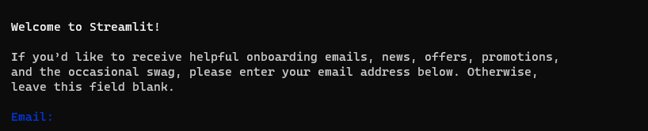

# Streamlit
## Streamlit이란?
- streamlit: <https://streamlit.io/>
- 데이터 스크립트를 가지고 웹페이지를 만들어주는 라이브러리
    - 파이썬 코드로만 이루어져있다.
    - Front-end, 웹사이트 지식이 필요없다.

# Streamlit 스크립트 파일 만들기
## 라이브러리 설치
```
pip install streamlit
```

## 파이썬 코드 예시 (.py 형식)

```python
import streamlit as st

# 출력
st.title('제목')
st.header('중제목')
st.subheader('소제목')
st.write('일반 글 1')
st.write('일반 글 2')
```


# Streamlit 실행방법

## 시작
1. 올리고 싶은 파이썬 파일을 올리고 싶은 경로로 들어간다
2. `start streamlit run {파이썬 파일}` 입력한다.
    - 실행 종료가 잘 안되기 때문에 `start`를 입력해서 새로운 cmd를 연다
3. 새로운 창에서 `Email:` 부분에 아무것도 치지 않고 `Enter를 입력한다`


## 모델 사용 방법
- `Browse files` 버튼을 누른 후 확인해보고 싶은 이미지 파일을 넣으면 결과 값이 검출이 된다.
