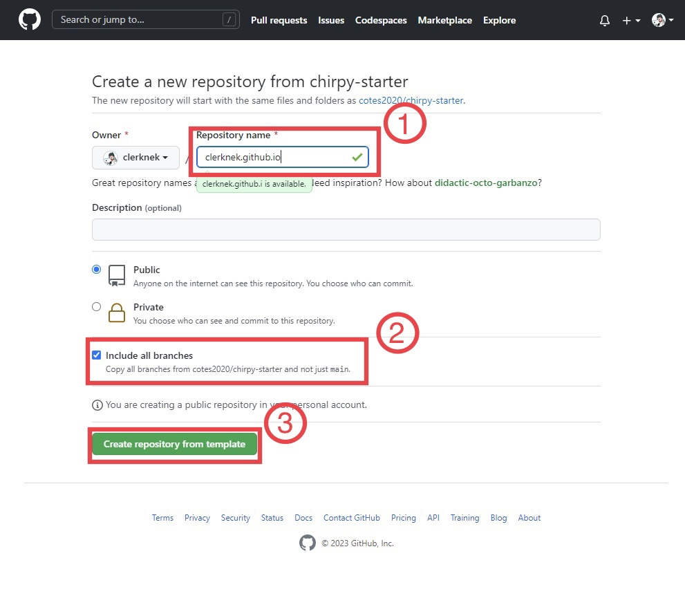
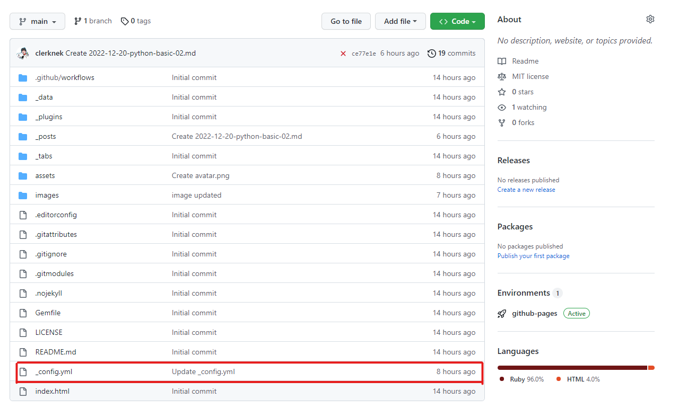
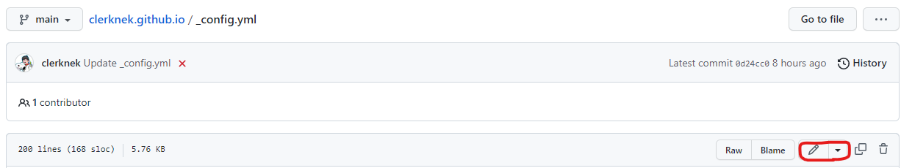
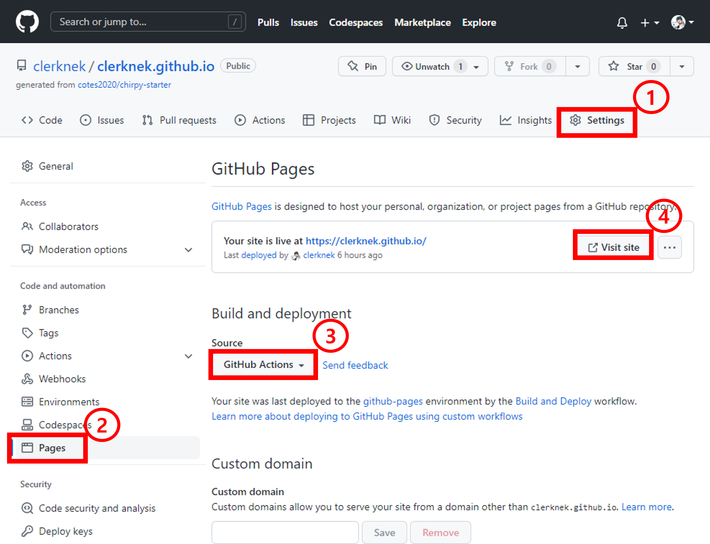
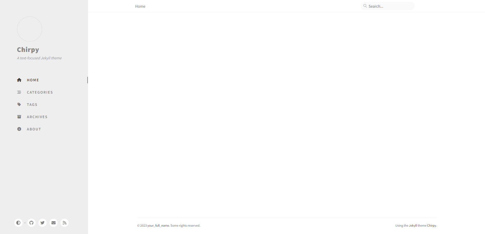

> 이번 포스팅에서는 Chirpy Starter를 이용해 간단하게 Github Page 만드는 법을 설명드리겠습니다. 관련 내용은 아래 제작자분 사이트에서 참고하였습니다.
> 아래 내용은 windows 기반으로 했습니다.

> - Chirpy 제작자 Github 주소
> <https://chirpy.cotes.page/posts/getting-started/#option-1-using-the-chirpy-starter>
> - Chirpy 튜토리얼
> <https://chirpy.cotes.page/categories/tutorial/>

## 왜 Github Page, Chirpy Starter인가?
Github Page의 장단점은 다른 분 사이트로 가보면 다 있으니 넘어가도록 하고 제 개인적인 경험에 따라 이야기를 해보도록 하겠습니다. 제가 Github Page를 사용한 이유는 크게 3가지가 있었습니다. 
>
1. 자유롭게 블로그를 설정하고 싶다.
2. Github에 좀 더 익숙해지고 싶다.
3. Markdown 기반으로 블로그 글을 작성하고 싶다.
>

Github Page관련 테마를 찾아본 결과 가장 마음에 들었던 테마가 바로 Chirpy였습니다.  
그 후 테마를 적용하는 방법을 찾아봤는 데 다른 사이트들을 찾아보니 다들 Fork를 이용하거나 직접 repository를 다운받아서 설정을 하는 등 github 초보인 저에게는 좀 어려운 방법으로 진행되었습니다. 또한 그러한 방법에는 반드시 Ruby나 다른 설치 프로그램을 다운받아야 되서 반쯤 포기한 상태일 때 해결책을 찾게 되었습니다!  
그 방법은 다름이 아닌 제작자 분의 블로그에 나와 있었는데요. 블로그에 나와 있는 설치 방식 중 첫번째인 **Chirpy Starter**를 이용해 보니 github에 대해 잘 몰라도 5분만에 Page를 만들 수가 있었습니다.  
이러한 경험을 바탕으로 저와 비슷한 처지이신 분들께 조금이나마 도움이 되도록 이번 글을 작성했습니다.

### 3줄 정리
1. Github Page라는 것을 알게 됨
2. 테마를 설정하기 위해 Chirpy를 적용하려고 노력했으나 계속 실패함
3. 제작자 분의 Github Page를 통해 Chirpy Starter를 사용해보니 엄청 쉽게 설치함

## 사전 준비
Github Page를 만들기 위해 우선 [Github 사이트](https://github.com/)에 들어가셔서 회원가입을 하셔야 됩니다.
가입 후 로그인이 끝났다면 Github Page를 만들 준비가 끝났습니다.

## Github Page 만들기
<https://github.com/cotes2020/chirpy-starter/generate>
1. 위 링크로 들어가셔서 아래 사진 ① 부분에 `(자신의 깃허브 닉네임).github.io`를 입력하고 ②에 체크한 후 ③에 있는 버튼을 눌러 repository를 생성합니다.
>

2. 새롭게 생성된 repository에 들어가면 이런 파일들이 있는데 그 중 `_config.yml`파일에 들어갑니다.
>

3. Github Page url을 설정해주기 위해 `_config.yml`파일 상단에 위치한 편집 버튼을 누릅니다.
>

4. `yml`파일을 내리다 보면 `url: ''` 부분이 있는 데 그 부분을 `https://(1번에서 생성한 repository 이름)`을 입력한 후 스크롤을 마지막까지 내려 파일을 저장합니다. 
입력 예시) `url: 'https://clerknek.github.io'`
>

5. repository 상단에 위치한 **Actions** 탭에 들어가셔서 **workflow**가 초록색 체크 표시가 뜰 때까지 기다려 줍니다.
>
>

6. **workflow**에서 체크 표시가 뜨면 ① Github 상단에 위치한 **Settings**탭에 들어가신 후 ② Page 탭에 들어가 ③ **Source**를 **Github Actions**로 바꿉니다. 
>

7. 6번을 다 끝내고 6번 사진의 ④ **Visit site** 버튼을 눌러주면 아래와 같이 chirpy 테마가 적용된 여러분의 Github Page를 확인하실 수 있습니다.
>

## 마치며
이번 포스팅에서는 Jekyll에 chirpy 테마를 이용해 간단하게 Github Page를 만들어 보았습니다. 저도 아직 Github Page를 많이 써보지 않았지만 간단하게 그 이후 사용법을 설명 드리자면 다음과 같습니다.
- Page의 기본 텍스트 설정 변경 방법: `_config.yml` 파일을 수정한다.
- 포스팅 글 쓰는 법: Markdown 파일을 `_posts` 폴더에 넣는다.
- Markdown 작성 시 유의할 점
    - Markdown 파일을 만든 후 파일 맨 위에 아래 나와 있는 코드를 입력해 기본 세팅을 해줘야 한다.
    ```
    ---
    title: '[Chirpy] 5분만에 끝내는 Github Page 만들기'
    date: 22-12-19 20:11:11 +0800
    categories: ['Github', 'Github Page']
    tags: [github, blog, chirpy, jekyll, windows]     # TAG names should always be lowercase
    ---
    ```
    - 사진을 추가할 때는 사진의 위치를 파악하고 `[사진 이름](사진 위치)` 형식으로 넣어 주되 사진 위치 맨 앞에는 항상 `/`를 붙여주도록 한다.
    - 파일 제목은 항상 `YY-MM-DD-(간단한 제목).md` 형식으로 적어야 한다. 이때 `(간단한 제목)`은 이후 포스팅 url 안에 들어가게 된다. 
    제목 예시) `2023-01-04-chirpy-tutorial.md`

좀 더 자세한 내용은 위에 올려 두었던 제작자 분의 사이트에서 확인하실 수 있습니다. 
Github Page를 사용해본지 얼마 안되서 간단하게 시작하는 것만 알려드렸습니다. 추후 시간이 나면 다음 포스팅에 사용법에 대해 좀 더 자세히 적어보도록 하겠습니다.
- **결론**
    - ~~역시 초보에게는 어렵게 설치하고 fork하는 것보다 간단한게 최고다 ㅎ~~
    - 뭐든지 간에 제작자의 설명(Github readme 파일)부터 살펴보자