#  Matplotlib
- 데이터의 시각화를 위한 파이썬 패키지
- 2차원 그래프를 위한 패키지이나 확장 API들을 이용해 3D 그래프등 다양한 형식의 시각화를 지원
- 파이썬 기반의 다른 시각화 패키지의 기본이 된다.
    - Seaborn, Pandas 등이 Matplotlib를 기반으로 사용한다.
- https://matplotlib.org

## 장점
- 동작하는 OS를 가리지 않는다.
- MATLAB과 유사한 사용자 인터페이스를 가진다.
- 그래프에 대한 상세한 설정을 할 수 있다.
- 다양한 출력 형식으로 저장할 수 있다.

## matplotlib 그래프 구성요소


- **figure**
    - 전체 그래프가 위치할 기본 틀
    - 하나의 figure에 여러개의 그래프를 그릴 수 있다.
    - https://matplotlib.org/stable/api/_as_gen/matplotlib.pyplot.figure.html
- **axes(subplot)**
    - figure내에 한개의 그래프를 그리기 위한 공간
        - figure에 한개 이상의 axes(subplot)로 구성해서 각 axes에 그래프를 그린다.
    - https://matplotlib.org/stable/api/axes_api.html
- **axis** 
    - 축 (x축, y축)은 값들을 위치시키는 선을 말한다.
    - axis label (x, y) : 축의 레이블(설명)
- **ticks** : 축의 값을 알려주는 눈금
    - Major tick
    - Minor tick
- **title** : 플롯 제목   
- **legend (범례)**
    - 하나의 axes내에 여러 그래프를 그린 경우 그것에 대한 설명


```python
%matplotlib inline
# %matplotlib qt

import matplotlib.pyplot as plt
import numpy as np

fig = plt.figure(figsize=(15,7), facecolor='gray') #facecolor: figure의 배경색
axes1 = fig.add_subplot(1,2,1)
axes2 = fig.add_subplot(1,2,2)

axes1.plot([1,2,3,4,5], [10,20,30,40,50], label='line1')
axes1.plot([1,2,3,4,5], [50,40,30,20,10], label='line2')
axes2.scatter(np.random.randint(100, size=50), np.random.randint(100, 200, size=50), color='r')

fig.suptitle('Example of Plot', size=25, color='blue') #size: 폰트크기, color: 글자색
axes1.set_title("PLOT 1", size=20)
axes2.set_title("Plot 2", size=20)

axes1.set_xlabel("X축", size=15)
axes1.set_ylabel("Y축", size=15)
axes2.set_xlabel("가격1", size=15)
axes2.set_ylabel('가격2', size=15)

axes1.legend()
axes1.grid(True)
plt.show()
```


    
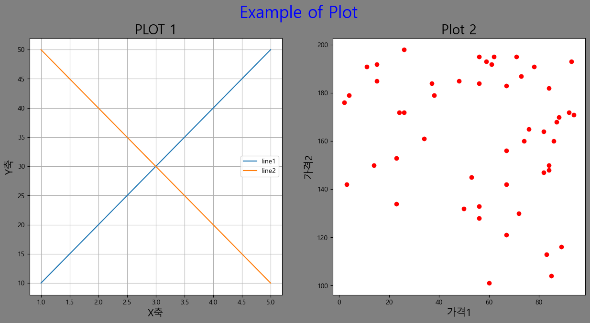
    


# 그래프 그리기
1. matplotlib.pyplot 모듈을 import
    - 2차원 그래프(axis가 두개인 그래프)를 그리기위한 함수를 제공하는 모듈
    - 별칭(alias) 로 plt를 관례적으로 사용한다.
    - `import matplotlib.pyplot as plt`

2. 그래프를 그린다.
 
3. 그래프에 필요한 설정을 한다.

4. 화면에 그린다.
    - 지연 랜더링(Deferred rendering) 메카니즘
    - 마지막에 `pyplot.show()` 호출 시 그래프를 그린다.

# 그래프를 그리는 두가지 방식
- pyplot 모듈의 함수들을 사용한다.
- Figure와 Axes 객체의 메소드들을 사용한다.

## pyplot 모듈을 이용해 그리기
1. pyplot 모듈이 그래프 그리는 함수와 Axes(Subplot) 설정 관련 함수를 제공


```python
x = [1, 2, 3, 4, 5]
y = range(10, 60, 10)  # 1차원 형태의 자료구조(리스트, 튜플, 제너레이터, 시리즈)
```


```python
# import
import matplotlib.pyplot as plt

# figure의 크기를 설정 (가장 먼저 해야 한다., 반드시 해야하는 것은 아님)
plt.figure(figsize=(10, 7)) # (가로, 세로) - 단위: inch

# 그래프그리기 => 값을 넣어서 원하는 그래프를 그리는 함수를 호출.
plt.plot(x, y)  # line plot(꺾은 건 그래프)

# 설정
plt.title('선그래프 예제', fontsize=20) # subplot 제목
plt.xlabel('X축 값')
plt.ylabel('Y축 값')
plt.grid(True, linestyle=':')  # 보조 선, linestyle 선 모양 바꾸기

# 저장
plt.savefig('sample.png')

# 화면에 출력
plt.show()
```


    
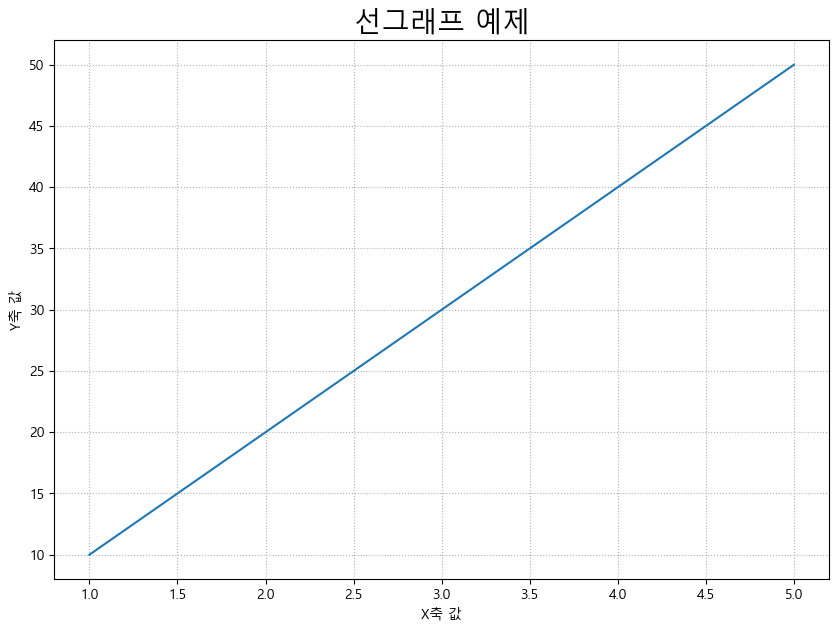
    


2. 하나의 figure에 여러 그래프 그리기
    - plt.subplot(row,columns,num)


```python
# figure 크기를 지정
plt.figure(figsize=(15,10))

# 그래프를 그릴 subplot을 설정.(지정)
plt.subplot(2, 3, 1) # figure를 2행 3열로 나누고 그중 첫번째 것
# 그래프 그리기
plt.plot(x, y)
# 설정하기
plt.title('첫번째 그래프')

plt.subplot(2, 3, 2)
plt.scatter(x, y)
plt.title('두번째 그래프')

plt.subplot(2, 3, 3)
plt.bar(x, y)
plt.title('세번째 그래프')

plt.subplot(234)
plt.pie(x)
plt.title('네번째 그래프')

plt.subplot(235)
plt.pie(y)
plt.title('다섯번째 그래프')

plt.subplot(236)
plt.boxplot(x)
plt.title('여섯번째 그래프')

# plt.tight_layout() # 공간의 크기를 맞춰준다.
plt.show()
```


    
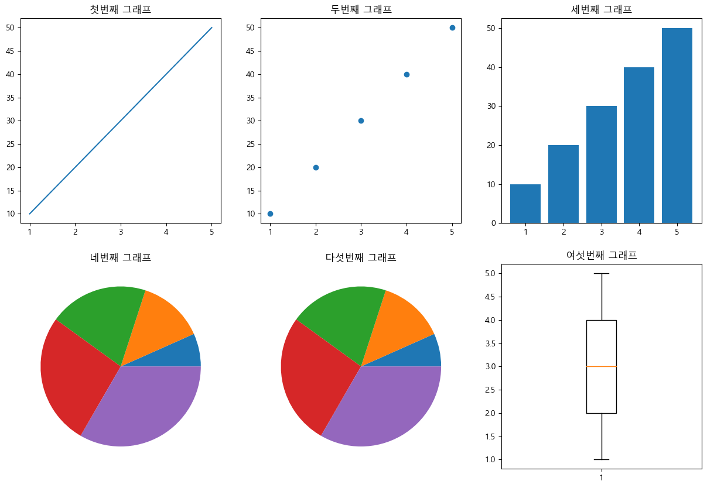
    


```python
# 그래프를 그릴 subplot을 설정.(지정)
plt.figure(figsize=(10, 7))
plt.subplot(1, 2, 1) # figure를 2행 3열로 나누고 그중 첫번째 것
# 그래프 그리기
plt.plot(x, y)
# 설정하기
plt.title('첫번째 그래프')

plt.subplot(2, 2, 2)
plt.scatter(x, y)
plt.title('두번째 그래프')

plt.subplot(2, 2, 4)
plt.bar(x, y)
plt.title('세번째 그래프')

plt.show()
```


    
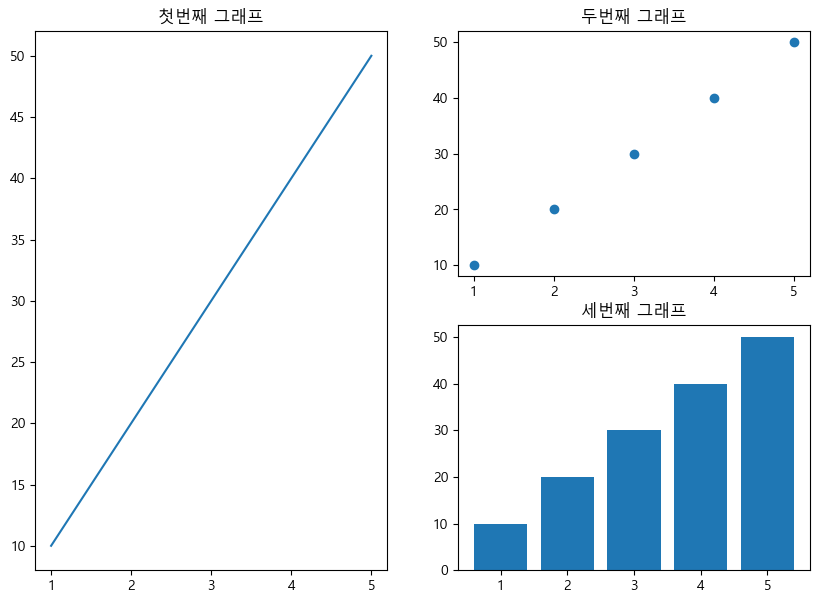
    


```python
# 한개의 subplot에 여러 그래프를 그리기
plt.plot(x, y, label='plot1')  # label -> 그래프에 이름 --> 범례(legend에 나올 이름)
plt.scatter(x, y, label='plot2')
plt.plot(y, x, label='plot3')

plt.legend()  # 범례가 나오도록 처리
plt.grid(True)
plt.show()
```


    
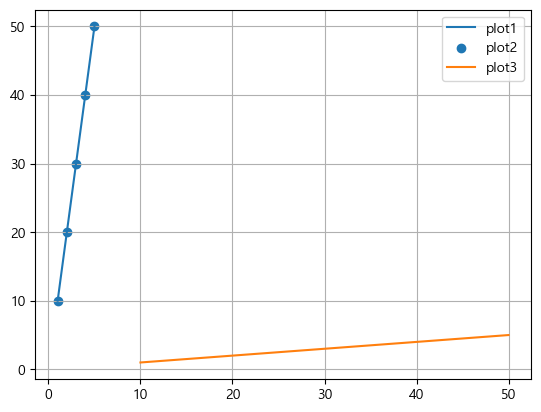
    


## Figure 와 Axes 객체를 이용해 그리기

- AxesSubplot 객체(Axes를 표현하는 객체)의 메소드들을 이용해 그래프를 그린다.
- axes 생성 방법
    - plt.gca(): AxesSubplot
        - 하나의 figure에 하나의 Axes 만 사용할 경우 사용.
    - 하나의 figure에 여러개의 Axes들을 사용할 경우
        - figure.add_subplot() 메소드 이용
            - figure를 먼저 생성후 axes 들을 추가
        - pyplot.subplots() 함수를 이용
            - figure와 axes배열을 동시에 생성

### Figure에 하나의 axes 그리기
- plt.gca() 사용


```python
axes = plt.gca()
# print(type(axes))
# axes객체의 메소드를 이용해 그래프 그리고 설정하기.
axes.plot(x, y, label='line plot')
axes.scatter(x, y, label='scatter')
# 설정함수 - set_xxxx()
axes.set_title('제목')
axes.set_xlabel('X축')
axes.set_ylabel('Y축')
axes.grid('True')
axes.legend()
plt.show()
```


    
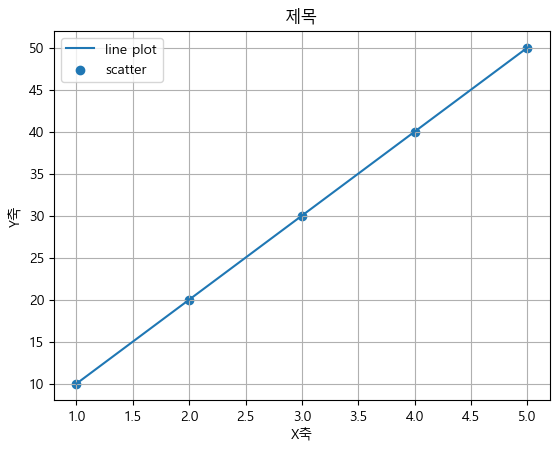
    


### 하나의 Figure에 여러개의 axes 그리기
1. <b style='font-size:1.3em'>figure.add_subplot() 메소드 이용</b>
    - figure객체에 axes를 추가하는 형태
    - nrows(총행수), ncols(총열수), index(axes위치) 지정


```python
# figure 객체 조회
fig = plt.figure(figsize=(10, 5))
# figure에 axis를 추가
ax1 = fig.add_subplot(1, 3, 1)
ax2 = fig.add_subplot(1, 3, 2)
ax3 = fig.add_subplot(1, 3, 3)

ax1.plot(x, y)
ax2.plot(x, y)
ax3.scatter(x, y)

ax1.grid(True) # 설정을 따로 따로 할 수 있다. 한꺼번에는 안됨
ax3.grid(True)

plt.tight_layout()
plt.show()
```


    

    


2. <b style='font-size:1.3em'>pyplot.subplots()</b>
    - nrows, ncols 로 axes개수와 위치 지정
    - 반환: figure와 axes(subplot)들을 담은 **ndarray**


```python
fig, axes = plt.subplots(1, 2, figsize=(7, 3))
# print(type(fig), type(axes), axes.shape)

axes[0].plot(x, y)
axes[0].set_title('첫번째')

axes[1].plot(x, y)
axes[1].set_title('두번째')

plt.show()
```


    
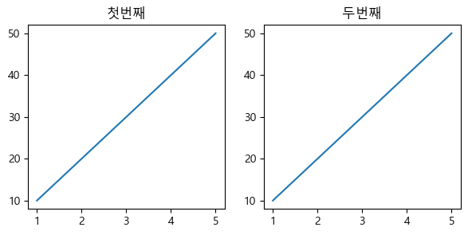
    


```python
fig, axes = plt.subplots(1, 2, figsize=(7, 3))
ax1, ax2 = axes
print(type(ax1), type(ax2))

ax1.plot(x, y)
ax1.set_title('첫번째')

axes[1].plot(x, y)
axes[1].set_title('두번째')

plt.show()
```

    <class 'matplotlib.axes._subplots.AxesSubplot'> <class 'matplotlib.axes._subplots.AxesSubplot'>
    


    

    


```python
fig, axes = plt.subplots(2, 2, figsize=(7, 7))
axes.shape
```


    (2, 2)


    
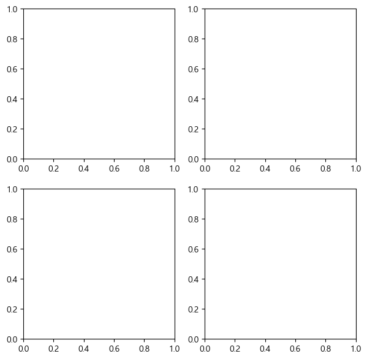
    


```python
fig, axes = plt.subplots(2, 2, figsize=(7, 7))

# axes.flatten().shape # flatten(): 다차원배열을 1차원 배열로 변환
ax1, ax2, ax3, ax4 = axes.flatten()

ax1.plot(x, y)
ax1.set_title('1번')

ax2.plot(x, y)
ax2.set_title('2번')

ax3.scatter(x, y)
ax3.set_title('3번')

plt.show()
```


    
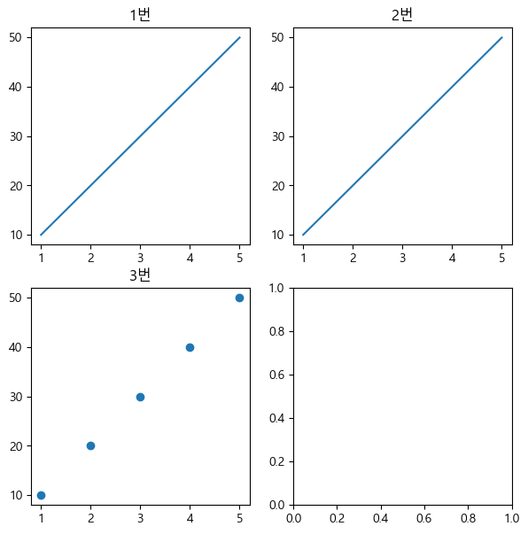
    


# 색상과 스타일

## 색 지정
- color 또는 c 매개변수를  이용해 지정
- **색상이름으로 지정.** 
    - 색이름 또는 약자로 지정 가능
    - 'red', 'r'
    
| 문자열 | 약자 |
|-|-|
| `blue` | `b` |
| `green` | `g` |
| `red` | `r` |
| `cyan` | `c` |
| `magenta` | `m` |
| `yellow` | `y` |
| `black` | `k` |
| `white` | `w` |


- **HTML 컬러문자열**
    - #으로 시작하며 RGB의 성분을 16진수로 표현
    - #RRGGBB 또는 #RRGGBBAA
    - #FF0000, #00FF00FA
- **0 ~ 1 사이 실수로 흰식과 검정색 사이의 회색조를 표시**
    - 0: 검정, 1: 흰색
- https://matplotlib.org/examples/color/named_colors.html
- https://htmlcolorcodes.com/
    - picker, chart(코드), name(색이름) 제공사이트


```python
fig, axes = plt.subplots(2, 2, figsize=(7, 7))

# axes.flatten().shape # flatten(): 다차원배열을 1차원 배열로 변환
ax1, ax2, ax3, ax4 = axes.flatten()

ax1.plot(x, y, color='red')
ax1.set_title('1번')

ax2.plot(x, y, c='#BF23FC' )
ax2.set_title('2번')

ax3.scatter(x, y, c = "0.5")
ax3.set_title('3번')

plt.show()
```


    
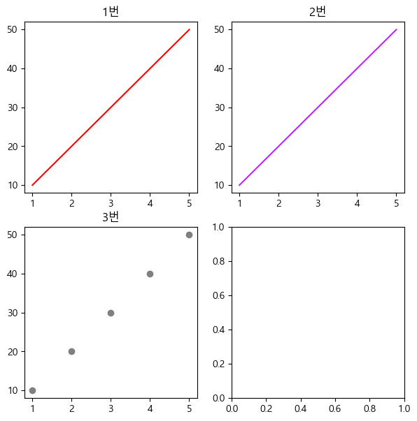
    


## Style
- Style: 그래프의 여러 시각효과들을 미리 설정해 놓은 것
- matplotlib는 다양한 스타일들을 미리 정의해 놓고 있다.
    - [스타일목록](https://matplotlib.org/stable/gallery/style_sheets/style_sheets_reference.html)
    - `plt.style.use()` 함수 이용해 지정
    - `plt.style.available`
        - 사용할 수 있는 스타일 이름 조회


```python
plt.style.available
```


    ['Solarize_Light2',
     '_classic_test_patch',
     '_mpl-gallery',
     '_mpl-gallery-nogrid',
     'bmh',
     'classic',
     'dark_background',
     'fast',
     'fivethirtyeight',
     'ggplot',
     'grayscale',
     'seaborn-v0_8',
     'seaborn-v0_8-bright',
     'seaborn-v0_8-colorblind',
     'seaborn-v0_8-dark',
     'seaborn-v0_8-dark-palette',
     'seaborn-v0_8-darkgrid',
     'seaborn-v0_8-deep',
     'seaborn-v0_8-muted',
     'seaborn-v0_8-notebook',
     'seaborn-v0_8-paper',
     'seaborn-v0_8-pastel',
     'seaborn-v0_8-poster',
     'seaborn-v0_8-talk',
     'seaborn-v0_8-ticks',
     'seaborn-v0_8-white',
     'seaborn-v0_8-whitegrid',
     'tableau-colorblind10']


```python
plt.style.use("dark_background") # 한번 코드를 작성하면 모든 셀에 적용
```


```python
fig, axes = plt.subplots(2, 2, figsize=(7, 7))

# axes.flatten().shape # flatten(): 다차원배열을 1차원 배열로 변환
ax1, ax2, ax3, ax4 = axes.flatten()

ax1.plot(x, y, color='red')
ax1.set_title('1번')

ax2.plot(x, y, c='#BF23FC' )
ax2.set_title('2번')

ax3.scatter(x, y, c = "0.5")
ax3.set_title('3번')

plt.show()
```


    
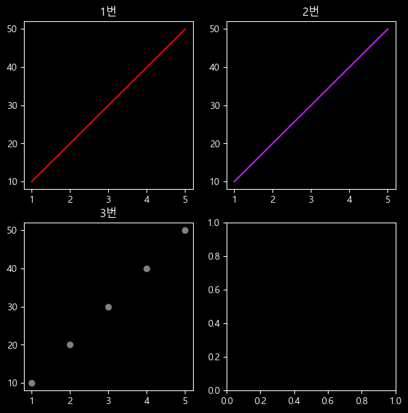
    

