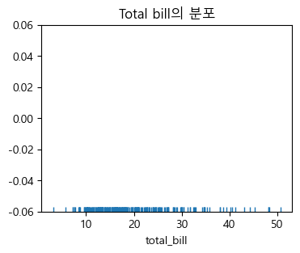
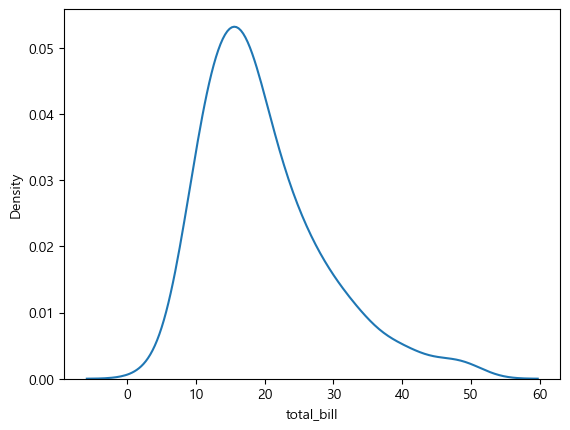
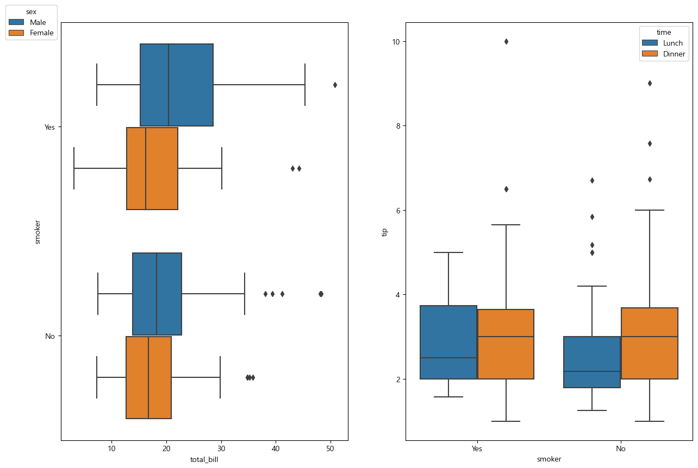
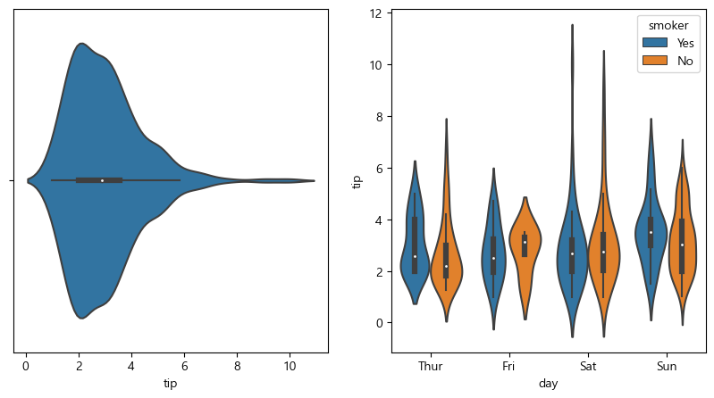

## 0. Seaborn
- matplotlib을 기반으로 다양한 테마와 그래프를 제공하는 파이썬 시각화 패키지.
- 기본적으로 toy data(테스트 해볼 수 있는 데이터) 를 제공해준다.
- 데이터프레임과의 연동이 잘 되어 있다. <-> matplotlib: 그래프를 그리기 위해 데이터를 사용자가 직접 지정해주어야 함


- 모듈 설치: 아나콘다에는 기본적으로 포함되어 있다.
    `!pip install seaborn`
- 모듈 사용
    ```python
    import seaborn as sns
    import matplotlib.pyplot as plt

    tips = sns.load_dataset('tips') # tips라는 toy data를 불러옴
    ```

- tips 데이터 셋

<div>
<style scoped>
    .dataframe tbody tr th:only-of-type {
        vertical-align: middle;
    }

    .dataframe tbody tr th {
        vertical-align: top;
    }

    .dataframe thead th {
        text-align: right;
    }
</style>
<table border="1" class="dataframe">
  <thead>
    <tr style="text-align: right;">
      <th></th>
      <th>total_bill</th>
      <th>tip</th>
      <th>sex</th>
      <th>smoker</th>
      <th>day</th>
      <th>time</th>
      <th>size</th>
    </tr>
  </thead>
  <tbody>
    <tr>
      <th>0</th>
      <td>16.99</td>
      <td>1.01</td>
      <td>Female</td>
      <td>No</td>
      <td>Sun</td>
      <td>Dinner</td>
      <td>2</td>
    </tr>
    <tr>
      <th>1</th>
      <td>10.34</td>
      <td>1.66</td>
      <td>Male</td>
      <td>No</td>
      <td>Sun</td>
      <td>Dinner</td>
      <td>3</td>
    </tr>
    <tr>
      <th>2</th>
      <td>21.01</td>
      <td>3.50</td>
      <td>Male</td>
      <td>No</td>
      <td>Sun</td>
      <td>Dinner</td>
      <td>3</td>
    </tr>
    <tr>
      <th>3</th>
      <td>23.68</td>
      <td>3.31</td>
      <td>Male</td>
      <td>No</td>
      <td>Sun</td>
      <td>Dinner</td>
      <td>2</td>
    </tr>
    <tr>
      <th>4</th>
      <td>24.59</td>
      <td>3.61</td>
      <td>Female</td>
      <td>No</td>
      <td>Sun</td>
      <td>Dinner</td>
      <td>4</td>
    </tr>
    <tr>
      <th>...</th>
      <td>...</td>
      <td>...</td>
      <td>...</td>
      <td>...</td>
      <td>...</td>
      <td>...</td>
      <td>...</td>
    </tr>
    <tr>
      <th>239</th>
      <td>29.03</td>
      <td>5.92</td>
      <td>Male</td>
      <td>No</td>
      <td>Sat</td>
      <td>Dinner</td>
      <td>3</td>
    </tr>
    <tr>
      <th>240</th>
      <td>27.18</td>
      <td>2.00</td>
      <td>Female</td>
      <td>Yes</td>
      <td>Sat</td>
      <td>Dinner</td>
      <td>2</td>
    </tr>
    <tr>
      <th>241</th>
      <td>22.67</td>
      <td>2.00</td>
      <td>Male</td>
      <td>Yes</td>
      <td>Sat</td>
      <td>Dinner</td>
      <td>2</td>
    </tr>
    <tr>
      <th>242</th>
      <td>17.82</td>
      <td>1.75</td>
      <td>Male</td>
      <td>No</td>
      <td>Sat</td>
      <td>Dinner</td>
      <td>2</td>
    </tr>
    <tr>
      <th>243</th>
      <td>18.78</td>
      <td>3.00</td>
      <td>Female</td>
      <td>No</td>
      <td>Thur</td>
      <td>Dinner</td>
      <td>2</td>
    </tr>
  </tbody>
</table>
<p>244 rows × 7 columns</p>
</div>


## 1. rugplot, kdeplot, displot
- 1차원 연속형 값들의 분포를 시각화 하는 그래프

### **rugplot()**
- 각 데이터들의 위치를 보여준다.

- 기본 코드
    ```python
    sns.rugplot(tips['total_bill'])
    ```

- x="컬럼명", data: DataFrame 형식
    ```python
    sns.rugplot(data=tips, x='total_bill')
    ```

- 코드 예시
    ```python
    sns.rugplot(data=tips, x='total_bill') # data: DataFrame 지정. x="컬럼명"
    plt.title('Total bill의 분포')
    plt.show()
    ```

    


### **kdeplot()**
- KDE를 그려줌
    - KDE(Kernel Density Estimation): 확률 밀도 추정
- 기본 코드
    ```python
    sns.kdeplot(data=tips, x='total_bill')
    ```

- 코드 예시
    ```python
    sns.displot(data=tips, x='total_bill', bins=30,
           rug = True,
           kde = True)
    plt.show()
    ```

    


### **displot()**
- 히스토그램을 기준으로 rugplot, kdeplot을 같이 그릴 수 있다
- 위 2개 보다 많이 씀

- 기본 코드
    ```python
    sns.displot(data=tips, x='total_bill')
    ```
- 추가 설정
    - `rug = True`: displot 위에 rugplot 보여주기
    - `kde = True`: displot 위에 kdeplot 보여주기
    - `hue = ''`: 원하는 그룹으로 나눠서 보여주기 (= groupby())

- 코드 예시
    ```python
    sns.displot(x='total_bill', data=tips, bins=30,
            rug = True,
            kde = True)
    plt.show()
    ```

    


## 2. boxplot, violinplot, swamplot
- 연속형 데이터(양적데이터)들의 분포를 확인하는 그래프를 그린다.
- 범주별로 연속형 데이터의 분포를 비교할 수 있다.

### **boxplot()**
- 기본 코드
    ```python
    sns.boxplot(data=tips, x='total_bill')
    ```  

- 코드 예시
    ```python
    ax1 = fig.add_subplot(1, 2, 1)
    ax2 = fig.add_subplot(1, 2, 2)

    # x(y): 연속형, y(x): 범주형
    sns.boxplot(x = 'total_bill',
                y = 'smoker',
                hue = 'sex',
                data = tips, ax=ax1)
    sns.boxplot(y='tip', x='smoker', hue='time', data=tips, ax=ax2)
    ax1.legend(bbox_to_anchor=(0,1.05), loc='upper right', title='sex')
    plt.show()
    ```

    


### **violinplot()**
- boxplot위에 분포 밀도(kernel density)를 좌우 대칭으로 덮어쓰는 방식의 그래프 -> kde 그래프를 boxplot 좌우로 붙인 모양
- 매개변수는 boxplot과 동일
- 기본 코드
    ```python
    sns.violinplot(data=tips, y='tip')
    ```  

- 코드 예시
    ```python
    plt.subplot(1, 2, 1)
    sns.violinplot(data=tips, x='tip')

    plt.subplot(1, 2, 2)
    sns.violinplot(data=tips, y='tip', 
                x='day',
                hue='smoker')

    plt.show()
    ```

    

### **swapplot()**
- 실제 값에 점을 찍어 준다.
- boxplot나 violin plot을 보안해준다.
- 좀더 정확하게 값이 어디있는지 알 수 있다.
- 단독으로는 잘 안쓰고 boxplot나 violin plot위에 그린다
- 기본 코드

    ```python
    sns.boxplot(data = tips, y = 'tip', color='r')
    sns.swarmplot(data = tips, y = 'tip')
    ```

### **여러가지 값을 한 그래프로 표현**
- 1. y로(y가 있을 때는 x로) 먼저 나눈다.
- 2. hue를 이용해 또 나눈다
- 예시 코드

    ```python
    sns.boxplot(data = tips,
            x = 'total_bill',
            y = 'smoker',
            hue = 'sex')
    ```  

## 3. 한개의 figure에 2개 이상의 그래프 그리기

- 기본 코드
    ```python
    fig = plt.figure(figsize=(15, 10))
    ax1 = fig.add_subplot(1, 2, 1)
    ax2 = fig.add_subplot(1, 2, 2)

    sns.boxplot(data=tips, x='total_bill', ax=ax1)
    sns.boxplot(data=tips, y='tip', ax=ax2)
    plt.show()
    ```

- 아래 코드로도 같은 그래프가 만들어진다.

    ```python
    plt.figure(figsize=(15, 10))
    plt.subplot(1, 2, 1)
    sns.boxplot(data=tips, x='total_bill')

    plt.subplot(1, 2, 2)
    sns.boxplot(data=tips, y='tip')
    plt.show()
    ```

## 4. countplot()
- 막대그래프(bar plot)을 그리는 함수
- 범주형 변수의 고유값의 개수를 표시
- matplotlib의 bar()

- 기본 코드
    ```python
    sns.countplot(data=tips, x='day')
    ```

- 추가 설정
    - `hue=''`: ~ 별로 나눠서 시각화
    - `dodge=False`: 수평누적막대 그래프


## 5. scatterplot, lmplot, jointplot, pairplot
- 산점도를 그리는 함수
### **scatterplot()**
- pandas에서 scatter 했던 것과는 다르게 테두리가 흰색으로 표시가 됨
- 기본 코드
    ```python
    sns.scatterplot(data=tips, x='total_bill')
    ```
- 추가 설정
    - `hue=''`: ~ 별로 나눠서 색깔을 표시
        
### **lmplot()**
- 산점도 위에 선형 회귀 적합선(+ 오차 범위)을 그린다.
- 기본 코드
    ```python
    sns.lmplot(data=tips, x='total_bill', y='tip')
    ```

### **jointplot()**
- 산점도 그래프 밖에 각 변수의 히스토그램을 그린다.
- pandas DataFrame만 사용할 수 있다.
- 기본 코드
    ```python
    sns.jointplot(data=tips, x='total_bill', y = 'tip')
    ```

### **pairplot()**
- 다변수(다차원) 데이터들 간의 산점도를 보여준다.
- 모든 column 간의 데이터 분포를 보여준다.
    - 수치형 데이터들만 그린다.
    - 데이터프레임을 인수로 받아 그리드(grid) 형태로 각 변수간의 산점도를 그린다. 
    - 같은 변수가 만나는 대각선 영역에는 해당 데이터의 히스토그램을 그린다.
- 기본 코드
    ```python
    sns.pairplot(tips)
    ```

## 6. heatmap()
- 값들에 비례해서 색을 다르게 해 2차원 자료로 시각화
- 오른쪽에 보면 어떤 색이 관계가 높은지 알려준다.
- 기본 코드
    ```python
    sns.heatmap(tips.corr(numeric_only=True)) # 수치형 값만 들어가야 되기 때문에 numeric_only=True를 추가한다.
    ```
- 추가 설정
    - `cmap=''`: heatmap의 palette 변경
    - `annot=True`: 값을 표시
    - `fmt=''`: 표시된 값 소숫점 자리 설정


## 7. lineplot()
- 선그래프
- 시간의 흐름에 따른 값의 변화를 보여주는데 유용하다. (시계열 데이터)
- pandas의 dataframe과는 다르게 x(index) 값을 따로 설정해야 한다.  

- 장점: hue를 이용해서 범주 값으로 나눠서 그래프를 만들기 쉽다.
- 단점: 일괄적으로 그래프를 그리고 싶을 때는 각 그래프 별로 적어야 해서 불편하다.

- 기본 코드
    ```python
    sns.lineplot(data=df, y='no1', x=df.index)
    ```

## + Palette(그래프 색깔)
- 값이 추가 될 때 그래프의 색이 바뀌는데 정해져 있는 색 순서를 의미한다.
- 현재 palette 확인 방법
    ```python
    import seaborn as sns
    sns.color_palette()
    ```
- Palette를 바꾸는 방법
    - 1. 그래프만 바꾸는 방법
        - 추가 설정에 `palette=''`를 넣는다
        - 예시 코드
            ```python
            sns.scatterplot(data=tips, x='total_bill',palette='Set1') 
            ```
    - 2. 전체 그래프를 바꾸는 방법
        - seaborn을 사용해 기본 팔레트를 변경할 수 있다.
        - 예시 코드
            ```python
            sns.set_palette('Set1')
            ```

- Palette tutorial
     <https://seaborn.pydata.org/tutorial/color_palettes.html#palette-tutorial>