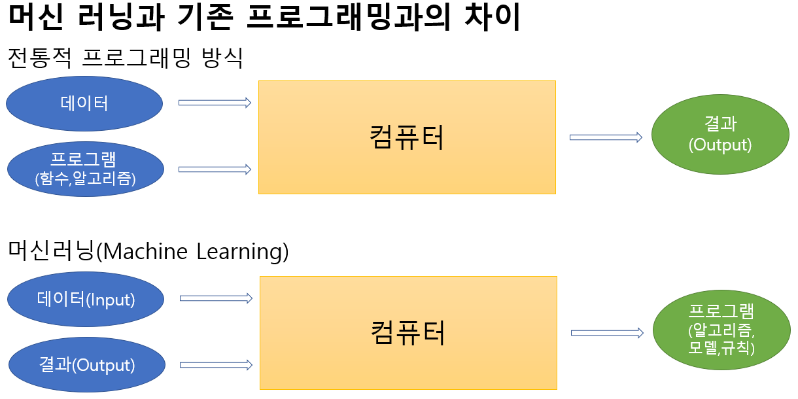

# 인공지능 개요

## 인공지능 (AI - Artificial Intelligence) 이란

### 지능이란?
- 지능: 어떤 문제를 해결하기 위한 지적 활동 능력
- 인공지능
    - 기계가 사람의 지능을 모방하게 하는 기술
    - 규칙기반, 데이터 학습 기반

### 정의
- 다트머스대학 수학과 교수인 존 매카시(John McCarthy)가 "지능이 있는 기계를 만들기 위한 과학과 공학" 이란 논문에서 처음으로 제안(1955년)
- 인간의 지능(인지, 추론, 학습 등)을 컴퓨터나 시스템 등으로 만든 것 또는, 만들 수 있는 방법론이나 실현 가능성 등을 연구하는 기술 또는 과학
  

## Strong AI vs Weak AI
- Artificial General Intelligence (AGI)
    - 인간이 할 수 있는 모든 지적인 업무를 해낼 수 있는 (가상적인) 기계의 지능을 말한다. 인공지능 연구의 주요 목표.

- **Strong AI (강 인공지능)**
    - AGI 성능을 가지는 인공지능
    - 인공지능 연구가 목표하는 방향.
    
- **Weak AI (약 인공지능)**
    - 기존에 인간은 쉽게 해결할 수 있었지만 컴퓨터로 처리하기 어려웠던 일을 컴퓨터가 수행할 수 있도록 하는 것이 목적.
    - 지각(知覺)을 가지고 있지 않으며 **특정한 업무를 처리**하는데 집중한다.

### 인공지능의 발전을 가능하게 만든 세가지 요소
- **데이터의 급격한 증가**
    - 디지털사진, 동영상, IoT 기기, SNS 컨텐츠 등으로 인해 데이터가 폭발적으로 증가 
    - 전 세계 디지털데이터의 90%가 최근 2년 동안 생성 
- **알고리즘의 발전**
    - 급증한 데이터를 이용한 기존 알고리즘 개선 및 새로운 알고리즘들이 개발됨.
- **컴퓨터 하드웨어의 발전**
    - CPU와 GPU의 발전. 
    - 특히 GPU의 발전은 딥러닝의 발전으로 이어짐.
    - TPU(Tensor Processing Unit)
        - 구글에서 개발한 딥러닝 전용 칩셋

## 머신러닝과 딥러닝

### 머신러닝(Machine Learning)
- 데이터 학습 기반의 인공 지능 분야
- 기계에게 어떻게 동작할지 일일이 코드로 명시하지 않고 데이터를 이용해 학습할 수 있도록 하는 알고리즘과 기술을 개발하는 인공지능의 한분야

### 딥러닝 (Deep Learning)
- 인공신경망 알고리즘을 기반으로 하는 머신러닝의 한 분야. 비정형데이터(영상, 음성, 텍스트)에서 뛰어난 성능을 나타낸다. 단 학습 데이터의 양이 많아야 한다.

- 비정형 데이터
    - 정해진 규칙 없이 저장되어 값의 의미를 쉽게 파악할 수 없는 데이터
    - 텍스트, 영상, 음성 데이터가 대표적인 예이다.
- 정형 데이터
    - 미리 정해 놓은 형식과 구조에 따라 저장되도록 구성된 데이터
    - 대표적이 예로 관계형 데이터베이스가 있다.


## 머신러닝 모델(알고리즘, 모형)
- 모델이란 데이터의 패턴을 수식화 한 함수를 말한다.
    - 그러나 처음에는 방대한 데이터의 패턴을 알 수 없기 때문에 "이 데이터는 이런 패턴을 가졌을 것"이라고 가정한 함수를 정한뒤 데이터를 학습시켜 데이터 패턴을 잘 표현하는 함수를 만든다.

    
### 모델을 만드는 과정
1. 모델을 정하여 수식화 한다. 
2. 모델을 데이터를 이용해 학습(Train) 시킨다. 
    - 모델을 데이터의 패턴에 맞춘다. (fit)
3. 학습된 모델이 얼마나 데이터 패턴을 잘 표현하는지 평가한다.(Test)

## 데이터 관련 용어
### Feature
- 추론하기 위한 근거가 되는 값들을 표현하는 용어.
- 예측 하거나 분류해야 하는 데이터의 특성, 속성 값을 말한다.
- 입력 변수(Input), 독립변수라고도 한다.
- 일반적으로 X로 표현한다.

### Label
- 예측하거나 분류해야 하는 값들을 표현하는 용어
- 출력 변수(Output), 종속변수, Target 이라고도 한다.
- 일반적으로 y로 표현한다.

### Class
- Label이 범주형(Categorical) 일 경우 그 고유값을 Class라고 한다.
    - 개/고양이, 남성/여성, A형/AB형/B형/O형

### 데이터 포인트
- 개별 데이터를 표현하는 용어. 

# 머신러닝 알고리즘 분류

## 지도학습(Supervised Learning)
- 모델에게 데이터의 특징(Feature)와 정답(Label)을 알려주며 학습시킨다.
- 대부분의 머신러닝은 지도학습이다.
- 지도학습은 분류와 회귀로 나뉜다.

### 분류(Classification):
    - **두개 이상의 클래스(범주)에서 선택을 묻는 지도 학습방법**
        - **이진 분류** : 맞는지 틀린지를 분류.
        - **다중 분류** : 여러개의 클래스중 하나를 분류
    - 의사결정나무(Decision Tree)
    - 로지스틱 회귀(Logistic Regression)
    - K-최근접 이웃(K-Nearest Neighbors, KNN)
    - 나이브 베이즈(Naive Bayes)
    - 서포트 벡터 머신(Support Vector Machine, SVM)
    - 랜덤 포레스트(Random Forest)
    - 신경망(Neural Network)

### 회귀(Regression):
    - **숫자(연속된값)를 예측 하는 지도학습**
    - 의사결정나무(Decision Tree)
    - 선형 회귀(Linear Regression)
    - 릿지 회귀(Rige Regression)
    - 라쏘 회귀(Lasso Regression)
    - 엘라스틱 넷(Elastic Net)
    - K-최근접 이웃(K-Nearest Neighbors, KNN)
    - 나이브 베이즈(Naive Bayes)
    - 서포트 벡터 머신(Support Vector Machine, SVM)
    - 랜덤 포레스트(Random Forest)
    - 신경망(Neural Network)

## 비지도학습 (Unsupervised Learning)
- **정답이 없이 데이터의 특징만 학습하여 데이터간의 관계를 찾는 학습방법**
- **군집(Clustering)**
    - 비슷한 유형의 데이터 그룹을 찾는다. 주로 데이터 경향성을 파악하는 비지도 학습
    - K-평균 클러스터링(K-Means Clustering)
    - 평균점 이동 클러스터링(Mean-Shift Clustering) 
    - DBSCAN(DensityBased Spatial Clustering of Applications with Noise)
- **차원축소(Dimensionality Reduction)**
    - 예측에 영향을 최대한 주지 않으면서 변수(Feature)를 축소하는 한다.
    - 고차원 데이터를 저차원의 데이터로 변환하는 비지도 학습
    - 주성분 분석(Principal Component Analysis, PCA)
    

# 머신러닝 개발 절차 (Machine Learning Process)

1. Business Understanding
    - 머신러닝 개발을 통해 얻고자 하는 것 파악.

2. Data Understanding
    - 데이터 수집
    - 탐색을 통해 데이터 파악

3. Data Preparation  
    - 데이터 전처리

4. Modeling
    - 머신러닝 모델 선정
    - 모델 학습

5. Evaluation
    - 모델 평가
    - 평가 결과에 따라 위 프로세스 반복

6. Deployment
    - 평가 결과가 좋으면 실제 업무에 적용

# 파이썬 머신러닝,딥러닝 주요 패키지
### Scikit-learn
    - 딥러닝을 제외한 머신러닝 주요 알고리즘 제공
### Tensorflow
    - 구글 브레인 팀이 개발한 텐서플로우는 머신러닝 및 딥러닝 위한 오픈소스 라이브러리다.
### Keras
    - 딥러닝 모델을 쉽게 만들 수 있도록 다양한 딥러닝 플랫폼 위에서 실행되는 고수준 딥러닝 패키지.
    - Tensorflow 2.0 부터 keras를 포함하고 있다.
### Pytorch
    - 토치(Torch) 및 카페2(Caffe2) 프레임워크를 기반으로한 페이스북에서 만든 딥러닝 프레임워크

# 사이킷런(scikit-learn)

<https://scikit-learn.org/stable>

파이썬 머신러닝 라이브러리가 가장 많이 사용된다. 딥러닝을 제외한 대부분의 머신러닝 알고리즘을 제공한다.


## 사이킷런의 특징
1. 파이썬 기반 다른 머신러닝 라이브러리가 사이킷런 스타일의 API를 지향할 정도로 쉽고 가장 파이썬스런 API 제공
2. 머신러닝 관련 다양한 알고리즘을 제공하며 모든 알고리즘에 일관성있는 사용법을 제공한다.

## scikit-learn(사이킷런) 설치
- `conda install -y scikit-learn`
- `pip install scikit-learn`


```python

```

## Estimator와 Transformer
### Estimator (추정기)
    - 데이터를 학습하고 예측하는 알고리즘(모델)들을 구현한 클래스들
        - ex) DecisionTreeClassifier, LinearRegression 등
    - fit() 
        - 데이터를 학습하는 메소드
    - predict()
        - 예측을 하는 메소드

### Transformer (변환기)
    - 데이터 전처리를 하는 클래스들. 데이터 셋의 값의 형태를 변환한다.
        - ex) LabelEncoder, MinMaxScaler등
    - fit()
        - 어떻게 변환할지 학습하는 메소드
    - transform()
        - 변환처리 하는 메소드
    - fit_transform()
        - fit()과 transform()을 같이 처리하는 메소드

## 사이킷런 주요모듈



