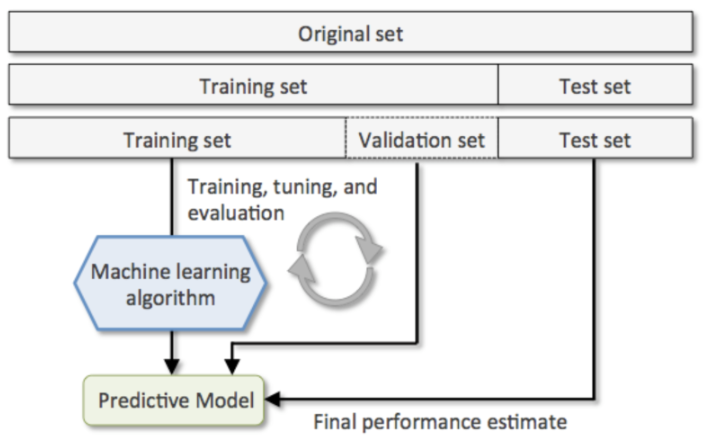
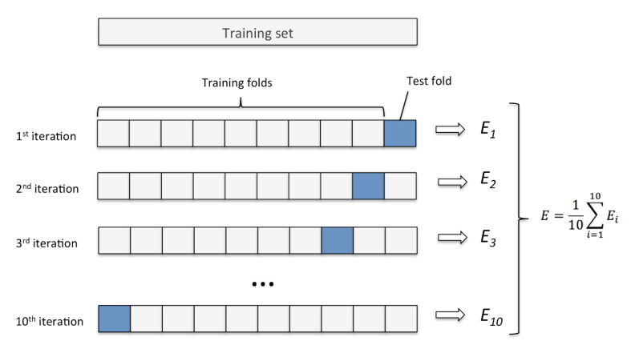

# 데이터 셋
- **Train 데이터셋 (훈련/학습 데이터셋)**
    - 모델을 **학습**시킬 때 사용할 데이터셋.
    - 옛날 데이터(Train Data)를 이용해서 새로운 데이터 추론

- **Validation 데이터셋 (검증 데이터셋)**
    - 모델의 성능 **중간 검증**을 위한 데이터셋
    - Test set과 Train set만 사용해서 `설정변경 -> 훈련 -> 평가`를 반복하게 되면 Test set에 모델이 맞춰지기 때문에 모델의 성능을 제대로 평가할 수 없게 된다.
    - 따라서 데이터 셋을 Train set, Validation set, Test set으로 나눠 **Train set과 Validation set으로 모델을 최적화** 한뒤 마지막에 **Test set으로 최종 평가**한다.

- **Test 데이터셋 (평가 데이터셋)**
    - 모델의 **성능을 최종적으로 측정**하기 위한 데이터셋
    - **Test 데이터셋은 마지막에 모델의 성능을 측정하는 용도로 한번만 사용되야 한다.**
        - 만약 원하는 성능이 나오지 않는다면 데이터나 하이퍼 파라미터를 변경한 뒤 다시 훈련시켜야 한다. -> **Hyper Parameter Tuning**

# Data 분리방식

## Hold Out

- 데이터셋을 Train set, Validation set, Test set으로 나눈다.
- sklearn.model_selection.train_test_split() 함수 사용
    - 하나의 데이터셋을 2분할 하는 함수

### 단점
- train/validation/test 셋이 어떻게 나눠 지냐에 따라 결과가 달라진다.

- 특히 데이터가 적을 경우 문제가 발생할 수 있다.
    - 이상치에 대한 영향을 많이 받는다.
    - 다양한 패턴을 찾을 수가 없기 때문에 새로운 데이터에 대한 예측 성능이 떨어지게 된다.
- Hold out 방식은 **(다양한 패턴을 가진) 데이터의 양이 많을 경우에 사용**한다. -> 이상치가 희석이 되기 때문

## K-Fold Cross Validation

1. 데이터셋을 설정한 K개로 나눈다
2. K개 중 하나를 Validation set으로 나머지는 Train set으로 하여 모델을 학습 및 평가한다.
3. 2번의 과정을 Validation set를 K번 바꿔가며 모델을 학습시킨 뒤 나온 평가지표의 평균을 내서 모델 성능을 평가한다.

- 데이터 양이 적을 때 사용
- 보통 Fold를 나눌때 2.5:7.5 또는 2:8 비율이 되게 하기 위해 4개 또는 5개 fold로 나눈다.
- 종류
    - KFold
        - 회귀문제의 Dataset을 분리할 때 사용
    - StratifiedKFold
        - 분류문제의 Dataset을 분리할 때 사용

### KFold vs StratifiedKFold
- KFold
    - 회귀문제일 때 사용
- StratifiedKFold
    - 분류문제일 때 사용
    - 각각의 클래스 별로 각각 순서대로 나눈다
        - 클래스 개수의 비율이 동일하게 나눠진다.

## GreedSearch에 대한 간단한 설명
- 대부분의 평가 결과는 클수록 결과가 좋다고 한다 ex) 적중률: 0.98 > 0.75
- 하지만 오차를 계산할 때는 오차 범위가 작은 것이 더 좋은 결과이다. ex) 오차: 13.75 > 75.2
    - 그것을 해결하기 위해서 평가지표에 -를 붙이는 일을 한다.
        - ex) `scoring='neg_mean_squared_error'`