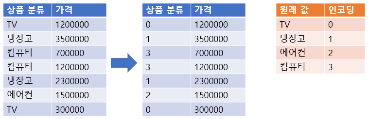
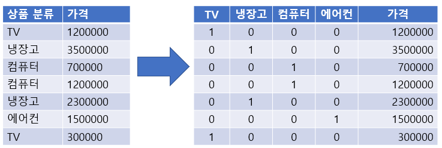

## Data Preprocessing
- 데이터를 가지고 머신러닝을 진행하기 위해서는 좋은 데이터를 가지고 해야 결과값이 잘 나온다.
    - Garbage in, Garbage out
- 비정형 데이터의 경우에는 데이터 구조가 정해져 있지 않기 때문에 오랫동안 발전을 못하다가 딥러닝이 발달되면서 발전이 되기 시작했다.
- 목적
    1. 학습이 가능한 데이터셋을 만들기 위한 전처리
        - 머신러닝 알고리즘은 숫자만 처리할 수 있다.
        - 따라서 결측치, 문자열이 있으면 학습이나 추론을 할 수 없다.
        
    2. 학습이 더 잘되도록 만들기 위한 전처리
        - 공학적 전처리 (Feature Engineering)
        - 도메인 지식에 의한 전처리
            - 쓸데없는 데이터가 많으면 예측 결과 이상해질 수 있다.
## 결측치 처리
- 결측치란
    - Not Available-NA, NaN, None, Null
    - 수집하지 못한 값, 모르는 값
- 처리 방법
    1. 제거 (열단위, 행단위)
        - 행단위를 기본으로 제거한다.
        - 다만 특정 열에 결측치가 너무 많을 경우 열을 제거한다.
        - 문제점
            - 너무 많은 데이터 값이 없어질 수 있다는 문제가 있다.
            - 하나의 결측치를 없애기 위해 행이나 열에 있는 모든 값을 없애야 한다.
    2. 다른 값으로 대체
        - 가장 가능성이 높은 값으로 대체
            - 수치형: 평균, 중앙값
            - 범주형: 최빈값
            - 그 Feature의 결측치를 예측하는 머신러닝 알고리즘을 모델링해서 추론
                - 다른 컬럼 값을 바탕으로 예측
        - 결측치 자체를 표현하는 값으로 대체
            - 나이 : -1, 혈액형 : ? 과 같이 그 Feature가 가질 수 없는 값으로 결측치 값을 변환
        - 문제점
            - 대체한다는 것은 다른 값을 집어넣는 것이기 때문에 잘못된 결과가 나올 수 있다.
                - 결측치 제거를 둘 다 할 수 있는 경우에는 제거를 사용하는 편이 좋다.

## 이상치(Outlier) 처리
- 이상치란
    - Feature를 가지는 대부분의 값들과는 동떨어진 값
- 오류값
    - 잘못 수집된 값
    - 처리 방법
        - 결측치로 변환후 처리
- 극단치(분포에서 벗어난 값)
    - 정상적인 값이지만 다른 값들과 다른 패턴을 가지는 값
    - 일반적으로 극단적으로 크거나 작은 값
    - 처리 방법
        1. 값을 그대로 유지
            - 데이터 양이 많기 때문에 영향을 별로 주지 않다고 판단할 경우
            - 나중에 그 값과 비슷한 경우를 예측해야 될 수 있다고 생각할 경우
        2. 결측치로 변환 후 처리
            - 너무 범위를 극단적으로 벗어났다고 판단 될 경우 
        3. 다른 값으로 대체
            - 보통 그 값이 가질 수 있는 Min/Max 값을 설정한 후 그 값으로 변경
            - 분위수를 통해 계산해서 정상적인 범위를 구한 후 그 범위의 Min/Max로 변경

## Feature 타입 별 전처리
### Feature(변수)의 타입
- **범주형(Categorical) 변수/이산형(Discrete) 변수**
    - 대상 값들이 서로 떨어진 값을 가지는 변수
    - 주로 `문자열`, `정수형`, `Categorical type`으로 구성
    - **명목(Norminal) 변수/비서열(Unordered) 변수**
        - 범주에 속한 값 간에 서열(순위)가 없는 변수
        - 예) 성별, 혈액형
    - **순위(Ordinal) 변수/서열(Ordered) 변수**
        - 범주에 속한 값 간에 서열(순위)가 있는 변수
        - 예) 성적, 직급
- **연속형(Continuous) 변수**
    - 대상값들이 서로 연속된 값을 가지는 변수 
    - 주로 `실수형`으로 구성
    - **등간(Interval) 변수**
        - 측정 대상의 순서와 측정 대상 간의 간격을 알 수 있는 변수로, 그 사이의 간격이 같은 변수를 말한다.
        - 0의 값이 특정의미로 사용된다.
        - 예) 온도 : 온도에서 0은 절대적 0의 값이 아니라 얼음이 어는 빙결점의 온도를 의미한다. 
    - **비율(Ratio) 변수**
        - 측정 대상의 순서와 측정 대상 간의 간격을 알 수 있는 변수로, 그 사이의 간격이 같은 변수를 말한다. (등간변수와 동일)
        - 0이 절대적인 0의 값으로 사용된다.
        - 예) 나이, 무게, 거리, 소득

- **각 데이터 별 Feature Type 설명**
    - **실수형 데이터**로 구성된 Feature는 *연속형 값*이다.
    - **문자열 데이터**로 구성된 Feature는 *단순 문자열값이거나 범주형 값*이다.
    - **정수형 데이터**로 구성된 Feature는 *범주형이거나 연속형 값*이다.
        - 몇개의 **고유값**으로 구성되었는지를 봐야 한다.

## 범주형 Feature의 처리
### Label Encoding
- 범주형 Feature의 고유값들을 0부터 1씩 증가하는 값으로 변환
- 이용 가능 모델
    - 트리 계열 모델
        - 숫자 크기의 차이가 모델에 영향을 주지 않는다.
        - 하나의 컬럼만 가지고 하나의 질문(트리)만 할때 자주 사용한다

        - ex) 의사결정나무, Random Forest

- 이용 불가능 모델
    - 선형 계열 모델
        - 숫자 크기의 차이가 모델에 영향을 준다.
        - ex) Logistic Regression, SVM, 신경망

- sklearn.preprocessing.LabelEncoder 사용
    - fit(): 어떻게 변환할 지 학습 `-> TV를 0으로 냉장고를 1로 하겠다.`
    - transform(): 문자열를 숫자로 변환 `-> 실질적인 값 변환`
    - fit_transform(): 학습과 변환을 한번에 처리 `-> fit(), transform()에서 사용한 데이터셋이 같은 경우 사용`
    - inverse_transform():숫자를 문자열로 변환 `-> 0을 원래 값인 TV로 변환`
    - classes_ : 인코딩한 클래스 조회 `-> 각각의 transform 결과 조회 주황색 표`
        - `_`: 사이킷런에서 앞의 문자가 변수를 나타낸다는 것을 알려주기 위해 사용하는 방법

    - 데이터셋은 **1차원** 자료구조로 추출한다.
        - ex) `['TV', '냉장고', '에어컨', '컴퓨터']`

    
### One-Hot Encoding

- N개의 클래스를 N 차원의 One-Hot 벡터(희소 행렬)로 표현되도록 반환
    - 고유값들을 피처(컬럼)로 만들고 정답에 해당하는 열은 1로 나머진 0으로 표시한다.
        - 희소 행렬: 대부분 0값이 들어가는 행렬

- 이용 가능 모델
    - 선형 계열 모델
        - 숫자 크기의 차이가 모델에 영향을 준다.
        - 하나의 컬럼만 가지고 하나의 질문 할때(트리 계열) 분리가 잘 되지 않는다        
        - ex) Logistic Regression, SVM, 신경망

- 이용 불가능 모델
    - 트리 계열 모델
        - 숫자 크기의 차이가 모델에 영향을 주지 않는다.
        - ex) 의사결정나무, Random Forest

- sklearn.preprocessing.OneHotEncoder 이용
    - fit(): 데이터셋을 기준으로 어떻게 변환할 지 학습
    - transform(): Argument로 받은 데이터셋을 원핫인코딩 처리
    - fit_transform(): 학습과 변환을 한번에 처리
    - get_feature_names_out() : 원핫인코딩으로 변환된 Feature(컬럼)들의 이름을 반환
    - 데이터셋은 **2차원 배열**을 전달 하며 Feature별로 원핫인코딩 처리한다.
        - DataFrame도 가능
        - 원핫인코딩 처리시 모든 타입의 값들을 다 변환한다. (연속형 값들도 변환) 그래서 변환려는 변수들만 모아서 처리해야 한다.
        - ex)`[["TV"], ["냉장고"]...]`

- **Pandas**
    - pandas.get_dummies(DataFrame [, columns=[변환할 컬럼명]]) 함수 이용
    - DataFrame에서 범주형(`object`, `category`) 변수만 변환한다.
        - 숫자는 그냥 One-Hot encoding이 안된다.
            - 범주형 변수의 값을 숫자 값을 가지는 경우가 있다. (ex: 별점, 레벨)    
            - 이런 경우 get_dummies() columns=['컬럼명','컬럼명'] 매개변수로 컬럼들을 명시한다.

### Label Encoding vs One-Hot Encoding
- 숫자의 크기 차이가 모델에 영향을 미치는 선형 계열 모델(로지스틱회귀, SVM, 신경망)에서 범주형 데이터 변환시 Label Encoding보다 One Hot Encoding을 사용한다.
- DecisionTree 계열의 알고리즘은 Feature에 0이 많은 경우(Sparse Matrix라고 한다.) 성능이 떨어지기 때문에 Label Encoding을 한다.

## 연속형(수치형) 데이터 전처리
- 연속형 데이터는 변수가 가지는 값들이 연속된 값인 경우로 보통 정해진 범위 안의 모든 실수가 값이 될 수 있다.
### Feature Scaling(정규화)
- 각 Feature들 간의 값의 범위(척도-Scale)가 다를 경우 이 값의 범위를 일정한 범위로 맞추는 작업  

    꽃잎 길이 (cm) | 꽃받침 길이 (mm) | 꽃의 무게 (g)
    ---|---|---
    5|50|2
    3|30|5
    2|20|7

    - `꽃잎의 길이`와 `꽃받침 길이`는 같은 값이지만 숫자 상으로는 `꽃받침 길이`가 훨씬 크다 -> 단위만 다르지만 값을 다르게 인식
        - 이 경우 단위를 같게 만들면 된다. 하지만...
    - `꽃의 무게`는 단위 자체가 다르지만 다른 값들과 동일한 기준으로 생각한다.
        - 이 경우에는 단위를 같게 만들 수 없다. 따라서...
            - **모든 값을 평균 0, 표준편차 1로 맞춰준다. (Standard Scaling)**
            - **모든 값을 0과 1 사이 값으로 변환한다. (MinMax Scaling)**

- Decision Tree는 정규화를 할 필요가 없다
    - Decision Tree는 한 column만 가지고 측정을 하는 것이기 때문에 분리를 잘하는 조건만 찾으면 된다.

#### 메소드
- fit(): 어떻게 변환할 지 학습
    - Standard Scaling: 값들의 평균, 표준편차를 찾는 과정
    - MinMax Scaling: 값들의 최대값, 최솟값을 찾는 과정
    - 2차원 배열을 받으면 0축을 기준으로 학습한다. (DataFrame으로는 컬럼기준)
- transform(): 변환
    - 2차원 배열을 받으며 0축을 기준으로 변환한다. (DataFrame으로는 컬럼기준)
- fit_transform(): 학습과 변환을 한번에 처리
- inverse_transform(): 변환된 값을 원래값으로 복원

### StandardScaler(표준화)
- Feature 값이 **평균 0, 표준편차 1** 범위에 있도록 변환  



- 위 공식을 **z-score** 라고 부름
- **sklearn.preprocessing.StandardScaler** 를 이용