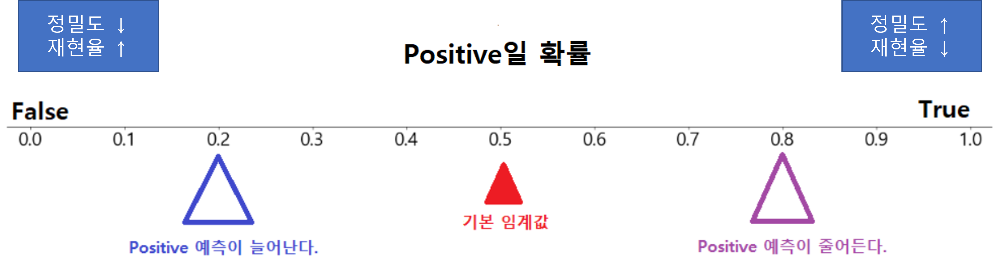

# 분류와 회귀의 평가방법
### 분류 평가 지표
1. 정확도
2. 정밀도
3. 재현률
4. F1 점수
5. PR Curve, AP score
6. ROC, AUC score

- 정밀도, 재현률 F1 점수 -> Positive에 대한 평가 지표

### 회귀 평가방법
1. MSE
2. RMSE
3. ${R^2}$

### scikit-learn 평가함수 모듈
- sklearn.metrics 모듈을 통해 제공

# 분류(Classification) 평가 지표
## 이진 분류(Binary classification)의 양성(Positive)과 음성(Negative)
- 양성(Positive)-1: 모델이 찾으려는(추론하려는) 주 대상
- 음성(Negative)-0: 모델이 찾으려는(추론하려는) 주 대상이 아닌 것
>- 이진 분류와 다중 분류
>    - 개인지 고양이인지 찾는 분류 -> 다중분류
>    - 개인지 아닌지 찾는 분류 -> 이진분류
- 이진 분류 예시
    - 환자 분류
        - 양성 - 환자, 음성 - 정상인
    - 스팸메일 분류
        - 양성 - 스팸메일, 음성 - 정상메일
    - 금융사기 모델
        - 양성 - 사기거래, 음성 - 정상거래


## 정확도 (Accuracy)
- 대표적인 분류의 평가 지표

$$
\large{
정확도 (Accuracy) = \cfrac{맞게 예측한 건수} {전체 예측 건수}
}
$$

- 전체 대비 맞은 예측 값 비율로 평가한다.
- `accuracy_score(정답, 모델예측값)`

### Accuracy 평가지표의 문제
- 이진 분류에서 **양성(Positive)에 대한 지표만 확인 할 수 없다.** 
- 불균형 데이터의 경우 정확한 평가지표가 될 수 없다.
    - 예: 양성과 음성의 비율이 1:9 인 경우 모두 음성이라고 하면 정확도는 90%가 된다.


## 혼동 행렬(Confusion Marix)
- 실제 값(정답)과 예측 한 것을 표로 만든 평가표
    - 분류의 예측 결과가 몇개나 맞고 틀렸는지를 확인할 때 사용한다.
- 함수: confusion_matrix(정답, 모델예측값)
- 결과의 0번축(True, False): 실제 class, 1번 축(Positive, Negative): 예측 class -> Scikit learn 기준


>    - T/F: 맞은 지 아닌지
>    - P/N: 예측한 값

- **TP(True Positive)** 
    - 양성으로 예측했는데 맞은 개수
- **TN(True Negative)** 
    - 음성으로 예측했는데 맞은 개수
- **FP(False Positive)** 
    - 양성으로 예측했는데 틀린 개수 
    - 음성을 양성으로 예측
- **FN(False Negative)** 
    - 음성으로 예측했는데 틀린 개수 
    - 양성을 음성으로 예측

- 예)
```python
[[20, 6],
 [4, 40]]
```


## 이진 분류 평가지표

- **Accuracy (정확도)** 
    - 전체 데이터 중에 맞게 예측한 것의 비율
    - Accuracy(정확도)는 이진분류 뿐아니라 모든 분류의 기본 평가방식이다.
    
### 양성(Positive) 예측력 측정 평가지표

- **Recall/Sensitivity(재현율/민감도)** 
    - 실제 Positive(양성)인 것 중에 Positive(양성)로 예측 한 것의 비율
    - **TPR**(True Positive Rate) 이라고도 한다.
    - ex) 스팸 메일 중 스팸메일로 예측한 비율. 금융사기 데이터 중 사기로 예측한 비율
- **Precision(정밀도)**
    - Positive(양성)으로 예측 한 것 중 실제 Positive(양성)인 비율
    - **PPV**(Positive Predictive Value) 라고도 한다.
    - ex) 스팸메일로 예측한 것 중 스팸메일의 비율. 금융 사기로 예측한 것 중 금융사기인 것의 비율

- **F1 점수**
    - 정밀도와 재현율의 조화평균 점수
    - recall과 precision이 비슷할 수록 높은 값을 가지게 된다. F1 score가 높다는 것은 recall과 precision이 한쪽으로 치우쳐저 있이 않고 둘다 좋다고 판단할 수 있는 근거가 된다.

### 음성(Negative) 예측력 측정 평가지표
- **Specificity(특이도)**
    - 실제 Negative(음성)인 것들 중 Negative(음성)으로 맞게 예측 한 것의 비율
    - **TNR**(True Negative Rate) 라고도 한다.

- **Fall out(위양성률)**
    - 실제 Negative(음성)인 것들 중 Positive(양성)으로 잘못 예측한 것의 비율. `1 - 특이도`
    - **FPR** (False Positive Rate) 라고도 한다.
    - $Fall Out(FPR) = \cfrac{FP}{TN+FP}$

    


## 각 평가 지표 계산 함수
- sklearn.metrics 모듈
- **confusion_matrix(y 실제값, y 예측값),  ConfusionMatrixDisplay(Confusion marix 시각화클래스)**
    - 혼돈 행렬 반환
    - plot confusion metrix 는 dupulicate 됨
- **recall_score(y 실제값, y 예측값)**
    - Recall(재현율) 점수 반환 (Positive 중 Positive로 예측한 비율 (TPR))
- **precision_score(y 실제값, y 예측값)**
    - Precision(정밀도) 점수 반환 (Positive로 예측한 것 중 Positive인 것의 비율 (PPV))
- **f1_score(y 실제값, y 예측값)**
    - F1 점수 반환 (recall과 precision의 조화 평균값)
- **classification_report(y 실제값, y 예측값)**
    - 클래스 별로 recall, precision, f1 점수와 accuracy를 종합해서 보여준다.

## 이진 분류 내 Recall(재현율)과 Precision(정밀도)의 관계
- 모델이 잘 만들어졌을 경우에는 상관이 없지만 그렇지 않을 경우 후처리(재현율과 정밀도의 값을 조정)를 통해 좀 더 값을 정확하게 해준다.
    - **후처리**
        - 데이터가 문자일 경우 숫자형태로 전처리를 해주는 데 결과값으로 사용자에게 보여줄 때는 해당하는 문자 형태로 바꿔서 나타나게 된다.
        - predict()를 사용할 경우 (기본 임계점일때)
            - 0이 0.01이고 1이 0.99이면 1로 나타내 준다.
            - 0이 0.4이고 1이 0.6이어도 1로 나타내 준다.
### Recall(재현율)/Sensitivity(민감도)가 더 중요한 경우
- 정답이 Negative인 값들을 잘 찾아야 함 -> Negative일 확률이 거의 100%일때만 선택
- 실제 Positive 데이터를 Negative 로 잘못 판단하면 업무상 큰 영향이 있는 경우. 
- FN(False Negative)를 낮추는데 촛점을 맞춘다.
- 암환자 판정 모델, 보험사기적발 모델

### Precision(정밀도)가 더 중요한 경우
- 정답이 Positive인 값들을 잘 찾아야 함 -> Positive일 확률이 거의 100%일때만 선택
- 실제 Negative 데이터를 Positive 로 잘못 판단하면 업무상 큰 영향이 있는 경우.
- FP(False Positive)를 낮추는데 초점을 맞춘다.
- 스팸메일 판정

## Threshold(임계값)
- 모델이 분류 Label을 결정할 때 기준이 되는 확률 기준값.
- 재현율과 정밀도 중 더 강조해야 하는 상황일 경우 임계값을 변경하여 평가 수치를 올린다.



- 임계값을 변화시켰을때 **정밀도와 재현율은 반비례 관계를 가진다.**
- 임계값을 변화시켰을때 **FPR/Fall out(위양성률)과 재현율은 비례 관계를 가진다.** -> `1 - 특이도`
    - 임계값을 높이면 정밀도는 높아지고 재현율을 낮아진다. -> 왠만하면 Negative
    - 임계값을 낮추면 정밀도는 낮아지고 재현율은 높아진다. -> 왠만하면 Positive


- 위 그래프를 확인하고 Recall 값과 Precision의 교차점을 기준으로 강조해야 하는 값이 잘 나올만한 Threshold를 정하면 된다.


- 위 그래프에서 나타난 첫번째 점이 Precision은 높고 Recall은 낮기 때문에 Threshold 값이 가장 크다.