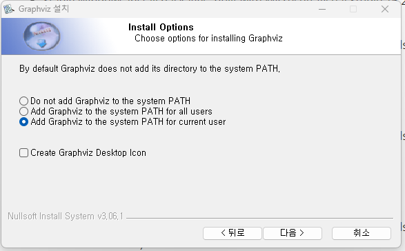
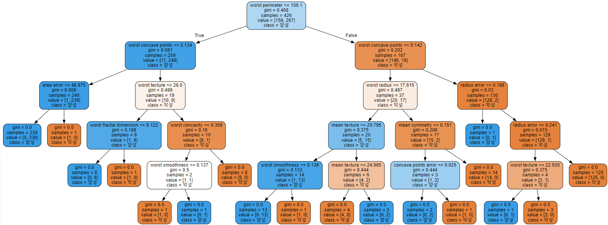
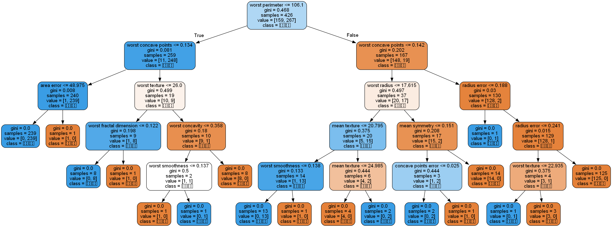

## 과적합과 일반화

- 데이터 학습량에 따른 과적합과 일반화 간단 분류
- Underfitting < **Generalization** < Overfitting
- 단순한 모델

### **Generalization (일반화)**
- 모델이 새로운 데이터셋(테스트 데이터)에 대하여 정확히 예측하면 이것을 일반화 되었다고 말한다.
- 모델이 훈련 데이터로 평가한 결과와 테스트 데이터로 평가한 결과의 차이가 거의 없고 좋은 평가지표를 보여준다.

### **Overfitting (과대적합)**
#### 개념
- 학습할 때는 예측 성능이 너무 좋지만 일반성이 떨어져 새로운 데이터(Test data)에 대해선 성능이 좋지 않는 것
- Train 데이터를 너무 잘 맞추려고 해서 이상치까지 고려를 해버리게 된다.
- 쓸데 없는 것(이상치)까지 학습해서 헷깔리는 현상
#### 원인
- 학습 데이터 양에 비해 모델이 너무 복잡한 경우 발생.
    - 데이터의 양을 늘린다. 
        - 시간과 돈이 들기 때문에 현실적으로 어렵다.
    - 모델을 좀더 단순하게 만든다.
        - 사용한 모델보다 좀더 단순한 모델을 사용한다.
        - 모든 모델은 모델의 복잡도를 변경할 수 있는 **규제와 관련된 하이퍼파라미터**를 제공하는데 이것을 조절한다.
#### 결과
- 복잡한 모델이 만들어진다.
    - Train Set 성능 **&uarr;**  but  Validation Set 성능 **&darr;&darr;**
    - Train Set에서는 성능이 좋지만 Validation Set에서는 Train Set에 비해 **너무** 성능이 안좋다.
    
### **Underfitting (과소적합)**
#### 개념
- 모델이 훈련 데이터과 테스트 데이터셋 모두에서 성능이 안좋은 것을 말한다.
- Train 데이터를 사용을 덜 해서 분류해야 하는 것도 하질 못했다.
- 학습이 아직 덜 된 것
#### 원인
- 데이터 양에 비해서 모델이 너무 단순한 경우 발생
    - 좀더 복잡한 모델을 사용한다.
    - 모델이 제공하는 규제 하이퍼파라미터를 조절한다.
#### 결과
- 단순한 모델이 만들어진다.
    - Train Set 성능 **&darr;**, Validation Set 성능 **&darr;**
    - Train Set에도 Validation Set에도 성능이 안좋은 모델

## 규제 하이퍼파라미터
- 주로 정수 값
- 모델의 복잡도를 규제하는 hyper parameter
    - Hyper Parameter
        - 모델의 성능에 영향을 끼치는 파라미터 값으로 모델 생성시 사람이 직접 지정해 주는 값
    - Hyper Parameter Tunning
        - 모델의 성능을 가장 높일 수 있는 하이퍼파라미터를 찾는 작업
    - Parameter
        - 머신러닝에서 파라미터는 모델이 데이터 학습을 통해 직접 찾아야 하는 값을 말한다.

## graphviz 를 이용해서 트리 구조 시각화 하기
### Graphviz 란
- 다이어그램을 그리는 툴
### 설치 방법
- 설치: <https://graphviz.org/>  
	1. download
	2. 다음
	3. 동의함
	4. install option에서 환경변수를 잡아주기 위해 마지막 버튼인 Add Graphviz to the system PATH for current user를 선택한다



- 설치후 (컴파일 과정을 거친다)
	1.  명령프롬프트 관리자 권한 실행
	2.  `dot -c`를 입력한다
	3. 완료

- graphviz 설치
	1. `conda activate` 를 통해 가상환경에 접속한다
	2. `pip install graphviz`를 입력한다
	3. jupyter notebook 을 실행시키면 적용
- 순서도
- Decision Tree 객체가 학습된 예측 결과를 시각적으로 확인할 수 있음

### 사용 예시

```python
from sklearn.tree import export_graphviz
from graphviz import Source

graph = Source(export_graphviz(tree5,  # max_depth가 5인 Decision Tree 모델
                               out_file=r'c:\temp\tree.dot', # 결과 값을 .dot 타입으로 저장
                               feature_names=data.feature_names,
                               class_names=['악성', '양성'], # class 이름
                               rounded=True,
                               filled=True # 다수 클래스를 색으로 확인할 수 있도록 색을 채운다. 색이 진하면 그 색이 차지하는 비율이 높은 것을 의미
                              ))

graph
```

- 결과


### .dot 파일을 이미지 파일로 변환하는 방법

``` python
!dot -Tpng c:\temp\tree.dot -o tree.png
```

- 결과



- 대신 한글은 깨지기 때문에 다른 값으로 바꿔야 한다.

## Decision Tree 복잡도 제어(규제 파라미터)
- Decision Tree 모델을 복잡하게 하는 것은 노드가 너무 많이 만들어 지는 것이다. 
    - 노드가 많이 만들어 질수록 훈련데이터셋에 Overfitting 된다.
- 적절한 시점에 트리 생성을 중단해야 한다.

- 모델의 복잡도 관련 주요 하이퍼파라미터
    - **max_depth**: 트리의 최대 깊이
    - **max_leaf_nodes** : 리프노드 개수
    - **min_samples_leaf** : leaf 노드가 되기위한 최소 샘플수 