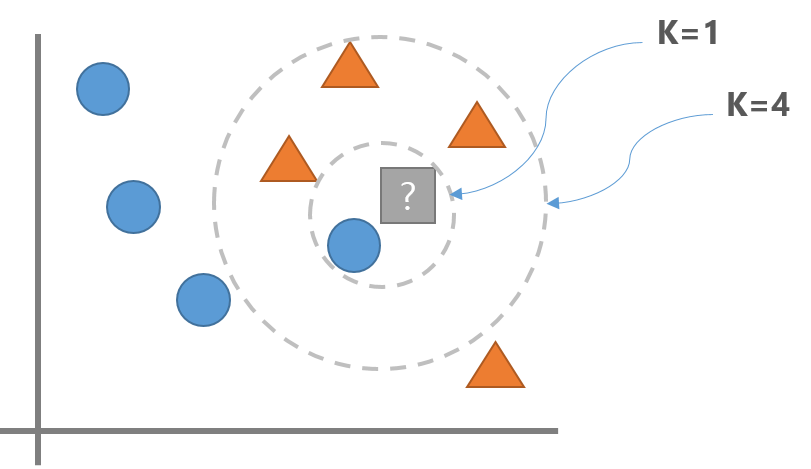
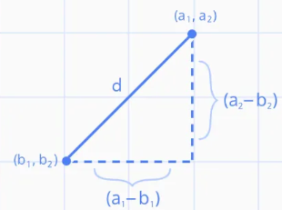
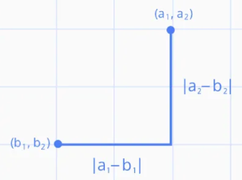
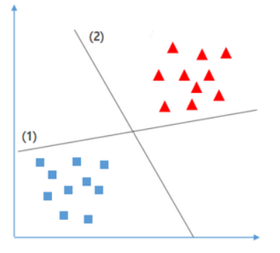
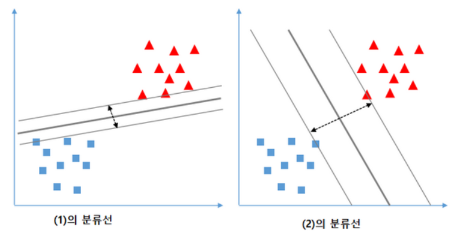
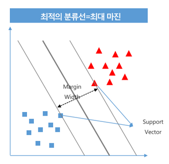

# KNN
## KNN이란?
- K-최근접 이웃 (K-NearestNeighbors)
- Classification(분류)과 Regression(회귀)를 모두 지원한다
    - Classification은 가장 가까운 K **원소 종류의 개수**로 계산
    - Regression은 가장 가까운 K **원소 값의 평균**으로 계산
- 예측하려는 데이터와 주위에 있는 데이터의 거리를 측정해 **가장 가까운 K개의 데이터**를 참조해 분류 예측한다.
- 학습시 단순히 데이터를 저장하고 **예측 시점에 거리를 계산**한다.
    - 학습은 빠르지만 예측시 시간이 많이 걸린다.
## K (Hyper Parameter)
- K는 새로운 데이터포인트를 분류할때 확인할 데이터 포인트의 개수를 지정하는 hyper parameter이다.

- **분류****
    - K를 1로 하면 파란색, K를 3으로 하면 주황색 으로 분류한다.
- ****회귀****
    - K를 1로 하면 파란색, K를 3으로 하면 주황색 data point의 평균값으로 추론한다.
- K가 너무 **작으면 Overfitting**이 일어날 수 있고 K가 너무 **크면 Underfitting**이 발생할 수 있다.
    - Overfitting: K값을 더 크게 잡는다.
    - Underfitting: K값을 더 작게 잡는다

## 주요 Hyper Parameter

- **분류: sklearn.neighbors.KNeighborsClassifier**,  **회귀: sklearn.neighbors.KNeighborsRegressor**
- 이웃 수 
    - n_neighbors = K
    - n_neighbors는 Feature수의 제곱근 정도를 지정할 때 성능이 좋은 것으로 알려져 있다.
- 거리 재는 방법 
    - p=2: 유클리디안 거리(Euclidean distance - 기본값 - L2 Norm)
        - 제곱을 통해 거리계산 **&rarr;** 대각선
    - p=1: 맨하탄 거리(Manhattan distance - L1 Norm)
        - 일반 거리로 거리계산 **&rarr;** 네모

> ### 유클리디안 거리(Euclidean_distance)

$$
distance = \sqrt{(a_1 - b_1)^2 + (a_2-b_2)^2}\\
n차원 벡터간의 거리 = \sqrt{(a_1 - b_1)^2 + (a_2-b_2)^2 +...+(a_n-b_n)^2}
$$

> ### 맨하탄 거리 (Manhattan distance)

$$
distance = |a_1 - b_1| + |a_2 - b_2| \\
𝑛차원벡터간의거리= |a_1 - b_1| + |a_2 - b_2| + ... + |a_n - b_n|
$$

## 요약
### 장점
- 이해하기 쉬운 모델이며 튜닝할 하이퍼파라미터의 수가 적어 빠르게 만들 수있다.

### 단점
- 훈련세트가 너무 큰 경우(Feature나 관측치의 개수가 많은 경우) 거리를 계산하는 양이 늘어나 예측이 느려진다.
    - 추론에 시간이 많이 걸린다.
- Feature간의 값의 단위가 다르면 작은 단위의 Feature에 영향을 많이 받게 되므로 전처리로 **Feature Scaling작업**이 필요하다.
- Feature가 너무 많은 경우와 대부분의 값이 0으로 구성된(희소-sparse) 데이터셋에서 성능이 아주 나쁘다

### 사용처
- K-NN은 서비스할 모델을 구현할때 보다는 복잡한 알고리즘을 적용해 보기 전에 확인용 또는 base line을 잡기 위한 모델로 사용한다.
    - 주로 K-NN 결과 보다 더 좋은 모델을 만들어야 한다.(기준)

# SVM
## SVM이란?
- Support Vector Machine
- 딥러닝 이전에 분류에서 뛰어난 성능으로 많이 사용되었던 **분류 모델**
- 하나의 분류 그룹을 다른 그룹과 분리하는 최적의 경계를 찾아내는 알고리즘
- 중간 크기의 데이터셋과 특성이(Feature) 많은 복잡한 데이터셋에서 성능이 좋은 것으로 알려져있다.

## Linear(선형) SVM
### Linear SVM 예시

- train 데이터의 경우에는 (1)의 경우가 최적의 분류이지만 지도학습을 하는 이유는 새로운 데이터를 바탕으로 결과값을 도출 해야 하기 때문에 **(2)의 경우가 최적의 분류를 위한 경계선**이 된다.
    - 데이터 간의 거리가 가까울 수록 **분류선과 가까운 데이터 값이 틀릴 가능 성이 높아진다.**
- **Linear SVM 모델은 두 클래스 간의 거리를 가장 넓게 분리할 수있는 경계선을 찾는 것을 목표로 한다.**

## SVM의 목표

- support vector간의 가장 넓은 margin을 가지는 decision boundary(결정 경계)를 찾는다.
    - **Support Vector**: 경계를 찾는데 기준이 되는 데이터포인트. 결정경계에 가장 가까이 있는 vector(데이터포인트)를 말한다.
    - **margin**: 두 support vector간의 너비
- margin이 넓은 결정경계를 만드는 함수를 찾는 것.

## 규제 - Hard Margin, Soft Margin
- TrainSet에 Outlier(이상치)들이 있다면 데이터를 완벽하게 나눌 수는 없다 -> Overfitting
- Margin을 나눌 때 Outlier를 얼마나 무시할 것인지에 따라 Hard margin과 soft margin으로 나뉜다.
- Outlier들을 무시하게 된다면 좀 더 넓은 margin을 얻을 수 있다.

### Hard margin
- Outlier들을 무시하지 않고 Support Vector를 찾는다.
- Margine이 Soft Margin에 비해 매우 좁다.
- Overfitting이 발생할 수 있다.

### Soft margin
- 일부 Outlier들을 무시하고 Support Vector를 찾는다.
- Margin의 거리가 넓다.
- Underfitting이 발생할 수 있다.

### Hyper Parameter C
- Outlier 을 무시하는 비율을 설정하는 Hyper Parameter
- 기본값 1
- Parameter 값을 크게 주면 제약조건이 강해진다.
    - Margin 값이 작아진다.
    - 오류가 작아진다.
    - Overfitting이 일어날 가능성이 크다.
- Parameter 값을 작게 주면 제약조건이 약해진다.
    - Margin 값이 커진다.
    - Test data에서 성능이 안좋아지나 generalization(일반화)되어 테스트 데이터 성능이 올라간다.
    - Overfitting이 일어날 가능성이 크다.
### Linear SVM에서 C의 변화에 따른 성능변화 확인
- overfitting: C의 값을 줄인다.
- underfitting: C의 값을 늘린다.

## Kernel SVM 
- None Linear(비선형) SVM
- 차원을 변경 해서 비선형 데이터셋을 선형으로 분리한다.



### Kernel trick(커널 트릭)
- 비선형 데이터셋을 선형으로 분리하기 위해 차원을 변경해야 하는데 이때 사용하는 함수를 **Kernel**이라고 하고 차원을 변경하는 것을 **kernel trick** 이라고 한다.
- 대표적인 kernel함수
    - **Radial kernel**
    - Polynomial kernel
    - Sigmoid kernel