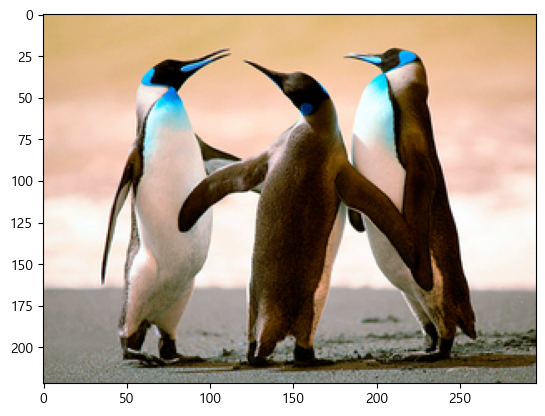
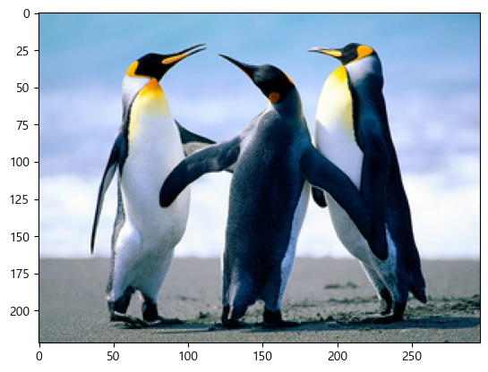
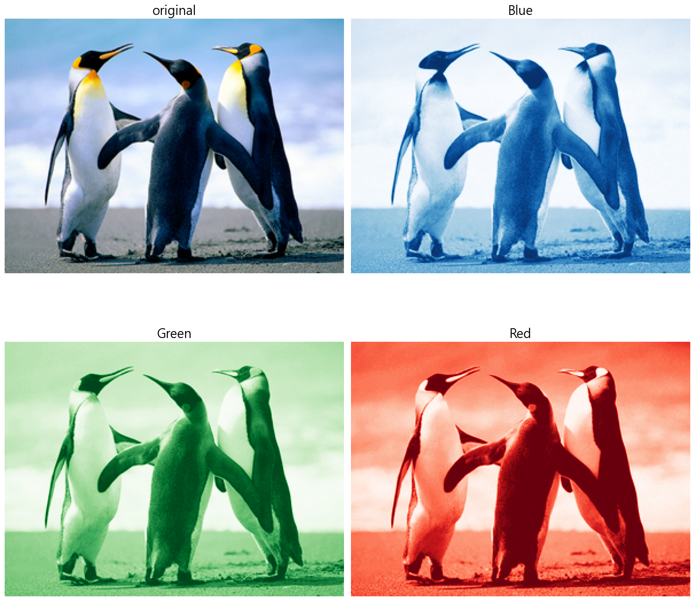
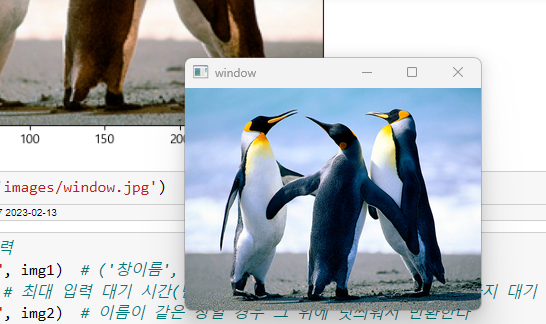
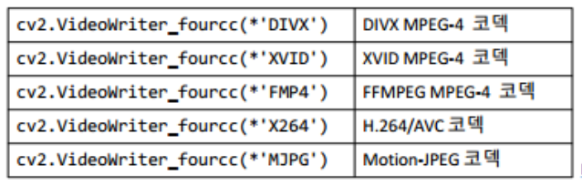

# 이미지 처리

## Image
- width X height X channel 의 pixels로 이루어진 matrix **&rarr;** 3차원 배열로 표기
    - **width**: 너비로 이미지의 가로 길이를 의미한다.
    - **height**: 높이로 이미지의 세로 길이를 의미한다.
    - **channel**: 색을 표현할 수 있는 값들의 개수 ex) rgb **&rarr;** 3
    - **pixel**: image가 가지고 있는 값으로 width X height 개수만큼 존재한다. image를 표현하는 bit방식에 따라 값의 범위가 달라진다.
    - 일반적인 Image는 unsigned integer 8bit로 표현 **&rarr;** 농도
        - 0 ~ 255 로 표현
    - bit수가 높아질 수록 표현할 수 있는 색의 범위가 증가한다.

## OpenCV 개요


- <https://opencv.org/>
- 튜토리얼: <https://docs.opencv.org/master/>
- Open Source Computer Vision Library로 실시간 computer vision을 목적으로 개발됨
- OpenCV 설치
    - `!pip install opencv-contrib-python`

- cf) pillow : 파이썬 기반으로 만든 이미지 처리 소프트웨어
    - 파이썬 기반으로 만들었기 때문에 OpenCV보다 속도가 느리다


## OpenCV 사용법
- import 하는 법
    -  `import cv2`

- **`imread(filename [, flag]) : ndarray`**
    - 이미지를 읽는다.

    - filename: 읽어들일 이미지 파일경로
    - flag: 읽기 모드
        - cv2.IMREAD_XXXXX 상수를 이용한다.  **&rarr;** 상수로 정의함으로써 값이 변경되지 않도록 한다.
        - IMREAD_COLOR가 기본(**BGR 모드**)
            - matplotlib에서 출력시 rgb 모드로 변환해야 한다.
### image 출력 방법
- matplotlib으로 출력
    ```python
    # 이미지 읽기
    img1 = cv2.imread('images/penguin.jpg')
    print(type(img1))
    print(img1.shape) # (height, width, channel) => channel: 3 => color, 1 => grayscale(흑백)
    plt.imshow(img1) # -> rgb로 안바꿔줘서 색이 반대로 나온다.
    plt.show()
    ```

    


## 색공간 변환
- **`cv2.cvtColor(src, code)`**
    - image 의 color space를 변환한다. 
    - src: 변환시킬 이미지 (ndarray)
    - code
        - 변환시킬 색공간 타입 지정
        - cv2.COLOR_XXX**2**YYY 형태의 상수 지정(XXX를YYY로 변환)
            - cv2.COLOR_XXX2YYY 형태의 상수 지정(XXX를YYY로 변환)
            - cv2.COLOR_BGR2GRAY (BGR -> GRAY)
            - cv2.COLOR_BGR2RGB (BGR -> RGB)
            - cv2.COLOR_BGR2HSV (BGR -> HSV)
        - HSV
            - Hue: 색상, 색의 종류
            - Saturation: 채도. 색의 선명도
            - Value : 명도. 밝기
    
- img1(bgr mode) ==> rgb mode로 변환
    ```python
    img2 = cv2.cvtColor(img1, cv2.COLOR_BGR2RGB) # (대상, flag)
    plt.imshow(img2)
    plt.show()
    ```

    

## 채널 확인
- 채널별로 나눠 이미지 출력
- 해당 채널의 값이 더 클 수록 그 채널 사진에 있는 부분이 더 밝아진다.
- ex) 아래 사진에서 하늘을 보게 되면 blue 채널이 red 채널보다 더 밝은 것을 알 수 있다.




## cv2에서 이미지 출력
- **`cv2.imshow(winname, mat)`**
    - 창을 띄워 이미지를 출력한다.
    - winname: 창 이름
        - 창이름이 같으면 같은 창에 띄운다.
    - mat: 출력할 이미지(ndarray)
        - dtype이 uint8이어야 정상 출력된다. (float일 경우 255를 곱해서 출력한다.)
    - 이미지 출력 예시
        ```python
        # open cv 이미지 출력
        cv2.imshow("window", img1)  # ('창이름', 이미지 배열)
        cv2.waitKey(0) # 최대 입력 대기 시간(단위: 밀리초-1/1000) , 0: 입력될때 까지 대기
        cv2.destroyAllWindows() # 이미지를 출력하는 윈도우(창)을 모두 닫는다.
        ```

        


- **`cv2.imwrite(filename, img): bool`**
    - 이미지 파일로 저장
    - filename: 저장할 파일경로
    - img: 저장할 이미지(ndarray)
    - 결과 값이 True면 저장이 완료되었다는 뜻
    - 이미지 저장 예시
        ```python
        # 파일로 저장
        save_path = 'images/penguin_gray.jpg'  # 저장할 경로
        cv2.imwrite(save_path, img3)
        ```


# 동영상 처리

## 동영상 읽기
- VideoCapture 클래스사용
    - 객체 생성
        - VideoCapture('동영상파일 경로'): 동영상파일
        - VideoCapture(웹캠 ID): 웹캠
- VideoCapture의 주요 메소드
    - isOpened(): bool
        - 입력 대상과 연결되었는지 여부반환
    - read(): (bool, img)
        - Frame 이미지로 읽기
        - 반환값
            - bool: 읽었는지 여부
            - img: 읽은 이미지(ndarray)

- 기본 코드
    ```python
    import cv2

    cap = cv2.VideoCapture(0) # 정수: web 캠 연결 -> 0부터 1씩 증가하는 값을 사용, 웹캠이 여러개인 경우 지정
    print(cap.isOpened())  # True면 캠에 잘 연결되었다는 것
    while True:
        # 한개 Frame을 읽기
        success, image = cap.read()
        if not success:
            print('프레임을 읽어오지 못함')
            break # 종료
            
        # 읽은 Frame을 출력
        cv2.imshow('frame', image)
        if cv2.waitKey(1) == 27: # 27: esc key => 종료 / waitKey(1) 1/1000초
            break
        
    cap.release() # 연결 닫기(해제)
    cv2.destroyAllWindows()
    ```

## 동영상파일

- FPS (Frame Per Second) - 1초에 몇 Frame을 보여주는 지, 동영상 파일에 설정되있다.
- 동영상파일의 FPS에 맞춰서(속도를 맞춰서) 플레이 하려면 한 Frame을 보여주고 FPS 맞는 시간간격만큼 기다려야 한다.
    - 기다리는 시간: 시간/FPS

### 동영상 저장
- capture(read)한 이미지 프레임을 연속적으로 저장하면 동영상 저장이 된다.
- VideoWriter 객체를 이용해 저장
    - **`VideoWriter(filename, codec, fps, size)`**
        - filename: 저장경로
        - codec
            - VideoWriter_fourcc 이용
            
        - fps
            - FPS (Frame Per Second) - 초당 몇 프레임인지 지정
        - size
            - 저장할 frame 크기로 원본 동영상이나 웹캠의 width, height 순서로 넣는다.
    - `VideoWriter().write(img)`
        - Frame 저장