# DNN, CNN, RNN
## DNN (Deep Neural Network)
- Dense layer -> 선형회귀
    - 1차원으로 입력 받아야함
        - 모델을 만들 때 `keras.layers.Flatten()`을 해준 후 사용 가능

## CNN
- Convolution layer 사용
- 이미지 쪽에서 사용을 많이함


## RNN 
- Recurrent layer 사용
- 순차 데이터를 분석할 때 사용 - 시계열, 음섬, 자연어
- 생성된 순서가 중요함


# DNN (Deep Neural Network)
## 신경망 구성요소
### Train(학습) 프로세스
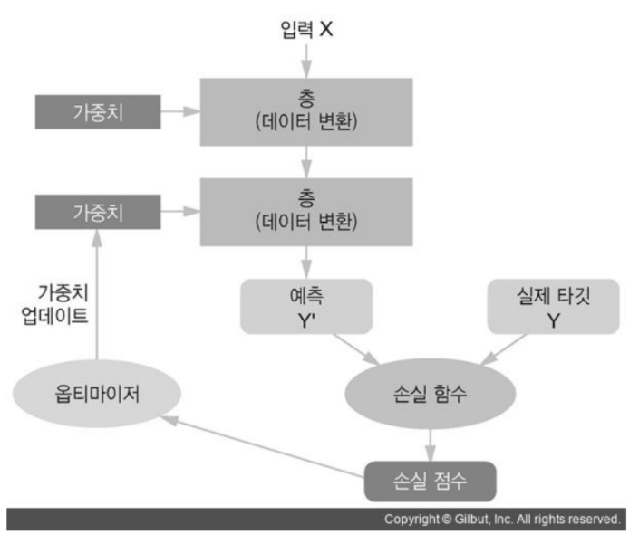

### 학습 단계 및 역할
1. 모델: 추론
    - batch size 단위로 추론한다.
2. 손실함수(Loss Function): 모델이 추론한 것과 정답간의 Loss(손실-오차)의 평균을 구한다.
3. 옵티마이저(Optimizer): 손실함수가 구한 Loss를 기반으로 모델의 파라미터들(weight)을 업데이트한다.


- **층(Layer)**: 모델이 추론하기 위한 각 단계를 정의
- **손실함수(loss function)**: 모델의 예측결과와 Ground truth(실제정답) 사이의 차이를 계산
- **optimizer**: 파라미터(가중치)를 업데이트하여 모델의 성능을 최적화

## 유닛/노드/뉴런 (Unit, Node, Neuron)
- 입력 Feature들을 입력받아 처리 후 출력하는 데이터 처리 모듈 
    - Input -> Output
- 입력 값에 Weight(가중치)를 곱하고 bias(편향)을 더한 결과를 Activation 함수에 넣어 최종 결과를 출력하는 계산을 처리한다

    

    > - Dense layer: $z = w^T x + b$
    > - Feature: $x_1, x_2, x_3$
    > - Unit: $w_1, w_2, w_3$
    > - Activation function: $a = \sigma( z)$
    > - layer를 쌓을 때 항상 activation fuction을 붙여준다.

   
    - **Input vector(입력값)**: $x=(x_1, x_2, x_3)^T$
    - **Weights(가중치)**: $w = (w_1, w_2, w_3)^T$
    - **Bias(편향)**: $b \in R$
    - **Activation function(활성함수)**: $\sigma(\cdot)$
        - 선형결합한 결과를 비선형화 시키는 목적
        - 다양한 비선형 함수들을 사용한다.

       $z=w_1 x_1 + w_2 x_2 + w_3 x_3 + b \Leftrightarrow z = w^T x + b$
       $\LARGE a=\sigma( z)$

- 선형일 경우 같은 방법으로만 찾기 때문에 처리가 단조로워진다
    - activation 함수에 비선형 데이터를 넣어 다양한 처리가 가능하도록 해야 한다
    - 주로 ReLU를 사용한다
    - 예시
        ```python
        model = keras.Sequential([
            keras.layers.InputLayer((28, 28)),
            keras.layers.Flatten(), # 입력데이터를 1차원 배열로 변환
            keras.layers.Dense(256), # unit 256개로 이뤄진 layer를 생성, 각 unit은 선형회귀(W*X + 8) 계산을 처리
            keras.layers.ReLU(), # max(X, 0) -> Activation(활성) 함수 => 비선형 함수를 사용
            keras.layers.Dense(128),
            keras.layers.ReLU(),
            keras.layers.Dense(10),
            keras.layers.Softmax()
        ])
        ```
- weight의 개수는 입력 feature의 개수에 영향을 받는다.
- 출력의 개수는 unit의 개수에 영향을 받는다.
    

## 레이어/층(Layer)
- 네트워크 모델의 각 처리단계를 정의한 것.
    - 실제 처리를 담당하는 Unit들을 모아놓은 구조
- **Input Layer(입력층)**
    - 입력값들을 받아 Hidden Layer에 전달하는 노드들로 구성된 Layer.
    - 입력 데이터의 shape을 설정하는 역할을 한다.
- **Output Layer(출력층)**
    - 모델의 최종 예측결과를 출력하는 노드들로 구성된 Layer
    - 마음대로 설정을 할 수 없음
- **Hidden Layer(은닉층)**
    - Input Layer와 Output Layer사이에 존재하는 Layer.
    - 정해져 있지 않음
    - 머신러닝에서 튜닝 대상을 의미
- 대부분 Layer들은 학습을 통해 최적화할 Paramter를 가짐 
    - Dropout, Pooling Layer와 같이 Parameter가 없는 layer도 있다.
- Layer들의 연결한 것을 **<font size=5>Network</font>** 라고 한다.
    - 딥러닝은 Layer들을 깊게 쌓은 것을 말한다.(여러 Layer들을 연결한 것)
- 목적, 구현 방식에 따라 다양한 종류의 Layer들이 있다.
    - **Fully Connected Layer (Dense layer)**
        - 추론 단계에서 주로 사용
    - **Convolution Layer**
        - 이미지 Feature extraction으로 주로 사용
    - **Recurrent Layer** 
        - Sequential(순차) 데이터의 Feature extraction으로 주로 사용
    - **Embedding Layer**
        - Text 데이터의 Feature extraction으로 주로 사용
- **API** 
    - <https://keras.io/api/layers/>
    - <https://www.tensorflow.org/api_docs/python/tf/keras/layers>

## 모델 (Network)
- Layer를 연결한 것이 Deep learning 모델다.
- 이전 레이어의 출력을 input으로 받아 처리 후 output으로 출력하는 레이어들을 연결한다.
- 적절한 network 구조(architecture)를 찾는 것은 공학적이기 보다는 경험적(Art)접근이 필요하다.
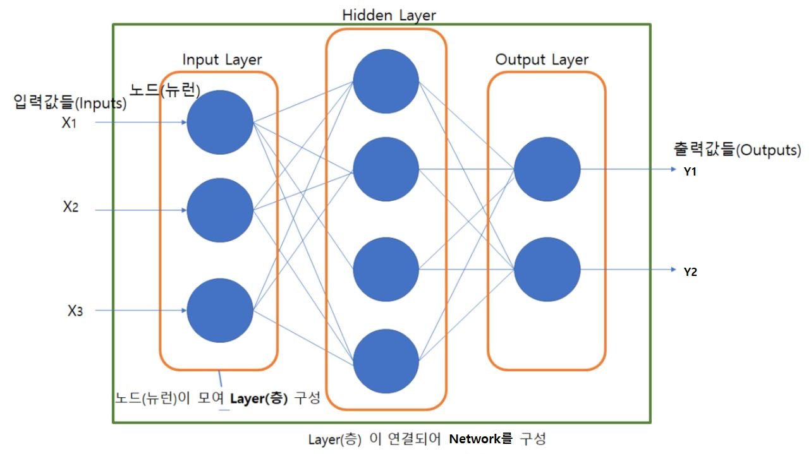

- **API**
    - <https://keras.io/api/models/>
    - <https://www.tensorflow.org/api_docs/python/tf/keras/models>

## 활성 함수 (Activation Function)
- 각 유닛이 입력과 Weight간에 가중합을 구한 뒤 출력결과를 만들기 위해 거치는 함수
- 같은 층(layer)의 모든 유닛들은 같은 활성 함수를 가진다.
- **출력 레이어**의 경우 출력하려는 문제에 맞춰 활성함수를 결정한다. &rarr; **마지막에 나오는 출력값이 activation fuction의 결과 값이기 때문**
- **은닉층 (Hidden Layer)**의 경우 비선형성을 주어 각 Layer가 처리하는 일을 분리하는 것을 목적으로 한다. &rarr; inputlayer는 activation function을 쓰지 않는다.
    - 비선형함수를 사용하지 않으면 Layer들을 여러개 추가하는 의미가 없어진다. 
    - **ReLU** 함수를 주로 사용한다. 

### Sigmoid (logistic function)
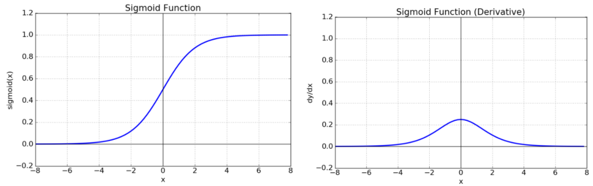

- $$\large \sigma(z) = \frac 1 {1+e^{-z}}$$
- 출력값의 범위
    - $0<sigmoid(z)<1$
- 한계
    - 초기 딥러닝의 hidden layer(은닉층)의 activation function(활성함수)로 많이 사용 되었다.
    - 층을 깊게 쌓을 경우 **기울기 소실(Gradient Vanishing)** 문제를 발생시켜 학습이 안되는 문제가 있다.
- **Binary classification(이진 분류)를 위한 네트워크의 Output layer(출력층)의 활성함수로 사용된다.**
    - 모델이 positive(1)의 확률을 출력결과로 추론하도록 할 경우 사용. (unit개수 1, activation함수 sigmoid)
    - 위와 같은 한계때문에 hidden layer(은닉층)의 activation function(활성함수)로는 잘 사용되지 않는다.

> **<font size=5>기울기 소실(Gradient Vanishing) 문제란</font>**
> - 최적화 과정에서 gradient가 0이 되어서 Bottom Layer의 가중치들이 학습이 안되는 현상 -> 결과 값이 0이 된다. -> 과거 deep learning에서 가장 큰 문제점 중 하나였다 (+과적합)
>     - Bottom Layer: Input Layer(입력층)에 가까이 있는 Layer들. 
>     - Top layer: Output Layer(출력층)에 가까이 있는 Layer들.


### Hyperbolic tangent
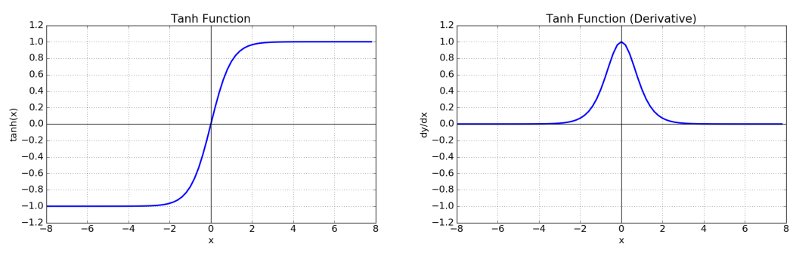

- $$\large  tanh(z) = \cfrac{e^{z} - e^{-z}}{e^{z} + e^{-z}}$$
- 출력값의 범위
    - $-1<tanh(z)<1$
- Output이 0을 중심으로 분포하므로 sigmoid보다 학습에 효율적이다.
- 기울기 소실(Gradient Vanishing) 문제를 발생시킨다.

### ReLU(Rectified Linear Unit)
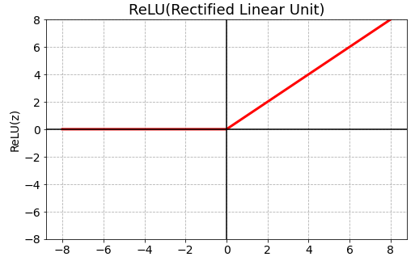

$$\large  ReLU(z)=max(0,z)$$
- 기울기 소실(Gradient Vanishing) 문제를 어느정도 해결
- 연산속도가 빠르다
- 0이하의 값(z <= 0)들에 대해 뉴런이 죽는 단점이 있다. (Dying ReLU)
    - 0 이하의 값이 계산이 안되는 점

### Leaky ReLU
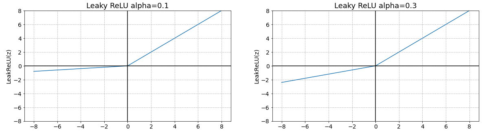

<br><br>
    $$\large  LeakyReLU(z)=max(\alpha z,z)\\
    0< \alpha <1$$
<br><br>
- ReLU의 Dying ReLU 현상을 해결하기 위해 나온 함수
- 음수 z를 0으로 반환하지 않고 alpah (0 ~ 1 사이 실수)를 곱해 반환한다. 

### Softmax
$$\large  Softmax(z_j) = \frac{exp(z_j)}{\sum_{k=1}^K exp(z_k)}\\ \:j=1,2, \ldots, K$$
- **Multi-class classification(다중 분류)를 위한 네트워크의 Output layer(출력층)의 활성함수로 주로 사용된다.** 
    - 은닉층의 활성함수로 사용하지 않는다.

- $exp(z) = e^z$ &rarr; 값의 차이를 더 크게 하기 위해서
- Layer의 unit들의 출력 값들을 정규화 하여 각 class에 대한 확률값으로 변환한다.
    - 출력노드들의 값은 0 ~ 1사이의 실수로 변환되고 그 값들의 총합은 1이 된다.
    - 위 계산 덕분에 차이가 많이나면 크기 차이가 더 많이나고 반대면 더 작아진다.
    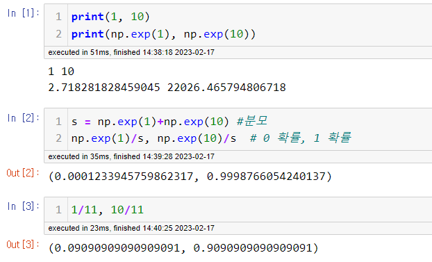

- **API**
    - <https://keras.io/api/layers/activations/>
    - <https://www.tensorflow.org/api_docs/python/tf/keras/activations>

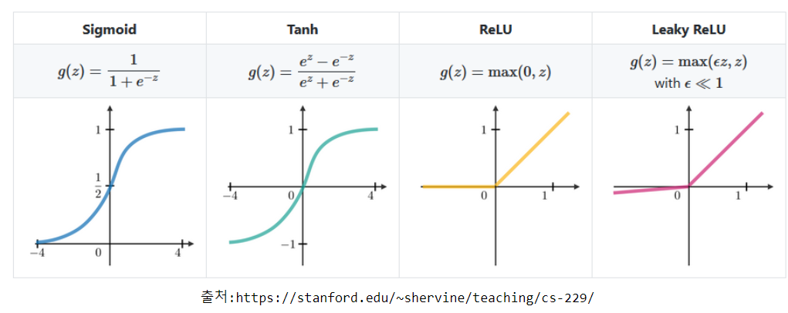

### output layer에서 사용하는 activition function
- 이진, 회귀 일때 sigmoid
- 다중 분류 일때 softmax

## 손실함수(Loss function, 비용함수)
- Model이 출력한 예측값(prediction) $\hat y^{(i)}$와 실제 데이터(output) $y^{(i)}$의 차이를 계산하는 함수
- 네트워크 모델을 훈련하는 동안 Loss 함수가 계산한 Loss값(손실)이 최소화 되도록 파라미터(가중치와 편향)을 업데이트한다.
    - 즉 Loss함수는 최적화 시작이 되는 값이다.
- 네트워크 모델이 해결하려는 문제의 종류에 따라 다른 Loss함수를 사용한다.

- <font size="5" color="red">해결하려는 문제의 종류에 따라 표준적인 Loss function이 있다.</font>

## Classification (분류)
- cross entropy (log loss) 사용
$$
\large log(모델이\,출력한\,정답에\,대한\,확률)
$$

- 위 식이 나오는 이유
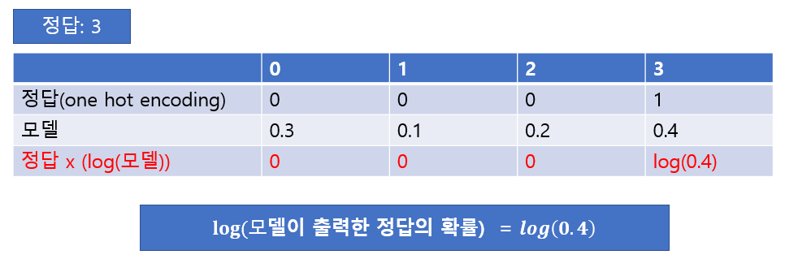


### Binary classification (이진 분류)
- 두 개의 클래스를 분류
    - 모델이 양성(1)의 확률을 출력하여 Threshold 보다 작으면 0, 크면 1로 label을 예측
- 예) 문장을 입력하여 긍정/부정 구분
- Output Layer의 unit 개수를 1로 하고 activation 함수로 sigmoid를 사용하여 positive(1)의 확률로 예측 결과를 출력하도록 모델을 정의 한 경우 **binary_crossentropy**를 loss function으로 사용한다.

- $$\large Loss(\hat y^{(i)} ,y^{(i)}) = - y^{(i)} log(\hat y^{(i)} ) - (1- y^{(i)}) log (1-\hat y^{(i)} )$$

$y^{(i)}$: 실제 값(Ground Truth), $\hat y^{(i)}$: 예측확률

### Multi-class classification (다중 클래스 분류)
- 두 개 이상의 클래스를 분류 
    - 여러개 중 하나
- 예) 이미지를 0,1,2,...,9로 구분
- 예) 사진 속 사람의 위치를 구분 &rarr; 
    - 사진에 있는 것이 사람인지에 대한 loss + 위치 값에 대한 loss
    - crossentropy를 사용하는 것은 똑같다.
- **categorical_crossentropy**를 loss function으로 사용 
- $$\large Loss(\hat y_c^{(i)} ,y^{(i)}) = - \sum_{c=1}^C y_c^{(i)} log(\hat y_c^{(i)} ) $$

$y^{(i)}$: 실제 값(Ground Truth), $\hat y_c^{(i)}$: class별 예측확률


### Regression (회귀)
- 연속형 값을 예측 
- 예) 주가 예측 
- **Mean squared error**를 loss function으로 사용 
    - "mse" 로 지정
    - 오차에 가까우면 가까울 수록 더 값이 작도록 한다.
    - 오차에 멀면 멀수록 더 값이 크게 한다.
        - ex) 0.5 -> 0.25, 5 -> 25
- $$\large Loss(\hat y^{(i)} ,y^{(i)}) = \frac  1 2 (\hat y^{(i)} - y^{(i)})^2$$

$y^{(i)}$: 실제 값(Ground Truth), $\hat y^{(i)}$: 예측 값

- **API**
    - https://keras.io/api/losses/
    - https://www.tensorflow.org/api_docs/python/tf/keras/losses

## 평가지표 (Metrics)
- 모델의 성능을 평가하는 지표
- 손실함수(Loss Function)와 차이
    - 손실함수는 모델을 학습할 때 가중치 업데이트를 위한 오차를 구할 때 사용한다.
    - 평가지표 함수는 모델의 성능이 확인하는데 사용한다. 

- **API**
    - https://keras.io/api/metrics/
    - https://www.tensorflow.org/api_docs/python/tf/keras/metrics

## 문제별 출력레이어 Activation 함수, Loss 함수

문제형태|Activation함수|Loss 함수
 :- | :- | :-
이진분류(Binary Classification)|sigmoid| binary_crossentropy
다중분류(Multi-class Classification)|softmax| categorical_crossentropy<br>sparse_categorical_crossentropy
회귀(Regression)|None|MSE

# Optimizer (최적화 방법)

- Training시 모델 네트워크의 parameter를 데이터에 맞춰 최적화 하는 알고리즘
    - Deep Learning은 경사하강법(Gradient Descent)와 오차 역전파(back propagation) 알고리즘을 기반으로 파라미터들을 최적화한다.

## Gradient Decent (경사하강법)
- ### 최적화 
    - 모델 네트워크가 출력한 결과와 실제값(Ground Truth)의 차이를 정의하는 함수를 **Loss function(손실함수, 비용함수)** 라고 한다.
    - Training 시 Loss function이 출력하는 값을 줄이기 위해 파라미터(weight, bias)를 update 과정을 **최적화(Optimization)** 이라고 한다.
- ### Gradient Decent(경사하강법)
    - 최적화를 위해 파라미터들에 대한 Loss function의 Gradient값을 구해 Gradient의 반대 방향으로 일정크기 만큼 파라미터들을 업데이트 하는 것을 경사하강법이라고 한다.
        
$$\large W_{new} = W-\alpha\frac{\partial}{\partial {W}}Loss(W)\\W: 파라미터\: \alpha:학습률$$
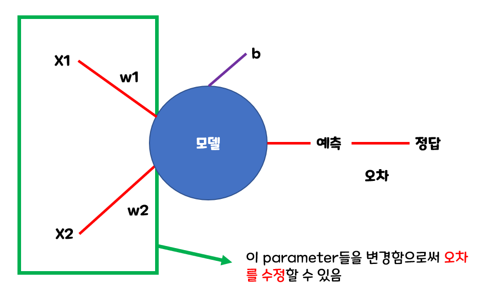

## 오차 역전파(Back Propagation) 

- 딥러닝 학습시 파라미터를 최적화 할 때 추론한 역방향으로 loss를 전달하여 단계적으로 파라미터들을 업데이트한다.
    - Loss에서부터(뒤에서부터) 한계단씩 미분해 gradient 값을 구하고 이를 Chain rule(연쇄법칙)에 의해 곱해가면서 파라미터를 최적화한다.
    - 출력에서 입력방향으로 계산하여 역전파(Back propagation)라고 한다.
        - 추론의 경우 입력에서 출력 방향으로 계산하며 이것은 순전파(Forward propagation)이라고 한다.

### 계산 그래프 (Computational Graph)
- 복잡한 계산 과정을 자료구조의 하나인 그래프로 표현한 것
    - 딥러닝 모델이 구현된 방식
- 그래프는 노드(Node)와 엣지(Edge)로 구성됨.
    - 노드: 연산을 정의
    - 엣지: 데이터가 흘러가는 방향

### 계산 그래프의 예
- 슈퍼에서 1개에 100원인 사과를 2개 샀을 때 지불할 금액은 어떻게 될까? 단 부가세는 10% 부과된다.
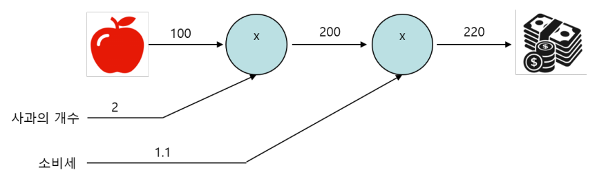

### 계산 그래프 절차 및 특징
- 계산 그래프를 사용한 문제 풀이 절차
    - 계산 그래프를 구성
    - 계산 방향을 결정
        - 계산 시작에서 계산 결과 방향으로 순서대로 계산: **순전파(Forward propagation)**
        - 계산 결과에서 계산 시작 역방향으로 계산: **역전파(Back propagation)**
- 특징/장점
    - **국소적 계산**을 통해 결과를 얻는다.
        - 각 노드의 계산은 자신과 관계된 정보(입력 값들)만 가지고 계산한 뒤 그 결과를 다음으로 출력한다.
    - 복잡한 계산을 단계적으로 나눠 처리하므로 문제를 단순하게 만들어 계산할 수 있다.
        - **딥러닝에서 역전파를 이용해 각 가중치 업데이트를 위한 미분(기울기) 계산을 효율적으로 할 수 있게 된다.**
    - 중간 계산결과를 보관할 수 있다.

## 합성함수의 미분
- **<font size='5'>합성함수 : 여러 함수로 구성된 함수</font>**
$$
\large z = (x+y)^2\\
\large z = t^2\\
\large t=x+y
$$

- **<font size='5'>연쇄 법칙(Chain Rule)</font>**
    - 합성함수의 미분은 합성함수를 구성하는 각 함수의 미분의 곱으로 나타낼 수 있다.
$$
\large\cfrac{\partial z}{\partial x} = \cfrac{\partial z}{\partial t} \cfrac{\partial t}{\partial x} \\
\cfrac{\partial z}{\partial t} = 2t,\;\cfrac{\partial t}{\partial x} = 1 \\
\large\cfrac{\partial z}{\partial x}=2t \times 1 = 2(x+y)
$$

### 연쇄 법칙과 계산 그래프
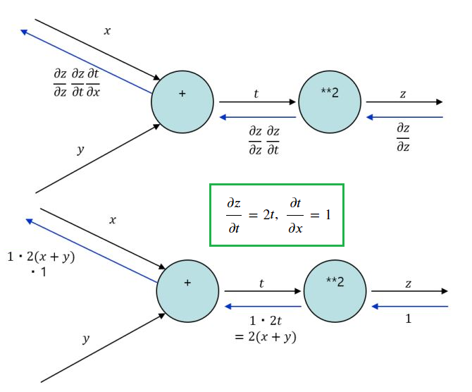

## 딥러닝 네트워크에서 최적화 예
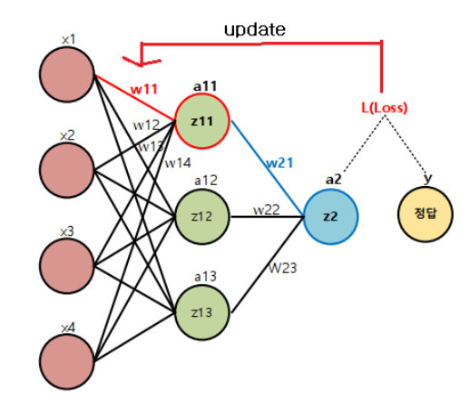

$$
\begin{align}
&z11 = x1\cdot x11 + x2 \cdot w12 + x3 \cdot w13 + x4 \cdot w14\\
&a11 = \sigma(z11) = \frac 1 {1+e^{-z11}}\\
&z2 = a11\cdot x21 + a12 \cdot w22 + a13 \cdot w23\\
&a2 = z2\\
&L = (y-a2)^2
\end{align}
$$

### $W_{11}$을 업데이트 하기 위한 미분값은?
$$
\large\frac{\partial}{\partial {W_{11}}}{Loss} = ????
$$
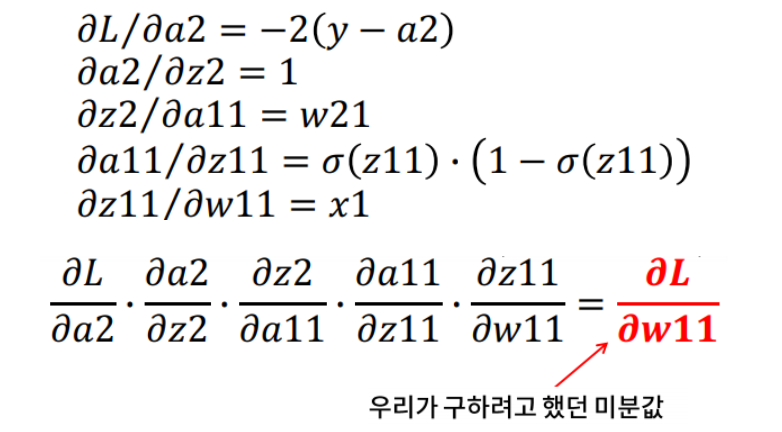
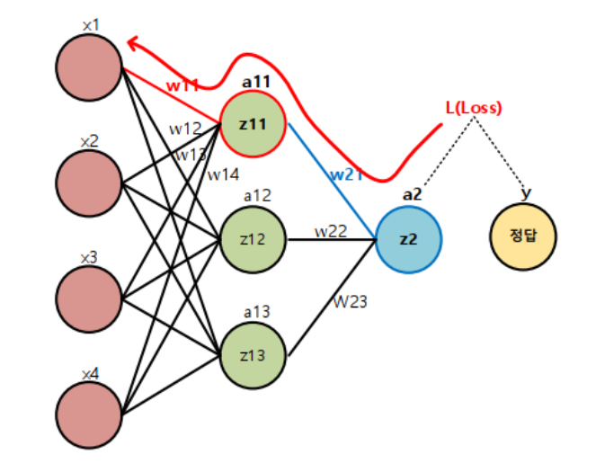

- **순전파(forward propagation): 추론**
- **역전파(back propagation): 학습시 파라미터(weight) 업데이트**

## 딥러닝에 GPU가 필요한 이유
- 복잡한 연산을 하는 것과는 다르게 딥러닝은 단순 연산만 한다
    - CPU는 GPU보다 복잡한 연산을 빨리 할 수 없다.
    - 하지만 CPU는 한번에 많은 연산을 진행할 수 없다.
- 그렇기 때문에 GPU에 달려 있는 스트림 프로세서가 많으면 많을 수록 더 많은 연산을 한번에 할 수 있다.

## 파라미터 업데이트 단위

- **Batch Gradient Decent (배치 경사하강법)**
    - Loss를 계산할 때 전체 학습데이터를 사용해 그 평균값을 기반으로 파라미터를 최적화한다.
    - 많은 계산량이 필요해서 속도가 느리다. 학습 데이터가 클 경우 메모리가 부족할 수 있다.

- **Mini Batch Stochastic Gradient Decent (미니배치 확률적 경사하강법)**
    - Loss를 계산할 때 전체 데이터를 다 사용하지 않고 지정한 데이터 양(batch size) 만큼 마다 계산해 파라미터를 업데이트 한다.
    - 계산은 빠른 장점이 있지만 최적값을 찾아 가는 방향이 불안정 하여 부정확 하다. 그러나 반복 횟수를 늘리면 Batch 방식과 유사한 결과로 수렴한다.

> **스텝(Step)**:  한번 파라미터를 업데이트하는 단위
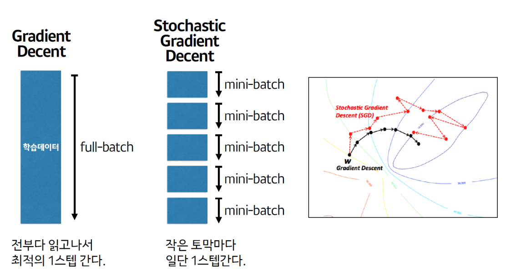

## SGD를 기반으로 한 주요 옵티마이저
- 방향성을 개선한 최적화 방법
    - Momentum
    - NAG(Nesterov Accelerated Gradient)
- 학습률을 개선한 최적화 방법
    - Adagrad
    - RMSProp
- 방향성 + 학습률 개선 최적화 방법
    - Adam

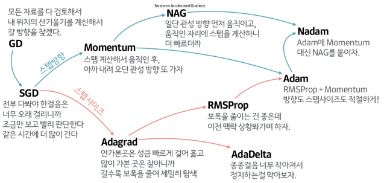

<center>[출처] https://www.slideshare.net/yongho/ss-79607172</center>

- **API**
    - https://keras.io/api/optimizers/
    - https://www.tensorflow.org/api_docs/python/tf/keras/activations