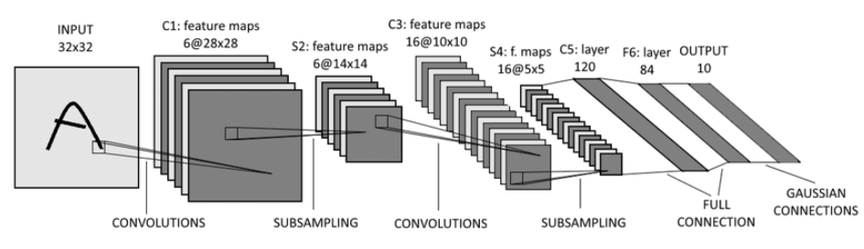
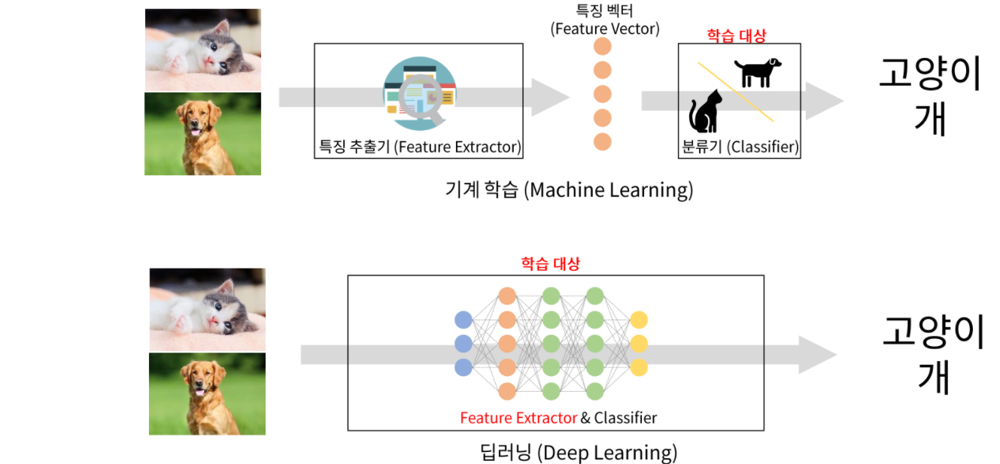
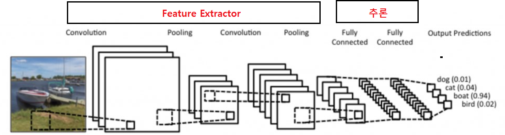
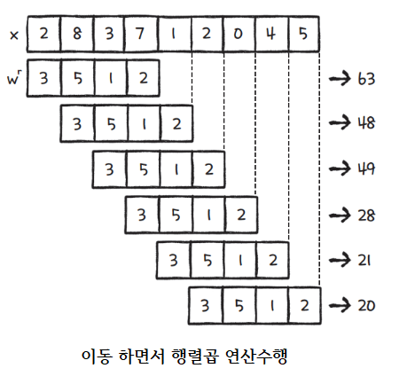
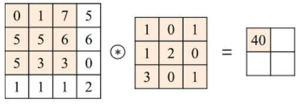
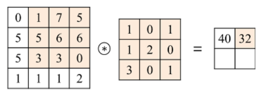
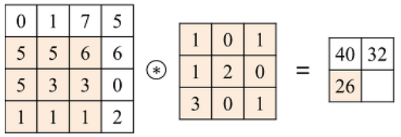
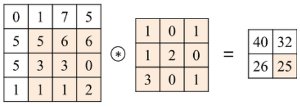

# CNN - 합성곱 신경망(Convolutional Neural Network)
- 1989년 **Yann Lecun**이 LeNet 모델을 만들면서 제안한 Deep learning 구조
- 주로 컴퓨터 비전(이미지, 동영상관련 처리) 에서 사용되는 딥러닝 모델로 Convolution 레이어를 이용해 데이터의 특징을 추출하는 전처리 작업을 포함시킨 신경망(Neural Network) 모델.

## CNN 응용되는 다양한 컴퓨터 비전 영역

### 1.  Image Classification (이미지 분류)
- 입력된 이미지가 어떤 라벨에 대응되는지 이미지에 대한 분류(Classification)을 처리.

### 2. Object Detection(물체 검출)
- 이미지 안의 Object(물체)들의 위치를 찾고 어떤 물체인지 분류하는 작업을 한다.
- Localization : 이미지안에서 하나의 Object의 위치와 class를 분류한다.
- Dection: 이미지 안의 여러개의 Object의 위치와 Class를 분류한다.

### 3. Image Segmentation (세분화)
- 이미지를 입력받아서 픽셀별로 분류한다.
- Semantic segmentation(의미기반 세분화)
    - 클래스 단위로 구분한다.
    - 같은 클래스는 같은 것으로 구분한다.
- Instance segmantation(인스턴스 기반 세분화)
    - 각 객체 단위로 구분한다.
    - 동일한 클래스라도 다른 객체일 경우 다른 것으로 구분한다.

### 4. Image Captioning
- 이미지에 대한 설명문을 자동으로 생성

### 5. Super Resolution
- 저해상도의 이미지를 고해상도의 이미지로 변환

### 6. Neural Style Transfer 
- 입력 이미지와 스타일 이미지를 합쳐 합성된 새로운 이미지 생성 
- 이미지 스타일 변경해주는 것. 
- ex) 사진을 피카소 그림스타일로 변경 등.

### 7. Text Dectection & OCR
- Text Dectection: 이미지 내의 텍스트 영역을 Bounding Box로 찾아 표시
- OCR: Text Detection이 처리된 Bounding Box 안의 글자들이 어떤 글자인지 찾는다.

### 8. Keypoint Detection (특징점 검출)

- 인간의 특징점(Keypoint)들을 추정한다.
    - 풀고자 하는 문제에 따라 
        - Human Pose estimation: 사람의 관절을 검출해 자세를 추정
        - Face keypoint detection: 사람얼굴의 각 특징점을 추출해 사람의 표정등을 추정
        - Hand detection: 손가락 관절들을 검출하여 손의 형태를 추정한다.

##  Computer Vision 이 어려운 이유

- 사람과 컴퓨터가 보는 이미지의 차이
    - 컴퓨터가 보는 이미지는 0 ~ 255 사이의 숫자로 이뤄진 행렬이다. 
    - 그 숫자들안에서 패턴을 찾는 것이 쉽지 않다.

### 1. 배경과 대상이 비슷해서 구별이 안되는 경우
- 명암이나 배경에 의해 경계가 구별이 안되는 경우

### 2. 같은 종류의 대상도 형태가 너무 많은 경우

### 3. 대상이 가려져 있는 경우

### 4. 같은 class에 다양한 형태가 있는 경우

# 기존의 전통적인  이미지 처리 방식과 딥러닝의 차이

## Handcrafted Feature (전통적인 영상처리 방식)
- 분류하려고 하는 이미지의 특징들을 사람이 직접 찾아서 만든다. (Feature Exctraction)
    - 그 찾아낸 특징들을 기반으로 학습시킨다.
    - 특성 추출을 위해 Filter 행렬을 주로 이용함
- 미처 발견하지 못한 특징을 가진 이미지에 대해서는 분류를 하지 못하기 때문에 성능이 떨어진다.
- 다양한 많은 대상들에 대해 특성을 추출하는 것을 사람이 만드는 것이 어렵다.

## End to End learning (딥러닝)
- 이미지의 **특징 추출**부터 추론까지 자동으로 학습시킨다.

## CNN(Convolution  Neural Network) 

### 구성
- 이미지로 부터 부분적 특성을 추출하는 **Feature Extraction** 부분과 분류를 위한 **추론 부분**으로 나눈다.
- **Feature Extraction 부분에 이미지 특징 추출에 성능이 좋은 Convolution Layer를 사용한다.** 
    - Feature Exctraction : Convolution Layer
    - 추론 : Dense Layer (Fully connected layer) 등

## 영상처리에서 Feature Exctractor를  Dense Layer사용했을 때 문제점
- Dense layer(Fully connected layer)는 이미지의 공간적(spatial) 구조를 학습하는 것이 어렵다.
    - 같은 형태가 전체 이미지에서 위치가 바뀌었을때 다른 값으로 인식하게 된다.
- 이미지를 input으로 사용하면 weight의 양이 이 매우 큼 
    - weight가 많으면 학습 대상이 많은 것이므로 학습하기가 그만큼 어려워진다.
    - 64 * 64 픽셀 이미지의 경우
        - 흑백은 Unit(노드) 하나당 500 * 500 = 250000 개 학습 파라미터(가중치-weight)
        - 컬러는 Unit(노드) 하나당 500 * 500 * 3 (RGB 3가지) = 750000 학습 파라미터(가중치-weight)

## Convolution(합성곱) 연산  이란
- Convolution Layer는 이미지와 필터간의 **Convolution(합성곱) 연산**을 통해 이미지의 특징을 추출해 낸다.
- 합성곱 연산은 input data와 weight간의 가중합을 구할 때 한번에 구하지 않고 작은 크기의 Filter를 이동시키면서 가중합을 구한다.

### 1D Convolution 연산

### 2D Convolution 연산

- input 행렬과 Filter 행렬간에 행렬곱 연산을 한다. 
    - 동일한 index의 값끼리 곱한 뒤 더해준다. 

1. 

2. 

3. 

4. 

이미지 참조: <https://untitledtblog.tistory.com/150>

