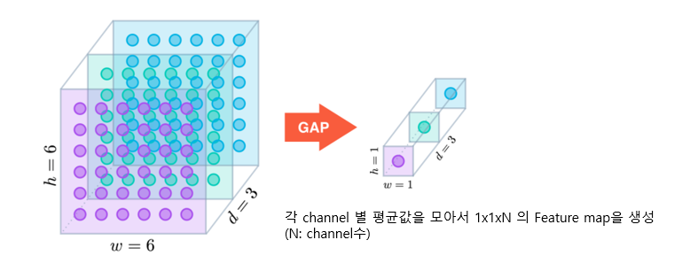
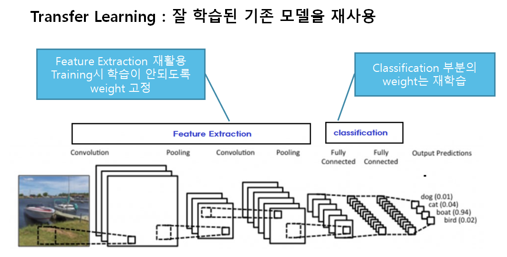
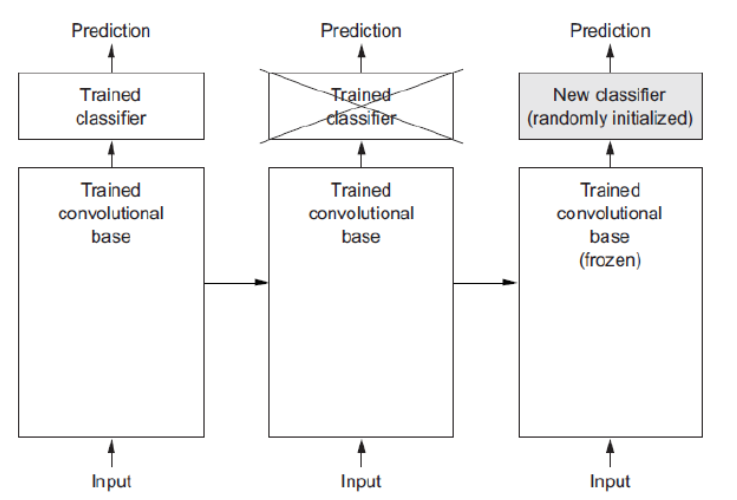
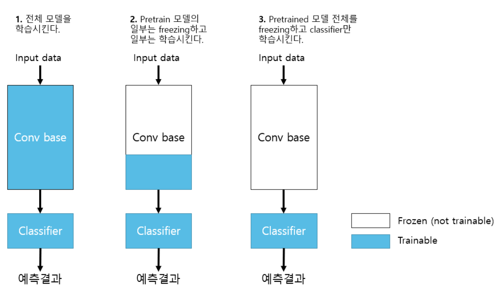
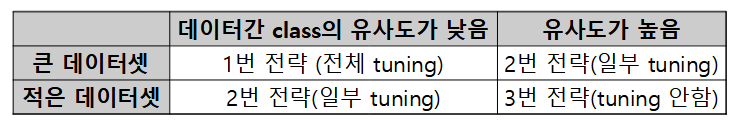

# GlobalAveragePooling (GAP)

- 입력 Feature map의 채널별로 평균값을 추출하여 1 x 1 x channel 의 Feature map을 생성하는 Pooling
- **Flatten** 대신 사용한다 &rarr; 3차원을 1차원으로 줄여줌 
    - Flatten의 경우에는 Weight가 너무 많이 발생한다
        - 7*7*512를 512 Dense에 넣을 때의 weight
            - Flatten의 경우: 7*7*512*512
            - GAP의 경우: 512*512
    - **Feature map의 채널수가 많을 경우 GAP를 사용하는 것이 효과적이나 채널수가 적다면 Flatten을 사용하는 것이 좋다.**
- `model.add(keras.layers.GlobalAveragePooling2D())`

# Pretrained Model
- 다른 목적을 위해 미리 학습된 모델.
- 사용하는 이유: 딥러닝을 하는 데 시간과 돈이 많이 들기 때문에 사용
- Pretrained model을 좀 더 학습시켜 새로운 네트워크 모델에 적용시키는 방식을 **Transfer Learning (전이 학습)**이라고 한다.

## Keras에서 제공하는 Pretrained Model 
- tensorflow.keras.applications 패키지를 통해 제공
    - https://www.tensorflow.org/api_docs/python/tf/keras/applications?hl=ko
    - Modules
        - 각 모델별 입력 Image 전처리 함수 제공
    - Functions
        - 각 모델 생성함수
- 모델 생성함수의 주요 매개변수
    - `weights`: 모델의 학습된 weight 지정. 
        - 기본값- 'imagenet'. ImageNet 데이터셋으로 학습된 weight를 가진 모델 생성
    - `include_top`: fully connected layer(분류기)를 포함할지 여부. True 포함시킴, False: 포함 안 시킴
        - False를 지정하면 Feature Extractor인 Convolution Layer들로만 구성된 모델이 생성된다.
    - `input_shape`: Input(입력) 이미지의 크기 shape. 3D 텐서로 지정. (높이, 너비, 채널). 기본값: (224,224,3)

> 딥러닝 모델기반 application 개발시 대부분 Transfer Learning을 한다.  
> 다양한 분야에서 다양한 네트워크 모델들이 구현되어 공개 되어 있으며 학습된 Parameter들도 제공되고 있다.  
> [paperswithcode](https://paperswithcode.com/)에서 State Of The Art(SOTA) 논문들과 그 구현된 모델을 확인할 수 있다. 

> **State Of The Art(SOTA)**: 특정 시점에 특정 분야에서 가장 성능이 좋은 모델을 말한다.

# Transfer learning (전이학습)
- 사전에 학습된 신경망의 구조와 파라미터를 재사용해서 새로운 모델(우리가 만드는 모델)의 시작점으로 삼고 해결하려는 문제를 위해 다시 학습시킨다.
- 전이 학습을 통해 다음을 해결할 수 있다.
    1. 데이터 부족문제
        - 딥러닝은 대용량의 학습데이터가 필요하다.
        - 충분한 데이터를 수집하는 것은 항상 어렵다.
    2. 과다한 계산량
        - 신경망 학습에는 엄청난 양의 계산 자원이 필요하다.

- 미리 학습된(pre-trained) Model을 이용하여 모델을 구성한 뒤 현재 하려는 예측 문제를 해결한다.
- 보통 Pretrained Model에서 Feature Extraction 부분을 사용한다.
    - Computer Vision 문제의 경우 Bottom 쪽의 Convolution Layer(Feature Extractor)들은 이미지에 나타나는 일반적인 특성을 추출하므로 **다른 대상을 가지고 학습했다고 하더라도 재사용할 수 있다.**
    - Top 부분 Layer 부분은 특히 출력 Layer의 경우 대상 데이터셋의 목적에 맞게 변경 해야 하므로 재사용할 수 없다.

 

> **Frozen**: Training시 parameter가 update 되지 않도록 하는 것을 말한다.

### Feature extraction 재사용
- Pretrained Model에서 Feature Extractor 만 가져오고 추론기(Fully connected layer)만 새로 정의한 뒤 그 둘을 합쳐서 모델을 만든다.
- 학습시 직접 구성한 추론기만 학습되도록 한다.
    - Feature Extractor는 추론을 위한 Feature 추출을 하는 역할만 하고 그 parameter(weight)가 학습되지 않도록 한다.
- Keras에서 모델/레이어의 parameter trainable 속성 변경
    -  **Layer.trainable=False**
        - Layer의 trainable 속성을 변경
    - **Model.trainable=False**
        - 모델내의 모든 Layer들의 trainable 속성을 변경
    - trainable 속성변경은 **모델 컴파일 전에** 해야 한다.
        
#### Backbone, Base network
전체 네트워크에서 Feature Extraction의 역할을 담당하는 부분을 backbone/base network라고 한다.

## Fine-tuning(미세조정)
- Transfer Learning을 위한 Pretrained 모델을 내가 학습시켜야 하는 데이터셋(Custom Dataset)으로 재학습시키는 것을 fine tunning 이라고 한다.
- 주어진 문제에 더 적합하도록 Feature Extractor의 가중치들도 조정 한다.

### Fine tuning 전략

- **세 전략 모두 추론기는 trainable로 한다.**

**1. 전체 모델을 전부 학습시킨다.(1번)**    
- Pretrained 모델의 weight는 Feature extraction 의 초기 weight 역할을 한다.
- **Train dataset의 양이 많고** Pretrained 모델이 학습했던 dataset과 Custom dataset의 class간의 유사성이 **낮은 경우** 적용.
- 학습에 시간이 많이 걸린다.
    
    
**2. Pretrained 모델 Bottom layer들(Input과 가까운 Layer들)은 고정시키고 Top layer의 일부를 재학습시킨다.(2번)**     
- **Train dataset의 양이 많고** Pretrained 모델이 학습했던 dataset과 Custom dataset의 class간의 유사성이 **높은 경우** 적용.
- **Train dataset의 양이 적고** Pretained 모델이 학습했던 dataset과 custom dataset의 class간의 유사성이 **낮은 경우** 적용
    
    
**3. Pretrained 모델 전체를 고정시키고 classifier layer들만 학습시킨다.(3번)**      
- **Train dataset의 양이 적고** Pretrained 모델이 학습했던 dataset과 Custom dataset의 class간의 유사성이 **높은 경우** 적용.
  
  
> **Custom dataset:** 내가 학습시키고자 하는 dataset 
> 1번 2번 전략을 Fine tuning 이라고 한다.

## Model, Layer의 weight 조회
- Transfer Learning을 구현하기 위해 기존 학습된 모델(Pretrained Model)의 Layer를 변경시켜야 한다.

### Model에서 Layer들 조회
- model객체.layers
    - 모델을 구성하는 layer 객체들을 담은 리스트
- model객체.get_layer(Layer이름:str)
    - argument로 전달한 이름의 Layer객체를 반환

### Model과 Layer의 weight들 조회 및 설정
- Layer와 Model은 **Weight 조회**와 관련해 세가지 **속성**을 제공
    - **weights:** 레이어의 모든 weight 변수들을 담은 리스트
        - get_weights() : 레이어의 모든 weight 변수 리스트를 카피해서 반환한다.
    - **trainable_weights:** Train(학습)시 업데이트 되는 weights들 리스트
    - **non_trainable_weights:** Train(학습)시 업데이트 되지 않는(훈련되지 않는) weights들 리스트
- Layer와 Model은 boolean 값을 가지는 속성 **`trainable`**을 제공
    - trainable을 **False로** 설정하면 Layer의 weights들이 훈련가능에서 **훈련 불가능** 상태로 변경된다. 이런 상태를 **Frozen-동결** 이라고 하며 학습시 weight들이 업데이트 되지 않는다.