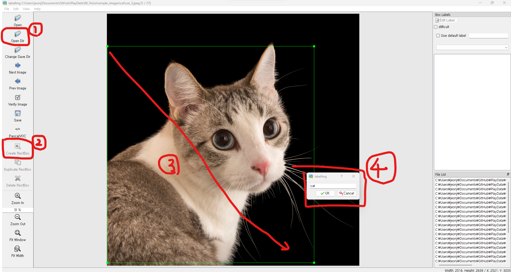

# 데이터 수집
## PASCAL VOC(Visual Object Classes)

- http://host.robots.ox.ac.uk/pascal/VOC/
- 2005년에서 2012년까지 열렸던 VOC challenges 대회에서 사용한 데이터셋으로 각 대회별 데이터셋을 Open Dataset으로 제공한다.
    - 이 중 2007년도와 2012년도 이미지가 많이 쓰인다.
    - [PASCAL VOC 2007 대회 메인페이지](http://host.robots.ox.ac.uk/pascal/VOC/voc2007/index.html)
    - [PASCAL VOC 2012 대회 메인페이지](http://host.robots.ox.ac.uk/pascal/VOC/voc2012/index.html)
- 20개 Category
- VOC 2007: Train/Validation/Test를 위한 총 9,963개 이미지를 제공하고 이미지 내의 22,640 물체에 대한 annotate 를 제공한다.
- VOC 2012: Train/Validation/Test를 위한 총 11,530개 이미지를 제공하고 이미지 내의 27,450 물체에대한 annotate와 6,929개의 segmentation 을 제공한다.
- Annotation 파일은 xml 포멧으로 제공

## MS-COCO Dataset
- COCO (Common Objects in Context) Dataset은 object detection, segmentation, keypoint detection 등을 위한 데이터셋으로 고해상도의 33만장의 이미지와 20만개 이상의 Label을 제공한다.
- https://cocodataset.org/
- https://arxiv.org/pdf/1405.0312.pdf
- 연도별로 데이터 셋을 제공한다.
- 데이터셋을 불러오고 사용하는 것을 도와주는 pycocotools 라이브러리를 제공한다.

## 그외 Datasets

- Open Image Dataset
    - 구글에서 공개하는 Image Data로 현존 최대 규모 범용 이미지 데이터이다. V5 기준 600개 category에 약 9천만장의 데이터셋을 제공.
    - https://storage.googleapis.com/openimages/web/index.html
    - https://github.com/cvdfoundation/open-images-dataset

- KITTI
    - 차 주행관련 데이터셋을 제공한다.
    - http://www.cvlibs.net/datasets/kitti/

- AIHub
    - 과학기술정보통신부와 한국정보화진흥원(NIA)에 주관하는 곳으로 이미지, 텍스트, 법률, 농업, 영상, 음성 등 다양한 분야의 딥러닝 학습에 필요한 데이터를 수집 구축하고 이를 AI-Hub 를 통해 공개하고 있다. 
    - https://aihub.or.kr/
- 이외에도 다양한 단체(기업, 연구소)들에서 데이터셋을 제공한다.    


# 이미지 수집

## [Simple Image Download](https://github.com/RiddlerQ/simple_image_download) 라이브러리

- 다운받고 싶은 이미지 keyword들을 받아서 google images 에서 검색해서 다운로드해 주는 라이브러리.

### 설치
- pip 설치
    - `pip install simple-image-download==0.4`

```python
from simple_image_download import simple_image_download as simp

response = simp.simple_image_download
# 개/고양이 사진을 수집
keywords = ['cat', 'dog']
for kw in keywords:
    response().download(kw, 30)  # cat과 dog 이미지를 구글에서 검색해서 각각 30장 다운로드
```

## 크롬브라우저 확장
- Image Downloader
    - https://chrome.google.com/webstore/detail/image-downloader/cnpniohnfphhjihaiiggeabnkjhpaldj/related

## 영상 무료 제공 사이트

다음 사이트들은 영상에 저작권 없이 무료로 다운 받아 사용할 수 있는 사이트들
- pixcels: https://www.pexels.com/
- pixabay: https://pixabay.com/ko/
- Unsplash: https://unsplash.com/


# Labeling 과 Annotation 파일 생성

## Annotation 파일이란
- 입력데이터에 대한 **정답과 정보**를 제공하는 파일
- Image Dataset의 경우 각 이미지파일의 위치(path), 크기, bounding box의 좌표, segmentation 좌표, class name 등들을 제공한다.
    - Annotation 파일에는 여러개의 정보들이 들어간다. 그래서 그것을 묶어서 제공하기 위해 다양한 format을 사용한다.    
    - Open Dataset마다 작성 format이 다른데 **JSON**, **XML**, **CSV** 등의 형식을 사용한다.


## Annotation tool

- **labelme**
    - object detection을 위한 사각형 형태, segementation을 위한 다각형 형태등 **다양한 형태의 bounding box를 그릴 수 있다**.
    - segementation을 사용할 때 쓰기
    - 설치
        - `pip install labelme`
    - 실행
        - `labelme`
    - **Labelme2Yolo 라이브러리를 이용한 annotation 형식변환**
        - labelme로 작성한 annotation은 json 형식으로 저장된다. 이것을 yolo 형식으로 변환해주는 api.
        - 설치
            - `pip install labelme2yolo`
        - 실행
            - `labelme2yolo --json_dir  Labelme_json파일_경로`
            - 선택 파라미터
                - \-\-val_size: validation 데이터셋 크기
                - \-\-test_size: test 데이터셋 크기
            - 처리결과는 json_dir 아래 YOLODataset 디렉토리 아래에 생성한다.
            - ex. `labelme2yolo --json_dir c:\dataset --val_size 0.1 --test_size 0.1`
            
- **labelimg**
    - **object detection을 위한 사각형 형태의 bounding box을 지원**한다. Pascal VOC, YOLO, CreateML 세가지 종류의 annotation 형식을 지원한다.
    - 제일 편함
        - 설치
            -`pip install labelimg`
        - 실행
            - `labelimg`                
            

- **[roboflow](https://roboflow.com/)**
    - 온라인 기반 annotation tool 제공
    - 공동 작업을 지원
    - 다양한 format의 annotation방식을 지원한다.
    - 무료 계정은 작업한 내용을 공개해야 한다. roboflow universe를 통해 많은 사람들이 작업한 프로젝트를 다운받을 수 있다.