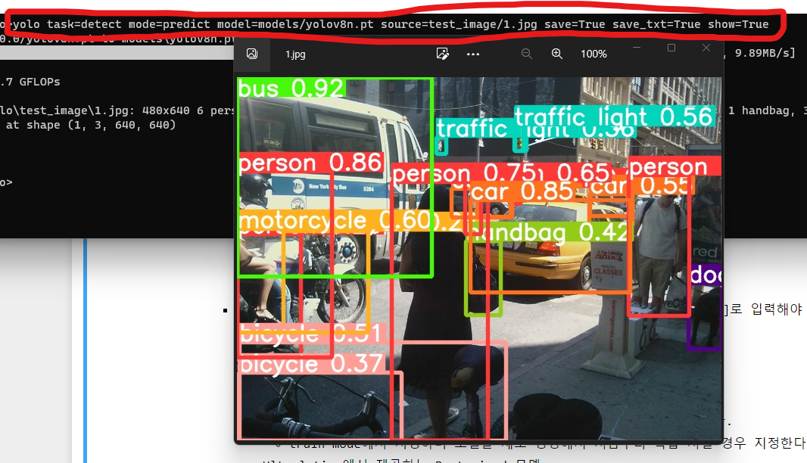
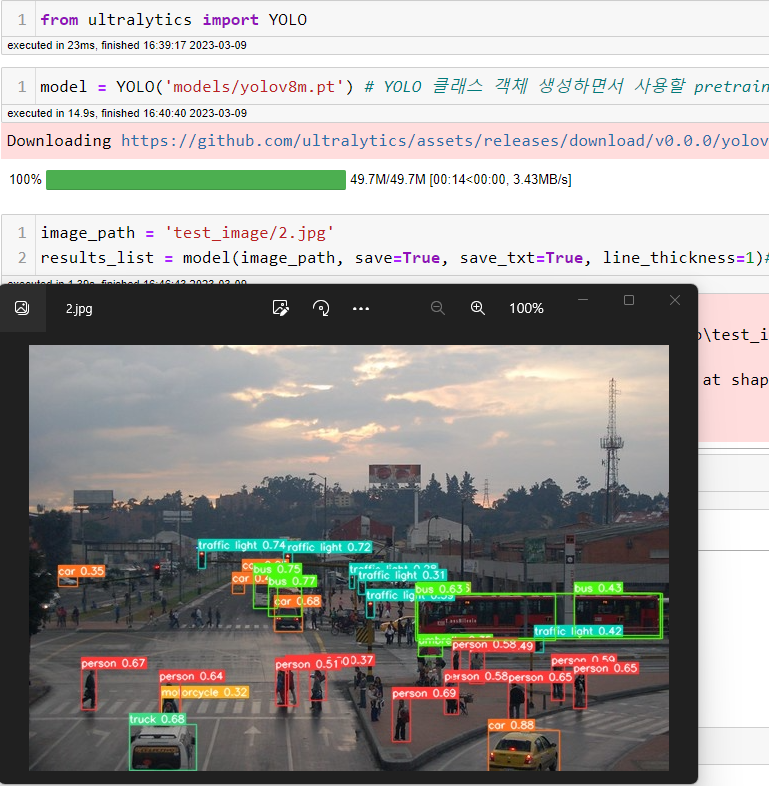

# [YOLOv8](https://docs.ultralytics.com/)

## 설치

- `pip install ultralytics`
- 주피터노트북에서 실행할 경우 프로그래스바를 실행하기 위해서 다음을 설치한다. (필수는 아님)
    - `conda install -y -c conda-forge ipywidgets`

## 사용
- CLI (command line interface)에서 터미널 명령어로 추론/평가/학습을 진행할 수 있다.
- Python lib 를 이용해 코드상에 원하는 추론/평가/학습을 진행할 수 있다.

# CLI 기본 명령어 구조

## 구문
- **yolo**  **task**=detect|classify|segment  **mode**=train|val|predict  **model**=yolov8n.yaml|yolov8n.pt|..  **args**
    - **task:** \[detect, classify, segment\] 중 하나를 지정한다. \[optional\]로 생략하면 모델을 보고 추측해서 task를 정한다.
        - **detect:** Object detection
        - **classify:** Image classification
        - **segment:** Instance segmentation
    - **mode:** \[train, val, predict, export\] 중 하나를 지정한다. \[필수\]로 입력해야 한다.
        - **train:** custom dataset을 train 시킨다.
        - **val:** 모델 성능을 평가한다.
        - **predict:** 입력 이미지에 대한 추론을 한다.
        - **export:** 모델을 다른 형식으로 변환한다.
    - **model:** **pretrained 모델**이나 **모델 설정 yaml 파일**의 경로를 설정한다. \[필수\]로 입력해야 한다.
        - pretrained 모델 파일경로
            - task에 맞는 pretrained 모델파일의 저장 경로를 지정한다.
            - transfer learnging을 하거나 fine tuning 시 방법
        - 모델 구조 설정 yaml 파일 경로
            - task에 맞는 pretrained 모델 설정파일(yaml파일)의 경로를 지정한다.
            - train mode에서 지정하며 모델을 새로 생성해서 처음부터 학습 시킬 경우 지정한다.
        - Ultralytics에서 제공하는 Pretrained 모델
            - 모델 크기에 따라 5개의 모델을 제공하며 큰 모델은 작은 모델에 비해 추론 성능이 좋은대신 속도는 느리다.
            - 모델은 처음 추론또는 학습할때 local 컴퓨터에 없으면 download 받는다.
            - <https://github.com/ultralytics/ultralytics#models>
            - ### 제공 모델

            | **task\모델크기**           | **nano** | **small_** | **medium** | **large** | **xlarge** |
            |:--------------------|----------|-------------|------------|-----------|----------|
            | **detection**      | yolov8n  | yolov8s     | yolov8m    | yolov8l   | yolov8x    |
            | **segmentation**   | yolov8n-seg  | yolov8s-seg     | yolov8m-seg    | yolov8l-seg   | yolov8x-seg    |
            | **classification** | yolov8n-cls  | yolov8s-cls     | yolov8m-cls    | yolov8l-cls   | yolov8x-cls    |            

            - 확장자가 `pt`이면 pretrained 된 모델을, `yaml`이면 모델 구조 설정파일을 download하여 실행한다.
                - pretrained model은 fine tuning이나 추론할 때, yaml설정파일은 처음부터 학습할 경우 설정하여 받는다.
    - **args:** task와 mode과 관련한 추가 설정값들을 지정한다.
        - <https://docs.ultralytics.com/cfg/>

### CLI를 이용한 예시

### Python에서 사용한 예시

 