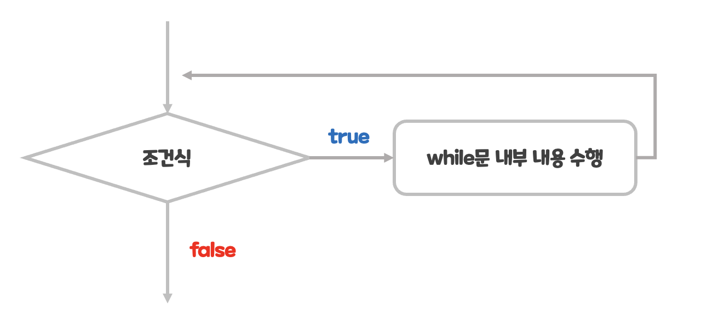
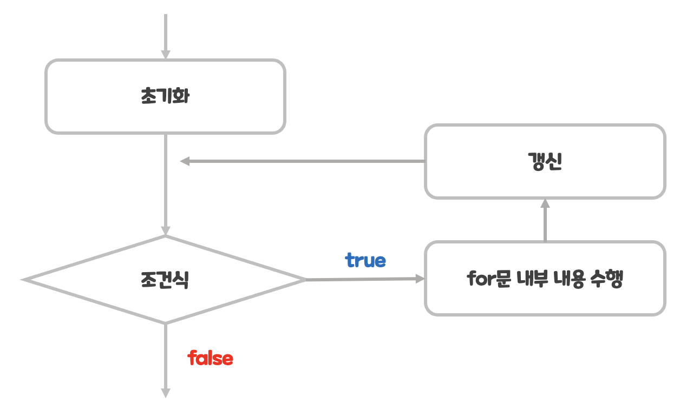

## 반복문(loop) 개요
- 규칙적 반복 코드를 단순화하는 문법

### 반복문의 분류
- **while 문**
	- 반복 횟수가 명확하지 않을 때 사용
- **for 문**
	- 반복 횟수가 명확할 때 사용

### 반복문의 주의점
- 무한 루프(infinite loop)
	- 반복이 끊임없이 동작하는 상황
	- 무한 루프에 갇히면 프로그램을 멈출 수 없음

## 반복문 활용
### while 문
- 반복 횟수가 조건에 따라 변할 때 사용하기 좋은 반복문
	```java
	while (조건식) {
		반복 내용
	}
	```
	- `조건식`이 참일 경우 `반복 내용`을 반복
	- `조건식`이 거짓이 되어야만 반복을 벗어날 수 있음

### for 문
- 반복 횟수가 명확할 때 사용하기 좋은 반복문
	```java
	for (초기화; 조건식; 갱신){
		반복 내용
	}
	```
	- for 문에서 `초기화`는 단 한 번 수행되며
	- 그 이후 `조건식`검사, `반복 내용`수행, `갱신`이 순차적으로 진행
	- 조건식이 참이면 `초기화`를 제외한 위 과정을 반복
- range를 사용한 for 문
	```java
	IntStream.range(1, 10).forEachOrdered(n -> {
		반복 내용
	});
	```
	- lambda와 range를 이용해서 `반복 내용`을 반복한다.

## 분기문
### break 문
- 반복문을 탈출하는 문법


### continue 문
- 실행 흐름을 다음 반복으로 넘기는 문법
- 반복문의 모든 코드를 수행하지 않은 채 다음 반복으로 이동
