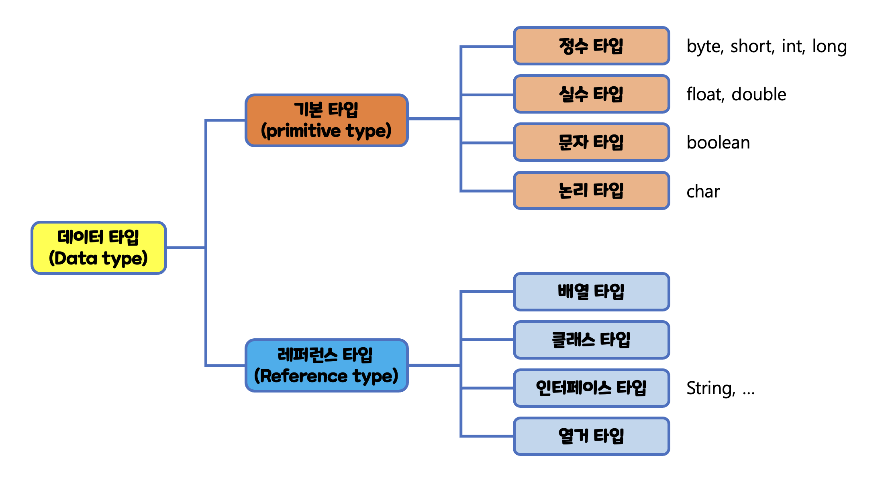

## 변수(variable)
- 변하는 수, 데이터를 저장하는 공간
- 데이터를 저장하기 위해 변수 선언을 해야 함
- 변수는 컴퓨터 메모리 공간에 이름이 붙여져 관리됨
- 변수 선언 예
	```java
	/*
	* int: 타입
	* age: 변수명
	* 21: 메모리 공간에 들어갈 내용
	*/
	int age = 21;
	```
## 타입(type)
- 데이터의 형태
- 타입 사용 예
	```java
	int age;
	double weight;
	boolean hungry;
	String name;
	```
	
### 자바의 타입


### 기본 타입(primitive type)
- 값을 직접 갖는 데이터 형태
- 정수, 실수, 문자, 논리 타입으로 나뉨
- 정수와 실수는 메모리 크기에 따라 다시 세부 타입으로 나뉜다
#### 자바의 기본 타입 종류
<table>
	<tr>
		<th></th>
		<th>타입</th>
		<th>기본값</th>
		<th>메모리 크기</th>
		<th>표현 범위</th>
	</tr>
	<tr>
		<td rowspan="4">정수</td>
		<td>byte</td>
		<td>0</td>
		<td>8bit</td>
		<td>-128 ~ 127</td>
	</tr>
	<tr>
		<td>short</td>
		<td>0</td>
		<td>16bit</td>
		<td>-32,768 ~ 32,767</td>
	</tr>
	<tr>
		<td>int</td>
		<td>0</td>
		<td>32bit</td>
		<td>-2,147,483,648 ~ 2,147,483,647</td>
	</tr>
	<tr>
		<td>long</td>
		<td>0L / 0l</td>
		<td>64bit</td>
		<td>-9,223,372,036,854,775,808 ~ 9,223,372,036,854,775,807</td>
	</tr>
	<tr>
		<td rowspan="2">실수</td>
		<td>float</td>
		<td>0.0F / 0.0f</td>
		<td>32bit</td>
		<td>(&#177;3.4 &times; 10<sup>-38</sup>) ~ (&#177;3.4 &times; 10<sup>38</sup>)의 근삿값</td>
	</tr>
	<tr>
		<td>double</td>
		<td>0.0D / 0.0d</td>
		<td>64bit</td>
		<td>(&#177;1.7 &times; 10<sup>-308</sup>) ~ (&#177;1.7 &times; 10<sup>308</sup>)의 근삿값</td>
	</tr>
	<tr>
		<td>논리</td>
		<td>boolean</td>
		<td>false</td>
		<td>8bit</td>
		<td>true, false</td>
	</tr>
	<tr>
		<td>문자</td>
		<td>char</td>
		<td>\u0000</td>
		<td>16bit</td>
		<td>0(\u0000) ~ 65,535(\uFFFF)</td>
	</tr>
</table>

### 레퍼런스 타입(reference type)
- 주소값을 갖는 데이터 형태
	```java
	String name = "홍길동";
	```
	- 여기서 `name`은 "홍길동"을 저장한 것이 아니라 "홍길동"이 저장된 **주소값**을 가지고 있다.

## 변수의 생성과 사용
### 문자열 변수
- 문자열을 다루기 위해서는 **String** 타입 변수가 필요
- 예시
	```java
	String food; // 문자열 변수 선언
	food = "치킨";  // 변수에 저장할 문자열
	// 단 food에는 "치킨"이 저장되는 것이 아닌 "치킨"이 저장된 주소값이 저장되는 것
	```
### 정수형 변수
- 정수를 다루기 위해서는 정수 타입이 필요
- 정수형 변수는 표현 범위에 따라 다양한 타입 지정이 가능 ex) byte, short, int, long
- 예시
	```java
	int age; // 정수형 변수 선언
	age = 24; // 정숫값 저장
	```
### 실수형 변수
- 실수형 변수는 정밀도에 따라 다양한 타입을 지정할 수 있음 ex) float, double
	- **정밀도**
		- 소수점 이하 몇 번째 자리까지 오차 없이 표현할 수 있는 가를 의미
		- float의 정밀도는 6자리, double의 정밀도는 15자리까지 보장

### 논리형 변수
- 논리값을 다루기 위해서는 **boolean** 타입 변수가 필요
	- 이를 통해 `true`와 `false`를 구분

## 변수의 활용
### 변수 생성 및 초기화
- 변수는 생성과 동시에 초기화 할 수 있음
- 초기화는 사용할 변수의 값을 지정해주는 것을 의미
- 변수 사용시 초기화 작업이 진행되어야 오류가 나지 않음
	```java
	// 변수 생성 후 초기화 하는 방식
	int pastYear; // 변수 생성
	pastYear = 2022; // 변수 초기화
	
	// 변수 생성과 동시에 초기화
	int year = 2023; 
	```

#### 변수 이름 짓기
- 특수 문자는 `_`와 `$`만 사용 가능
- 숫자는 첫 번째 자리에 위치할 수 없음
- camel case(카멜 표기법)을 사용
	- `String camelCaseExample;`
- 자바의 키워드는 변수의 이름이 될 수 없음

### 변수의 값 변경
- 변수의 값은 변경 될 수 있음
	```java
	String weather = "맑음"; // 변수 생성 및 초기화
	weather = "흐림" // 변수의 값 변경
	```
#### 상수
- 값 변경이 불가능한 변수
- 변수의 값을 고정한 개념
- `final`이라는 키워드를 붙여 선언
- 상수의 이름은 **대문자와 밑줄**로 하는 것이 관례
	```java
	final int NOT_FOUND = 404; // 상수 생성 및 초기화
	NOT_FOUND = 200; // ERROR 발생 - 상수는 값을 변경할 수 없음
	```

### 변수의 값 복사
#### **기본 타입**일 경우
- 변수를 **복사**할 수 있음
- 복사한 값을 바꿔도 원본은 바뀌지 않음
- 예시
	```java
	double origin = 3.14;
	double copy = orgin;

	System.out.println(copy); // "3.14" 출력
	
	// copy 변경
	copy = 1004;
	System.out.println(origin); // "3.14" 출력 -> 바뀌지 않음
	System.out.println(copy); // "1004" 출력
	```
#### **레퍼런스 타입**일 경우
- 변수를 **공유**할 수 있음
- 복사한 값이 원래의 값에 영향을 줌 &rarr 원본이 1개만 있음
- 예시
	```java
	// 레퍼런스 타입 생성
	StringBuffer sbOrigin=new StringBuffer("안녕");
	// 값 공유
	StringBuffer sbCopy=sbOrigin;
	
	System.out.println(sbCopy); // "안녕" 출력

	// sbCopy 변경
	sbCopy.append("하세요");
	System.out.println(sbOrigin); // "안녕하세요" 출력
	System.out.println(sbCopy); // "안녕하세요" 출력
	```	


### 문자열 연결
- 두 문자열 또는 문자열과 숫자의 경우 덧셈 연산(`+`)으로 연결 가능
- 두 문자열 연결 예시
	```java
	String a = "안녕";
	String b = "하세요";
	String c = a + b;
	System.out.println(c); // "안녕하세요" 출력
	```

- 문자열과 숫자 연결 예시
	```java
	int hour = 13;
	System.out.println("지금은" + hour + "시 입니다"); // "지금은 13시 입니다" 출력
	```

### 형식 문자열 출력
- 덧셈 연산으로 문자열을 만들면 가독성이 떨어지기 때문에 형식 문자열을 사용
- 메소드는 `System.out.printf()`를 사용
	- `%s` - 해당 위치에 String 값을 삽입
	- `%d` - 해당 위치에 int 값을 삽입
	- `%f` - 해당 위치에 double 값을 삽입
	- `%b` - 해당 위치에 boolean 값을 삽입
- 예시
	```java
	String item = "라면";
	long  price = 8000000000L;
	float  weight = 0.12F;
	boolean  discount = false;

	System.out.printf("이름: %s, 가격: %d원, 무게: %f, 할인: %b", item, price, weight, discount); // "이름: 라면, 가격: 8000000000원, 무게: 0.120000, 할인: false" 출력
	```

## 타입 변환
### 문자열과 숫자 간 타입 변환
- 문자열 &rarr; 정수
	- `Integer.parseInt("문자열")`
- 문자열 &rarr; 실수
	- `Double.parseDouble("문자열")`
- 숫자 &rarr; 문자열
	- 빈 문자열에 정수 또는 실수를 덧셈
	```java
	String a = "" + 1234; // "1234" 생성
	String b = "" + 3.14; // "3.14" 생성
	```
	- 변환 메소드 사용
	```java
	String a = Integer.toString(1234); // "1234" 생성
	String b = Double.toString(3.14);  // "3.14" 생성
	```
