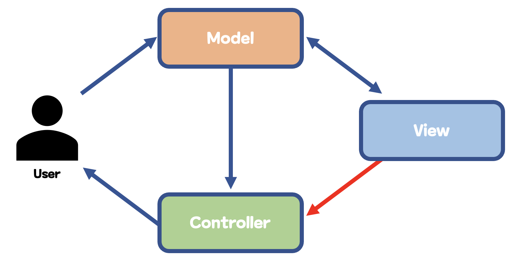

## 1. 생성자
### 생성자(constructor)란
- 클래스로부터 객체를 만드는 특별한 메소드
- 클래스 &rarr; 객체를 돕는 메소드
- ex. 과거 코드 - Person 객체를 만들고 필드를 초기화 하는 예
	```java
	class Person{
		String name;
		int age;
	}
	public static void main(String[] args){
		Person p = new Person();
		p.name = "홍길동";
		p.age = 24;
	}
	```

- ex. 생성자를 활용하여 변경한 코드 예
	```java
	class Person{
		String name;
		int age;
	
		// 생성자 정의
		Person(String n, int a){
			name = n;
			age = a;
		}
	}
	public static void main(String[] args){
		// 생성자 호출
		Person p = new Person("홍길동", 24);
	}
	```

###  기본 생성자(default constructor)
- 자동 적용되는 생성자
- 클래스에 아무런 생성자가 없는 경우 자동으로 추가
- 입력 변수가 없음
- ex. 기본 생성자 예시
	```java
	class Cola {
		...
		public Cola(){} // 기본 생성자: 클래스에 생성자가 없다면 자바에서 코드 실행 시 자동 생성
	}
	public class DrinkTest(){
		public static void main(String[] args){
			Cola c = new Cola();  // 따라서 생성자 호출 가능
		}
	}
	```
- 기본 생성자 덕분에 생성자가 없음에도 호출 가능 &rarr; 기본 생성자가 자동 삽입되기 때문

	&#10147; 단, 생성자를 명시해주면 기본 생성자는 사라지기 때문에 입력 변수가 없는 생성자를 사용하려면 다시 만들어 주어야한다. **(method overloading)**

- ex. `Drink`클래스 안에서 생성자를 2개 만들어주기
	```java
	class Drink {
		String name;
		int  price;
		Drink(String n, int  p) {
			name = n;
			price = p;
		}
		Drink(){} // 써야지 아래 'Drink d1 = new Drink();'에서 에러가 안남!
	}
	public  class DrinkTest {
		public  static  void main(String[] args) {
			Drink d1 = new Drink();
			Drink d2 = new Drink("박카스", 800);
		}
	}
	```

## 2. 참조변수
### 참조변수(reference variable)이란
- 객체를 가리키는 변수
- 대상의 주소를 저장
- 자신의 타입을 기준으로 가리키는 대상 해석

### 기본변수와의 차이

||기본변수|레퍼런스변수|
|:---:|---|---|
|저장데이터|값을 직접 저장|주소를 저장|
|원본 공유 여부|같은 값을 가지더라도 다른 사본임|서로 같은 값을 공유|
|타입 표기|소문자로 시작|관례상 대문자로 시작|

## 3. static 키워드
### static 이란
- 공유의 개념을 지닌 키워드
- 클래스의 필드(**클래스 변수**)와 메소드(**클래스 메소드**)에 적용 가능

### 클래스 변수(class variable)
- **static이 적용된 필드**
- 객체들이 공유하는 변수
- 객체 외부(클래스 영역)에 존재하는 필드
	- 인스턴스 변수는 객체 내부에 존재한다.
- 프로그램이 실행되기 전 클래스를 불러오는 시점에 만들어짐
- ex. 클래스 변수와 인스턴스 변수의 사용 예시
	```java
	class Person {
		static int count = 0;   // 클래스변수(static 필드) -> 프로그램 실행 전 생성됨, 객체 외부 클래스 영역에 존재
		int name; 				// 인스턴스변수(non-static 필드) -> 생성자 호출시 만들어지며, 각 객체 내부에 존재
	}
	```
- 클래스 변수는 dot 연산자를 통해 값을 가져오거나 변경 가능
	```java
	Person.count += 1;
	```
	
####  인스턴스 변수와 차이

||인스턴스변수|클래스변수|
|:---:|---|---|
|영역|객체 내부에 존재|객체 외부(클래스 영역)에 존재|
|생성 시점|생성자 호출 시|프로그램 실행 전|

#### &#10147; 클래스 영역 & 힙 영역 & 스택 영역
- 클래스 영역(class area)
	- 클래스와 static 변수등을 관리하는 메모리 공간
	- 프로그램 수행 전 초기화
- 힙영역(heap area)
	- 객체를 관리하는 메모리 공간
	- 프로그램 수행 중 new 키워드로 생성된 객체를 관리
- 스택 영역(stack area)
	- 후입선출(LIFO: Last In First Out)특징을 지닌 메모리 공간
	- 메소드 관련 정보(입력 변수, 지역 변수 등)을 관리

### 클래스 메소드(class method)
- static이 적용된 메소드
- 주체 객체 없이 수행 가능
- 주로 간단한 기능 구현을 위해 사용
- ex. `Math` class 메소드 사용 예시
	```java
	double x = Math.random(); // 임의의 0.0 이상 1.0 미만의 실수를 반환
	```

#### 클래스 메소드 호출 vs 인스턴스 메소드 호출
- 클래스 메소드(static method) 호출
	- 객체 생성 없이 클래스명을 통해 호출
	- 편의성 기능 구현에 유리
- 인스턴스 메소드(non-static method) 호출
	- **주 객체**를 통해서만 실행 가능
	- 수행 전 객체 생성이 필수

## 4. 접근 제한자
### 접근제한자(access modifier)란
- 외부 접근을 제어하는 키워드
- 정보를 감추거나 공개하기 위해 사용
- 클래스, 필드, 메소드 등에 적용 가능

#### 접근 제한자의 종류
- public
	- 모든 클래스의 접근을 허용
- protected
	- 동일한 패키지 또는 상속 관계가 있는 클래스의 접근 허용
- default
	- 동일 패키지(폴더)에 존재하는 클래스의 접근 허용
- private
	- 모든 클래스의 접근을 거부

#### 접근 제한자의 허용 범위

|구분|동일 클래스|동일 패키지|자식(자손) 클래스|외부 패키지|
|---|:---:|:---:|:---:|:---:|
|public|O|O|O|O|
|protected|O|O|O|X|
|default|O|O|X|X|
|private|O|X|X|X|

### private와 public
- private
	- 내부 접근만 허용
	- 일반적으로 필드에 적용
	- **정보 은닉**(information hiding)
		- 객체의 정보를 외부로부터 감추는 것
		- private을 사용한 정보 은닉은 필드 뿐 아니라 메소드에도 적용 가능
- public
	- 모든 외부 접근을 허용
	- 일반적으로 메소드에 적용

#### 게터 메소드(getter method)
- class 외부에서 private 선언한 필드를 **사용**하기 위한 메소드
- public 메소드를 통해 우회하여 접근해야 함
- `get + 필드명` 형태로 작성
- 반환값은 대상 필드와 같음

#### 세터 메소드(setter method)
- class 외부에서 private 선언한 필드를 **변경**하기 위한 메소드
- `set + 필드명` 형태로 작성
- 반환값은 `void`

#### getter, setter 예시
- 매개 변수와 필드 이름이 같을 경우 setter 메소드에서는 다음과 같이 나타낸다.
	- 매개 변수 phoneNum &rarr; `phoneNum`
	- 필드 phoneNum &rarr; `this.phoneNum`
- ex. `private phoneNum`에 접근하기 위한 getter, setter method
	```java
	class Person {
		private int phoneNum;
		public int getPhoneNum() {
			return phoneNum;
		}
		public void setBalance(int phoneNum) {
			this.phoneNum = phoneNum;
		}
	}
	```

## 5. 소프트웨어 디자인 패턴
- 소프트웨어 공학의 소프트웨어 디자인에서 특정 문맥에서 공통적으로 발생하는 문제에 대해 **재사용 가능한 해결책**
- 공통된 문제들을 해결하는데 좋다

### MVC(Model-View-Controller) 패턴


#### Model
- 데이터와 관련된 일(저장, 가공)
- 애플리케이션 데이터 표현
- 비즈니스로직과 관련된 부분 처리
- 데이터베이스 관련로직 구현

#### View
- 사용자 인터페이스 요소
- 데이터 시각화
- 사용자 데이터 입력

#### Controller
- Model과 View를 연결
- 사용자가 View(GUI)를 통해 입력하면 Model(Data) 변경

### Builder 패턴
- 복합 객체의 생성 과정과 표현 방법을 분리 &rarr; 동일한 생성 절차에서 다른 표현 결과를 만들 수 있게 하는 패턴
- 객체 클래스 내부에 여러 개의 생성자를 만들 필요가 없음
- `build()`함수로 검증 가능
- 직관적임
- setting method naming을 통해 값을 파악하는데 용이