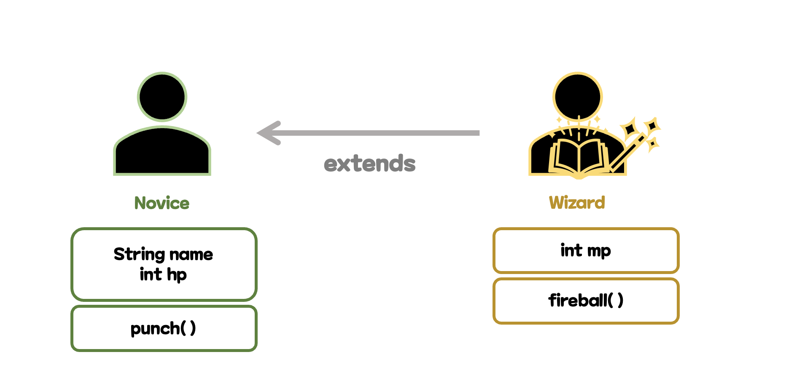
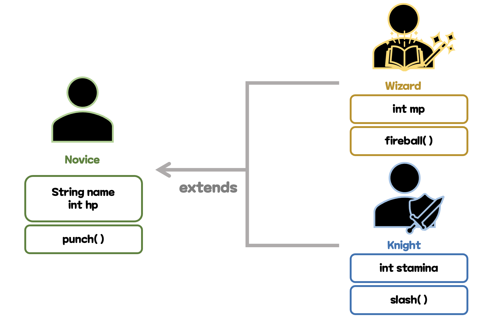
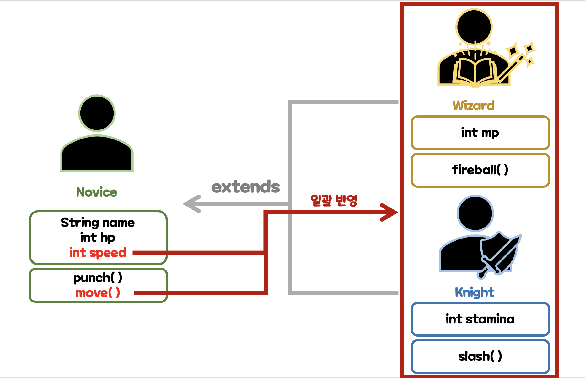
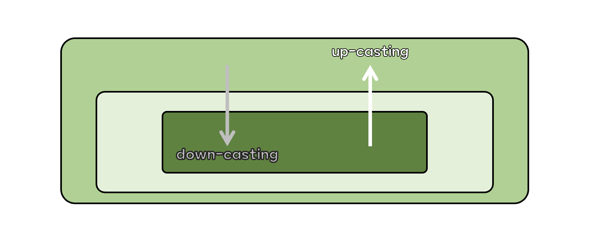

## 1. 상속 개요
### 상속(inheritance)이란
- 부모 클래스 코드를 자식 클래스가 물려받는 것
	- **부모 클래스(parent class)**
		- 기반이 되는 클래스
	- **자식 클래스(child class)**
		- 부모 클래스를 토대로 확장된 새 클래스
- 상속의 장점
	- 중복 코드 제거
	- 클래스 확장
	- 부모 클래스의 변경사항을 모든 자식 클래스에 반영 가능

### 상속 사용 예시
- `extends`
	- 상속 관계를 정의하는 키워드
	- `A extends B` 형태로 사용
		- `A`가 child class, `B`가 parent class

#### 중복 코드 제거


- ex. 게임에서 초보자(`Novice`)에서 전직한 직업이 마법사(`Wizard`)라고 할 때
	```java
	class Novice {
		String name;
		int hp;
		void punch() {
			System.out.println(name + "punch!!");
		}
	}
	
	class Wizard extends Novice{
		int mp;	
		void fireball() {
			System.out.println(name + "fireball!!"); // Novice에 있는 name속성을 사용할 수 있다.
		}
	} // Wizard는 Novice class에 있는 속성을 다 가지고 있다.
	```

#### 클래스 확장


- ex. 위에서 만든 코드에 새로운 전직 직업인 기사(`Knight`) 추가
	```java
	class Novice { ... }
	
	class Wizard extends Novice{ ... } // Wizard는 Novice class에 있는 속성을 다 가지고 있다.
	
	class Knight extends Novice{
		int stamina;
		void slash() {
			System.out.printf(name + " slash!"); // Novice에 있는 속성은 사용할 수 있지만 Wizard에 있는 속성은 사용할 수 없다.
		}
	} // Knight 또한 Wizard와 같이 Novice class에 있는 속성을 다 가지고 있다.
	```

#### 부모 클래스의 코드 반영


- ex. 부모 클래스 `Novice`에 `speed` 필드와 `move` 메소드 추가 &rarr; 모든 자식 클래스에 일괄 반영
	```java
	class Novice {
		String name;
		int hp;
		// 새로운 필드와 메소드 추가
		int  speed;
		void move() {
			System.out.println("간달프가 " + speed + " 속도로 이동");
		}	
		
		void punch() {
			System.out.println(name + " punch!!");
		}
	}
	
	class Wizard extends Novice{
		int mp;	
		void fireball() {
			System.out.println(name + " fireball!!");
		}
	}
	
	class Knight extends Novice{
		int stamina;
		void slash() {
			System.out.printf(name + " slash!");
		}
	}

	public  class RPGTest {
		public  static  void main(String[] args) {
			Wizard wz = new Wizard();
			wz.name = "간달프";
			wz.hp = 100;
			wz.mp = 80;
			wz.speed = 3;
			wz.punch();
			wz.fireball();
			wz.move();
		}
	}
	```
- ex 실행 결과
	```none
	간달프 punch!!
	간달프 fireball!!
	간달프가 3 속도로 이동
	```

## 2. 업 캐스팅과 메소드 오버라이딩
### 업 캐스팅(up-casting)이란

- 상속 관계가 정의된 자식 객체가 부모의 타입으로 해석되는 것
	- 이를 통해 서로 다른 자식 객체를 부모의 타입으로 묶어 관리 가능
	- ex. 위 코드에서 `Wizard`나 `Knight` 모두 부모 클래스인 Novice 타입으로 해석 가능
- 하지만 부모 객체를 자식 타입으로 down-casting(좁은 범위로 해석) 할 수는 없다.

### &#10147; 객체의 해석 기준
- 객체의 해석은 레퍼런스변수의 타입이 결정
- 레퍼런스변수가 부모의 타입이면 객체는 부모 객체로 해석(자식 영역이 감춰짐)
- 따라서 자식 객체의 필드와 메소드는 사용할 수 없음

### 메소드 오버라이딩(method overriding)
- 자식 클래스에서 **재정의된 메소드가 수행** 되는 것
	- 적은 코드로 다양한 동작을 가능
- ex. 메소드 오버라이딩 과정
	```java
	class Archer {
		void shoot() {
			System.out.println("Archer shoot");
		}
	}
	class MasterArcher extends Archer {
		void shoot(){
			System.out.println("Master Archer shoot");
		}
	}

	public class OverridingTest {
		public static void main(String[] args) {
			Archer a = new Archer();
			Archer ma = (Archer) new MasterArcher();
			a.shoot();
			ma.shoot();
		}
	}
	```
- ex 실행 결과
	```none
	Archer shoot
	Master Archer shoot
	```
	- 레퍼런스 변수 `ma`는 연결 객체를 `Archer`라 해석하지만 실제로 연결된 객체는 `MasterArcher`이므로, 메소드 오버라이딩이 발생해 'Master Archer shoot'이라는 결과가 나온다.

## 3. 상속과 생성자 호출
### 생성자 호출과 실행 흐름
- 상속 관계에서 **자식 객체가 만들어지려면 부모 영역이 먼저 완성**되어야 함
- 부모 영역을 완성하려면 자식 클래스 생성자 안에 **부모 클래스 생성자를 반드시 호출해주어야 한다.** 
- 생략 시 부모 클래스 생성자 호출 코드 `super()`를 자동으로 넣어줌
	- `super()`는 반드시 자식 클래스 생성자 첫번째 줄에 넣어주어야 한다.
- ex. 상속 객체 생성 과정
	```java
	public class ConstructorWithInheritance {
		public static void main(String[] args){
			new Galaxy();
		}
	}
	class SmartPhone{
		SmartPhone() {
			System.out.println("SmartPhone() 생성자 호출 완료");
		}
	}
	class Galaxy extends SmartPhone {
		Galaxy() {
			super(); // 생략 시 부모 생성자 호출 코드 자동 삽입
			System.out.println("Galaxy() 생성자 호출 완료");
		}
	}
	```
- ex 실행 결과
	```none
	SmartPhone() 생성자 호출 완료
	Galaxy() 생성자 호출 완료
	```

### 생성자를 통한 상속 객체의 초기화
- 만약 부모 클래스에 필드 name이 필요할 때 기본적으로 주어지는 `super()`의 경우에는 받는 매개변수가 없어 에러가 난다.
- 따라서 `super(name)` 형식으로 상속 객체를 초기화 해주어야 한다.
- ex. 상속 객체 초기화
	```java
	public class ConstructorWithInheritance {
		public static void main(String[] args){
			Galaxy g = new Galaxy("S23 Ultra", 143);
			System.out.printf("Samsung Galaxy %s의 가격은 약 %d만원 입니다.", g.name, g.price);
		}
	}
	class SmartPhone{
		int price;
		SmartPhone(int p) {
			price = p;
		}
	}
	class Galaxy extends SmartPhone {
		String name;
		Galaxy(String n, int p) {
			super(p);
			name = n;
		}
	}
	```
- ex 실행 결과
	```none
	Samsung Galaxy S23 Ultra의 가격은 약 143만원 입니다.
	```


## 4. 추상 클래스
### 추상 클래스(abstract class)란
- **추상화**
	- 클래스 간의 공통점을 찾아서 공통 부모를 만드는 과정
- 직접 객체를 생성할 수 없는 상속을 위해 정의된 개념적 클래스
- 잘못된 객체 생성을 예방할 수 있음
- 추상 클래스는 직접 객체를 만들 수 없음 
- class 앞에 **abstract**를 사용함으로써 선언
- ex. 개와  고양이를  동물로  분류하지만, 동물은  분류를  위해  만든  추상적  개념(실존 X)
	```java
	abstract class Animal { ... } // 추상 클래스 Animal
	Animal animal = new Animal(); // Error - 객체 생성 불가
	```

#### 추상 메서드(abstract method)
- 메서드 내용이 필요없을 때 구현
- 추상 클래스 내부에 존재	
- 프로그램의 표준화 정도를 높임
- 만약 abstract method를 사용한다면 그 클래스를 부모로 가지고 있는 자식 클래스는 그 메서드를 입력해야 한다.
- ex. abstract 메서드를 사용 안했을 경우
	```java
	abstract  class Animal {
		String name;
		void cry(){};
	}
		class Tiger extends Animal {
	//	void cry() {				// -> 없어도 상관 없음 대신 결과값은 안나옴
	//		System.out.println("어흥!");
	//	}
	}
	```
- ex. abstract 메서드를 사용했을 경우
	```java
	abstract  class Animal {
		String name;
		abstract void cry();
	}
		class Tiger extends Animal {
		void cry() {				// cry 메서드가 반드시 필요!!!
			System.out.println("어흥!");
		}
	}
	```


## 5. this, super, protected 키워드
### this 키워드
- 메소드 수행의 주체 객체를 가리키는 래퍼런스 변수
- 객체 생성시 자동 생성
- 사용처
	- 필드와 입력변수 구분
	- 소괄호를 붙여 또 다른 생성자 호출

#### 필드와 입력변수의 구분
- ex. 필드와 입력변수의 이름이 같은 경우 사용
	```java
	class Item {
		String name;
		int price;
		Item(String name, int price) {
			this.name = name; // 생성자 수행 객체-String name = 입력변수-Item(String name)
			this.price = price;
		}
	}
	```

#### 또 다른 생성자 호출
- 생성자를 호출할 때 첫줄에 입력해야함
- 그냥 이미 만들어진 생성자의 default값을 입력하면 된다고 생각하면 됨
- ex. `this()`형태로 또 다른 생성자 `Item(String name, int price)` 를 호출할 수 있음
	```java
	class Item {
		String name;
		int price;
		Item(String name, int price) {
			this.name = name;
			this.price = price;
		}
		Item(){
			this("이름 없음", -1); // 입력변수가 String과 int인 생성자 호출 -> 첫줄에 입력
		}
	}
	
	public class ThisTest{
		public static void main(String[] args) {
			Item item1 = new Item();
			System.out.printf("[%s](%d 골드) 생성 완료\n", item1.name, item1.price); 
		}
	}
	```
- ex 실행 결과
	```none
	[이름 없음](-1 골드) 생성 완료
	```

### super 키워드
- `this`의 부모 영역을 가리키는 레퍼런스 변수
- 사용처
	- 메소드 수행 객체와 부모 영역을 명확히 구분하기 위해
	- 소괄호를 붙여 부모 생성자 호출

#### 부모 영역을 명확히 구분
- ex. 부모 클래스에 있는 `name`과 `price`를 출력하고 싶을 때
	```java
	void printInfo() {
		System.out.printf("이름: %s, 가격: %d, 공격력: %d", 
						super.name, super.price, this.power);
	}
	```
#### 부모 생성자 호출
- ex. 부모 생성자를 호출하고 싶을 때
	```java
	Weapon(String name, int price, int power){
		super(name, price); // 부모 생성자 호출
		this.power = power;
	}
	```

### protected 키워드
- 같은 패키지 내부 또는 상속 관계에 있는 클래스에 접근을 허용하는 접근 제한자
- private의 경우 외부 접근이 불가능해 getter & setter 메소드를 만들어야 함
- ex. 상속 관계에서 부모 클래스의 필드가 private인 경우
	```java
	abstract class Item{
		private String name;
		private int price;
		...
		public String getName() { return name; }
		public int getPrice() { return price; }
		...
	}
	class Weapon extends Item{
		private int power;
		...
		void printInfo(){
			System.out.printf("이름: %s, 가격: %d, 공격력: %d", 
							super.getName(), super.getPrice(), this.power);
		} // 자식 객체가 부모 객체의 private 필드를 우회하여 반환 받음
	}
	```
- 이렇게 상속 관계에서 사용하기 불편한 부분을 해결해주는 것이 protected이다.
- ex. 상속 관계에서 부모 클래스의 필드가 protected인 경우
	```java
	abstract class Item{
		protected String name; // 동일 패키지 및 상속 관계의 자식 클래스에서 직접 접근 가능
		protected int price;
		...
	}
	class Weapon extends Item{
		protected int power;
		...
		void printInfo() {
			System.out.printf("이름: %s, 가격: %d, 공격력: %d", 
							super.name, super.price, this.power); // 직접 접근
		}
	}
	```