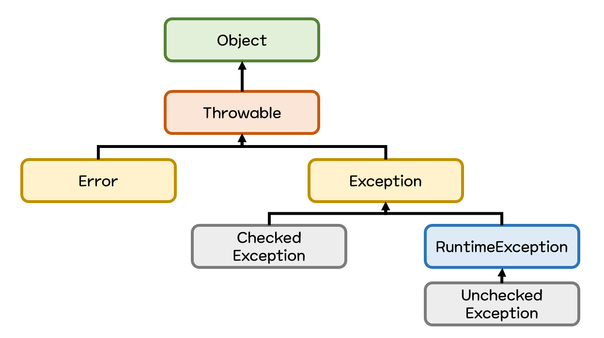
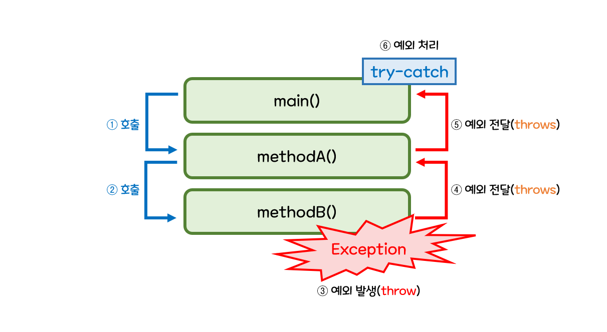
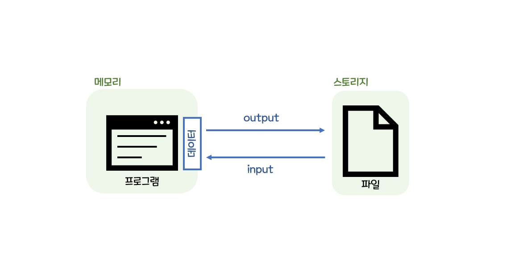
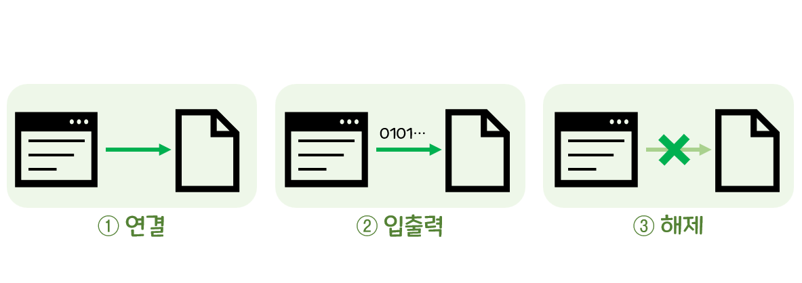

## 1. 예외 처리
### 예외(exception)란
- 프로그램상의 문제로 처리가 필요한 일종의 이벤트
	- 처리되지 못한 예외는 프로그램을 멈춤

### 예외 처리
#### try-catch-finally 문
- `try`문
	- 예외 발생 가능 코드 설정
- `catch`문
	- 발생 예외를 감지 및 처리
	- `try`문에서 발생된 에러가 `catch`문의 소괄호 타입과 같다면, 해당 예외 처리
	- `if-else` 형식처럼 처리할 내용을 추가할 수 있음
- `finally`문
	- 반드시 수행될 코드(생략 가능)
- 예시
	```java
	try{
		// 예외가 발생할 수 있는 코드
	} catch (예외_타입 레퍼런스변수){
		// 예외 처리를 위해 수행할 코드
	} finally {
		// 예외 발생과 상관없이 항상 수행할 코드
	}
	```

### 예외의 종류
#### 대표 예외 클래스

<table>
	<tr>
		<th></th>
		<th>예외 클래스명</th>
		<th>발생 원인</th>
	</tr>
	<tr>
		<td rowspan="6">실행 예외</td>
		<td>Arithmetic Exception</td>
		<td>숫자를 0으로 나눌때 처럼 잘못된 산술 연산을 하는 경우</td>
	</tr>
	<tr>
		<td>IllegalArgumentException</td>
		<td>잘못된 값을 메소드로 전달하는 경우</td>
	</tr>
	<tr>
		<td>IndexOutOfBoundsException</td>
		<td>배열 등 범위를 벗어난 인덱스 접근</td>
	</tr>
	<tr>
		<td>NoSuchElementException</td>
		<td>요청된 원소를 찾을 수 없는 경우</td>
	</tr>
	<tr>
		<td>NullPointerException</td>
		<td>가리키는 것이 없는 참조변수의 활용</td>
	</tr>
	<tr>
		<td>NumberFormatException</td>
		<td>잘못된 형식의 숫자 변환</td>
	</tr>
	<tr>
		<td rowspan="3">일반 예외</td>
		<td>ClassNotFoundException</td>
		<td> 클래스를 찾을 수 없는 경우</td>
	</tr>
	<tr>
		<td>InterruptedException</td>
		<td>인터럽트가 발생한 경우</td>
	</tr>
	<tr>
		<td>IOException</td>
		<td>입출력 문제가 생긴 경우</td>
	</tr>
</table>

### 예외의 종류


#### 예외 클래스의 상속 구조
- `Throwable`클래스로부터 모든 예외가 파생
	- `Throwable`
		- java.lang 패키지에 위치
		- 프로그램의 모든 문제적 상황을 정의한 것
		- `Error` 와 `Exception` 클래스로 확장됨
	- `Error`
		- 프로그래밍 외적 문제를 정의(메모리 부족, 장치 고장, ...)
	- `Exception`
		- 프로그래밍 내적 문제(코드로 처리가능한 예외)를 정의

&#10147; `Throwable` 클래스의 주요 메소드

|메소드 종류|설명|
|---|---|
|`public String getMessage()`|`Throwable` 객체의 메시지를 반환|
|`public void printStackTrace()`|`Throwable` 객체의 발생과 전달 과정을 에러 메시지로 출력|

#### 실행 예외와 일반 예외
- **실행 예외(unchecked exception)**
	- RuntimeException의 자손 클래스
	- 컴파일 단계에서 확인되지 않는 비 검사형 예외
- **일반 예외(checked exception)**
	- RuntimeException의 형제군 클래스
	- 컴파일 단계에서 확인되는 검사형 예외

|구분|실행 예외|일반 예외|
|---|---|---|
|클래스 관계|RuntimeException의 자손 클래스|RuntimeException의 형제 클래스|
|검사 여부|검사되지 않음|코드 컴파일 단계에서 검사됨|
|예외 미처리 시|프로그램 수행이 강제 종료됨|컴파일링에 실패함|

#### 사용자 정의형 예외
- 자바에서 제공하는 예외를 상속을 통해 확장한 것
- ex. `MyException`예외 코드 작성 예시
	```java
	class MyException extends Exception { // Exception 클래스를 상속 받음
		public MyException(String message){
			super(message); // 예외 시 남겨질 문자열
		}
	}
	```

### 예외의 발생과 전달


#### 예외 발생의 키워드 throw
- 예외의 발생은 `throw` 키워드를 통해 강제될 수 있음
- ex. `throw` 예시
	```java
	throw new 예외_생성자();
	```

#### 예외 전달의 키워드 throws
- 발생된 예외는 `throws` 키워드를 통해 메소드 호출 위치로 전달 할 수 있음
- ex. `throws` 예시
	```java
	메소드() throws 예외_A, 예외_B{
		...
	}
	```

## 2. 파일 입출력
### 파일 입출력(file input/output)이란
- 데이터를 파일로부터 입력받거나 출력받는 행위
- 데이터 보존을 목적으로 함
	- **파일(file)**
		- 데이터 관리를 위한 논리적 단위
		- 파일화된 데이터는 스토리지(storage)에 의해 반영구적 보존이 가능


&#10147; 메모리(memory)와 스토리지(storage)



- 컴퓨터의 기억장치
	- 메모리(memory)
		- 일반적으로 프로그램 데이터가 관리되는 곳
		- 처리 속도는 빠르지만 전원이 꺼지면 데이터가 사라짐
		- ex. RAM
	- 스토리지(storage)
		- RAM보다는 처리 속도는 느리지만 전원 공급 없이 데이터 보존 가능
		- ex. SSD, HDD

#### 파일 입출력 과정


1. 연결
	- 물리적 파일과 실행중인 프로그램 사이의 데이터 흐름 생성 과정
2. 입출력
	- 데이터 흐름을 통해 값을 주고받는 과정
3. 해제
	- 데이터 흐름을 해제함으로써 파일과 연결을 종료하는 과정

### 파일 입출력 기본 API
#### File 클래스
- 물리적 파일을 참조하기 위한 클래스
- 파일 결로를 지정해 객체를 만들 수 있음

<table>
	<tr>
		<th></th>
		<th>형식</th>
		<th>설명</th>
	</tr>
	<tr>
		<td>생성자</td>
		<td><code>File(String pathname)</code></td>
		<td><code>pathname</code>에 존재하는 물리적 파일을 위한 <code>File 객체</code> 생성</td>
	</tr>
	<tr>
		<td rowspan="5">메소드</td>
		<td><code>boolean exists()</code></td>
		<td>파일의 존재 여부 확인</td>
	</tr>
	<tr>
		<td><code>boolean createNewFile()</code></td>
		<td>파일 생성</td>
	</tr>
	<tr>
		<td><code>boolean delete()</code></td>
		<td>파일 삭제</td>
	</tr>
	<tr>
		<td><code>String getName()</code></td>
		<td>파일 또는 디렉토리명 반환</td>
	</tr>
	<tr>
		<td><code>boolean isDirectory()</code></td>
		<td>디렉토리 여부 확인</td>
	</tr>
</table>

#### FileWriter 클래스
- 파일에 문자 출력을 가능케 하는 클래스
- File 객체 또는 파일 경로를 지정해 객체를 만들 수 있음

<table>
	<tr>
		<th></th>
		<th>형식</th>
		<th>설명</th>
	</tr>
	<tr>
		<td>생성자</td>
		<td><code>FileWriter(File file)</code></td>
		<td><code>FileWriter</code> 객체 생성: 객체 생성시 파일을 향한 문자 출력 흐름이 만들어짐</td>
	</tr>
	<tr>
		<td rowspan="3">메소드</td>
		<td><code>void write(String s)</code></td>
		<td>문자열 s를 파일에 출력</td>
	</tr>
	<tr>
		<td><code>void write(char[] buf)</code></td>
		<td>문자 배열 buf를 파일에 출력</td>
	</tr>
	<tr>
		<td><code>void close()</code></td>
		<td>문자 출력 흐름 해제</td>
	</tr>
</table>

#### FileReader 클래스

<table>
	<tr>
		<th></th>
		<th>형식</th>
		<th>설명</th>
	</tr>
	<tr>
		<td>생성자</td>
		<td><code>FileReader(File file)</code></td>
		<td><code>FileReader</code> 객체 생성: 객체 생성시 파일로부터 문자 출력 흐름이 만들어짐</td>
	</tr>
	<tr>
		<td rowspan="3">메소드</td>
		<td><code>int read()</code></td>
		<td>문자 입력 흐름으로부터 단일 문자를 읽어오며, 읽어진 값은 정수로 반환</td>
	</tr>
	<tr>
		<td><code>int read(char[] buf)</code></td>
		<td>문자 입력 흐름으로부터 읽어온 문자를 buf에 저장 후, 그 개수를 반환</td>
	</tr>
	<tr>
		<td><code>void close()</code></td>
		<td>문자 입력 흐름 해제</td>
	</tr>
</table>

## 3. 람다식
### 람다(lambda)식이란
- 데이터 처리부에 제공하는 함수 역할을 하는 매개변수를 가진 중괄호 블록
- 자바는 람다식을 익명 구현 객체로 변환
	- **함수형 프로그래밍**
		- 함수를 정의하고 이 함수를 데이터 처리부로 보내 데이터를 처리하는 기법
		- 데이터 처리부는 제공된 함수의 입력값으로 데이터를 넣고 함수에 정의된 처리 내용을 실행
- ex. 람다식 형태
	```java
	(매개변수, ...) -> { 처리 내용 }
	```
	
### 람다식 사용법
- ex. message를 출력하는 코드
	```java
	public void printMsg(String message) {
		System.out.println(message);
	}
	```
- ex. 위를 람다식으로 변경할 시
	```java
	(String message) -> {System.out.println(message);}
	```
- ex. list라는 ArrayList의 모든 데이터를 출력하는 코드
	```java
	for (Integer num : list){
		System.out.println(num);
	}
	```
- ex. 위를 람다식으로 변경할 시
	```java
	list.forEach(n -> {System.out.println(n);});
	```
